# Java 与Python的不同点

1. print输出方式

   ```java
   //Python
   x = torch.tensor([1, 3, 4])
   print(f"the tensor: \n {x} \n")//推荐这种输出
   print("the tensor:\n", x)
   print("using {} device".format(device))
     
   //Java
   int a = 5;
   sout("a的值是：" + a);
   ```

2. python的变量不需要new，而java在使用一个变量时，一定要先定义变量的类型。

   原因在于，Java的运行方法，有内存、地址的概念。python类似于Matlab，所有的变量都是直接存的数据。

   ```java
   //python
   name = "quanzhou"
   myname = name
   print(myname)
   
   //java
   String name = "quanzhou";
   String myname = name;
   sout(myname);
   并且java这里还会报一个警告，“Local variable 'myname' is redundant”
   因为字符串是引用类型的变量，存的是地址，现在是两个均指向了一个地址，有一个多余
   ```

   

#ABC

1. **javac——编译工具；java——执行工具。文件名=类名**

   HelloWorld：javac HelloWorld.java      》》.class文件

   ​						java HelloWorld

   

2. **JDK里面包含了JRE；JRE中有相关的库和JVM。**

   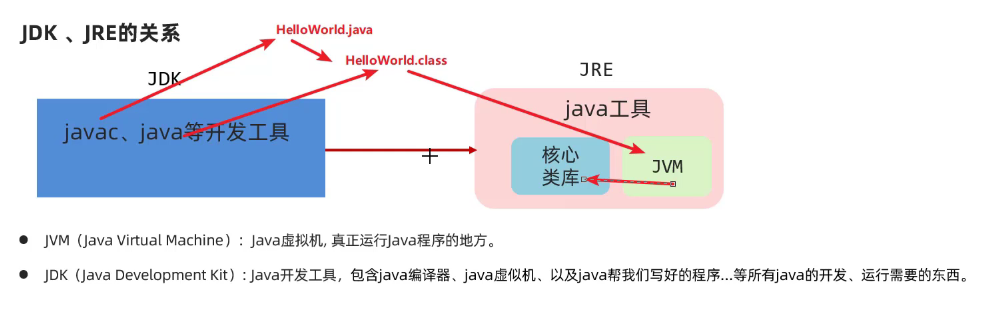

   

###3. **字面量**

   即数据在程序中的书写格式。\n------换行；\t-------空格   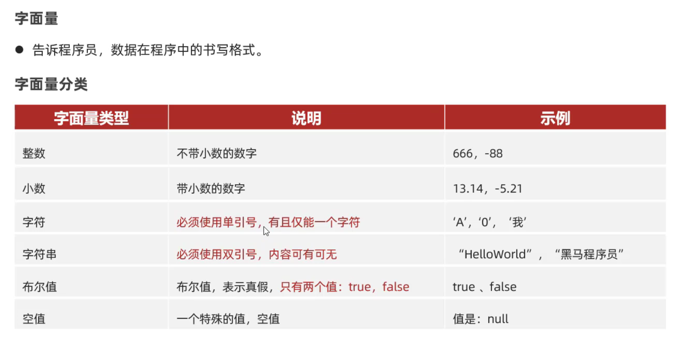

   

###4. **变量**

   定义格式： double money = 50 或者 double money

   注意：定义变量可以无初始值，但使用变量前一定要先有值。

  **成员变量（类中）与局部变量的区别（重点）**

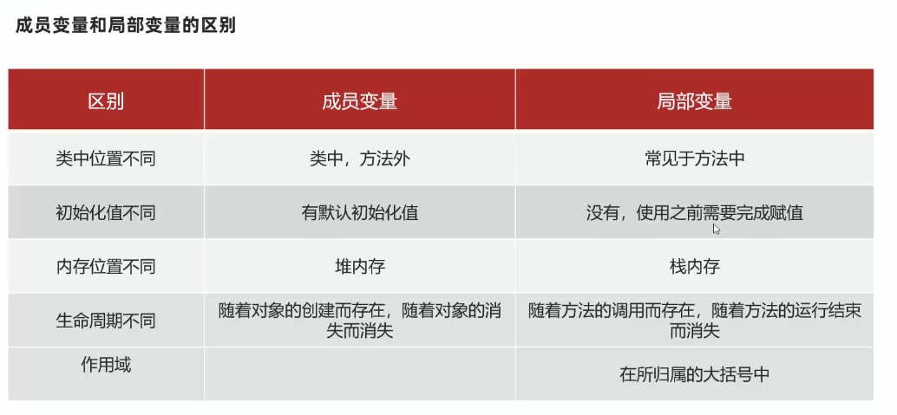

   

###5. **数据的类型**

   1字节=8位二进制。

   **引用类型**主要指数组和字符串（String），因为他们存储的是地址，而不是具体数据。

   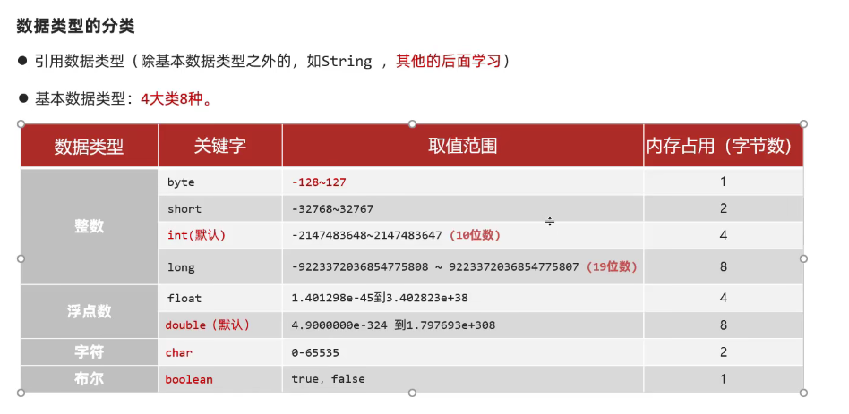

   字符串：

   ​     String  gg = “这是GG”；

   

###6. **AscII编码表**

   字符（char类型）在计算机内的存储是二进制形式；ASCII编码表就是每个字符的约定二进制编号

   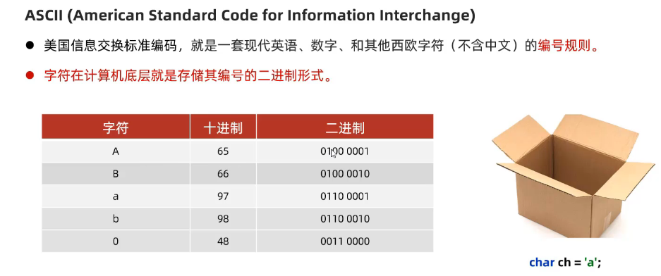

   

###7. **关键字，标识符**

   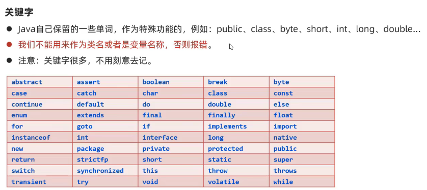

标识符：也就是变量名，类名的命名要求，要以数字，字母，__开头，不能用关键字。 

​		变量名称：驼峰模式，首字母小写，如 int javaNumber = 8；

​		类名称：驼峰，首字母大写，如 HelloWorld.java


8. **API**

   Application Programming Interface（应用程序编程接口）

   其实就是指：Java写好的程序（功能代码），我们可以直接调用。

# IDEA

## 区分Project和Module

- Project:（用open打开）

  ​		有.idea文件，无.iml文件、src文件夹、pom.xml。idea文件夹存放项目的配置信息

- Module:（用new打开）

  ​		有.iml文件（每个模块都有一个自己的）

- Example
  1. **使用open打开工程**（选工程名文件夹）


​				**2. 使用new导入模块**（选.iml文件）（这个简单，只有模块才有.iml文件，直接找到，选中就可以打开）

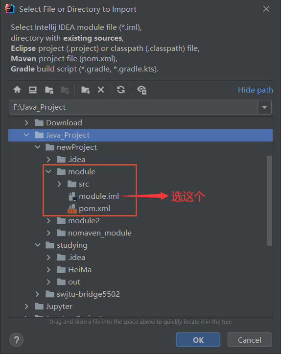


##快捷语句：

​	main；sout；

```java
main:
public static void main(String[] args) {
        
    }

sout:
System.out.println();
```


##快捷键：

​	crtl+D——直接复制当行语句到下一行；

​	Crtl+ALT+L——格式化；

​	ALT+Shift+↑——上下移动当前代码；

​	Crtl + ALT +T ——先选取代码部分，然后按住，可以将代码用**循环语句**包住66666；

​	for 循环的快速操作：arr是我们定义的数组，arr.for i 就可以直接遍历arr数组所有元素。即 " 变量名.for i "

一键生成类中的有参构造器和Getter、Setter方法：

- 定义完成员变量后，直接右键generate，选择Constructor  ，选择要赋值的成员变量，一键生成有参构造器！
- 定义完成员变量后，直接右键generate，选择Getter and Setter 生成所有成员变量的两个方法！

##编写程度的顺序

第一步：创建工程new project（一定是empty）

第二步：创建模块new module

第三步：创建包new package

第四步：创建类new class


##模块工程操作

- **删除模块**操作：module要直接从磁盘里面删除，否则删不干净

- **导入模块**操作：

  ​	1. 关联导入，找目标模块文件夹下的小黑点**.iml文件**（项目文件里面没有此模块代码）

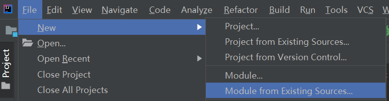

​			2. 创建导入

​				即自己先创建模块，然后再复制代码到自己的src下面。

​				复制的是别人模块src下的代码文件夹，一定注意。

- **打开工程**：

open，注意也是找小黑点，是工程文件夹的小黑点

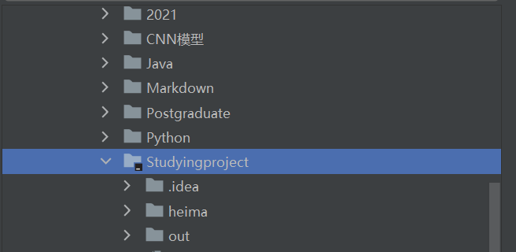

# Foundation

## 混淆点

### 1. 方法的调用

1. JavaBean里面方法。

   ​		对象调用类里面的成员变量，成员方法的方式：**对象名 . 属性（方法）**

2. 有主函数的类里的方法！

   ​		这个类里面的方法，直接调用其方法名就行了。

###2. 方法的修饰符问题

- 完整的方法定义格式为：

  ​		修饰符  返回值类型  方法名  （形参列表）{

    			方法体代码；

  ​	  		return返回值；

  ​		}

- 然后你会发现在main函数中调用的方法修饰符必须为 public static ，方法必须为静态；而在类里面写方法的时候，修饰符为  public  就行了。原因如下：

  ​		用static修饰的方法，无须产生类的实例对象就可以调用该方法。没有static修饰的方法，需要产生一个类的实例对象才可以调用该方法。static变量是存储在静态存储区的，不需要实例化。在main函数中调用函数只能调用静态的。如果要调用非静态的，那么必须要先实例化对象，然后通过对象来调用非静态方法。


## print写法

使用 + 来连接字符串、数字、变量等输出

```java
int i = 5;
sout("请输入第" + 1 + "个员工名字")//请输入第1个员工名字
sout("请输入第" + i + "个员工名字")

System.out.println(winnumber[i])//输出这个后自动换行
System.out.print(winnumber[i] + "\t")//输出这个后不换行，后面的紧接着输出
```


## 类型转换

### 自动类型转换

因为程序中经常存在不同类型的变量赋值给其他类型的变量，所以要进行类型转换。char是2个字节，int是4个字节

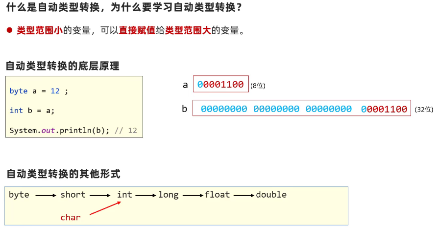

### 表达式的自动类型转换

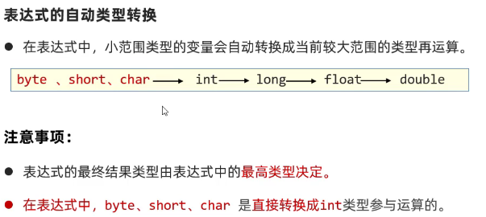

```java
byte a = 10;
int b = 20;
double c  = 18;
double z = a + b + c;//a+b+c表达式的输出类型为double
System.out.println(z);
//错误情况
byte i = 2;
byte j = 10;
byte k = i + j;//表达式中，byte是先转换成int，再参与运算的
System.out.println(k);
```

### 强制类型转换

强行将大范围类型的变量，数据赋值给小范围类型的变量。转换后可能会有数据缺失。浮点类型——整型，直接丢弃小数部分。

```java
int a = 20;
byte b = a;//这样会错误，因为a是大范围，b是小范围
byte b = (byte)a;
```

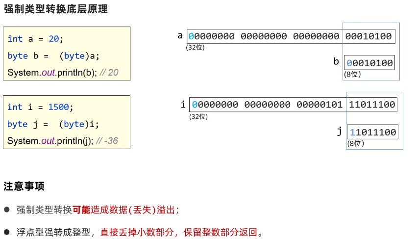

## 运算符

###  基本运算符

两个整数相除结果还是整数，因为表达式的最终类型由式子里面最高类型决定（自动类型转换原理）.

```java
a = 10;
b = 3;
c = a / b;
sout(c)>>>3
sout(a * 1.0 / b)>>>3.333333333
```

"+"符号在与字符串运算时作为连接符，结果仍为一个**字符串**。注意字符与字符串的区别，字符在计算机里面就是一个数字类型，当可以一起算时，字符就变成数字进行运算，不能算时，就还是以字符的形式输出。

​		口诀：“能算则算，不能算就在一起”

```java
 int a =5;
sout("abc" + a);//abc5
sout("abc" + 'a')//abca
sout(a + 'a')//102
sout("abc" + a + 'a')//abc5a
sout(a + "" + 'a')//5a
sout
```

### 扩展赋值运算符

唯一注意的点就是：这种运算符隐含了强制类型转换。这与表达式的自动类型转换有一点区别，例如

```java
byte a = 10;
byte b = 20;
int i = a + b;//a + b输出为int类型
a += b;//输出a为byte类型，而不是int。因为他相当于a = (byte)(a + b)
//一定记住扩展赋值运算符，输出类型与前面那个数据类型相同
```

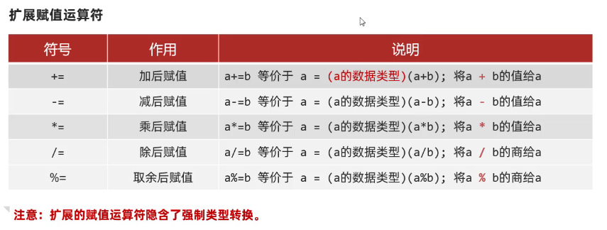

### 逻辑运算符

注意：运算完结果是一个布尔类型数据。True   /    False

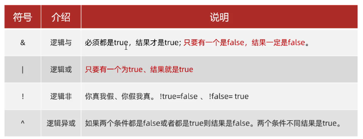

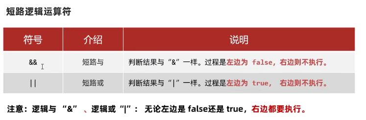

### 三元运算符

格式：条件表达式？值1：值2

​		if 表达式==True，则返回值1，否则返回值2。

```java
int score = 98;
String rs = score>=60 ? "Pass":"Fail";
```

## 键盘录入技术

```java
import java.util.Scanner
  
Scanner sc = new Scanner(System.in);
	int age = sc.nextInt();
	String name = sc.next();//输入字符串
```

## 流程控制

### 顺序结构

即按照代码顺序从上往下执行。

### 分支结构

1. if 语句

```java
if(条件表达式){
  语句;
}
//python
if 条件表达式:
	语句
```

2. switch

   注意事项：

   switch（）里面的表达式只能是 **byte，short， int， char**，枚举，String，不支持float，double，long。

   case给的值不允许出现重复，而且只能是字面量，不能是变量。即可以是"aa", ’a'，不能说int a = 5；这个a。

   记得break，否则出现穿透，把下面case的结果都执行。

```java
//表达式！=条件表达式
switch(表达式/变量){
  case 值1 :
    执行语句....；
    break;
  case 值2 :
    执行语句....;
    break;
  default:
    执行语句....;
}
```


### 循环结构

1.  for语句

```java
for(int i =0; i< 3; i++){
  sout("hello world")
}

//python
for i in range(5):
	aaaaa
```

2.  while

```java
while(){
  
}
```

3.   do - while

```java
do{
  
}while();
```

4. **死循环**

```java
while(true){
  sout("si diao la")
}

break ————立即退出该次循环
```

###break，continue

break: 跳出并且结束当前循环的执行。

continue：用于跳出当前循环的当次循环，进入下一次循环

## Random

```java
import java.util.Random;

Random r = new Random();
int number = r.nextInt(10);//0 ~ 9 的随机数，不包含10.
sout("随机产生了：" + number)
```

## 数组

记住：数组变量名称存储的是数组第一个对象的内存地址，所以数组是引用类型。

计算机编号都是从0开始，matlab不是计算机编号。

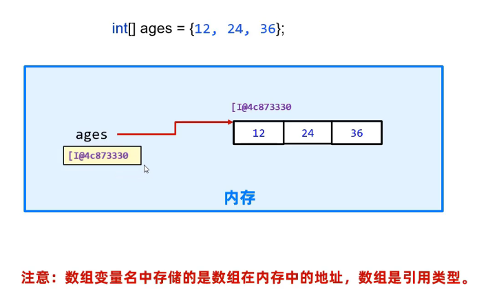


1.  初始化时赋值（静态初始化）

```java
String names[] = {'a', 'b', 'c'};// 等价于String names = new int[]{'a', 'b', 'c'}
sout(names);// [I@7699a589，数组名称存储的是，数组对象第一个数据的内存地址（与c++一样）
sout(names[0]);
int len = arr.length;//数组长度
```

2. 先初始化，后赋值（动态初始化）

```java
int arr[] = new int[3];//也会在内存中，先创建数组对象，和静态是一样的，只不过数据都是初始值。
arr[0] = 100;
sout(arr[0]);
```

动态初始化时，各类型数组元素的默认值为：

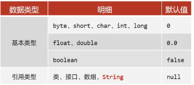

## 数组的内存图

例子：

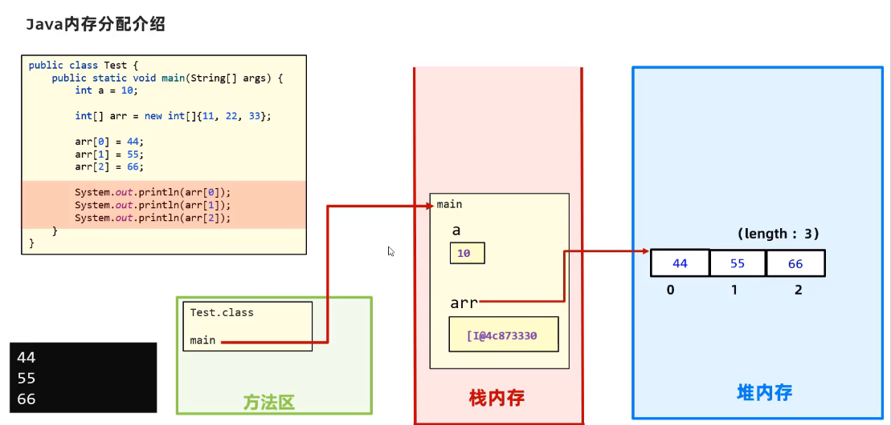


### 1. 方法区

字节码文件，方法，类，加载时进入的内存

### 2. 栈

方法运行时所进入的**内存变量**在这里

### 3. 堆内存

**new出来的东西**（对象）会在这块内存中开辟空间，并产生地址

### 4. 常见问题

1. 访问的元素位置超过最大索引。
2. 数组变量中没有存储数组的地址，而是null，则访问时会出现NullPointerException


## 方法

注意：方法与方法之间是平级的， 不能嵌套定义，只能相互调用。

return执行之后，后面的语句均不会再执行。

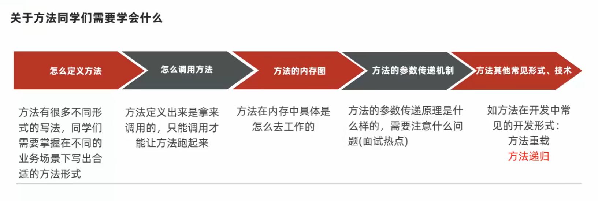

### 1. 两种基本的定义

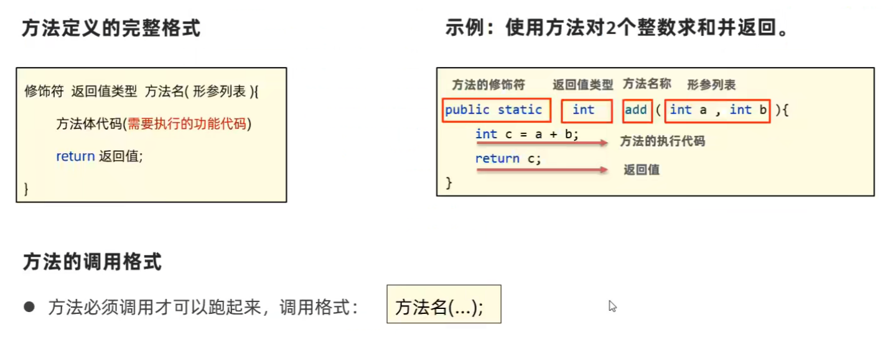

每个方法都有返回值类型，voi代表没有返回值， 但并不是说，该方法没有返回值类型。

```java
//第一种
public static void fun1(int a, int b){
  int c = a + b;
  sout(c);
}
//第二种
public static char getchar(){
  return 'a';
}
```

### 2. 方法的内存原理

定义的所有方法，包括主方法，还有次方法，运行的时候

1. 类文件编译成.class文件

2. 所有的方法到方法区里面，
3. 按照main（）里面顺序按个到栈内存去执行，涉及到了堆内存的就再去堆内存里面；
4. 注意当运行完一个方法后，java会自动清除掉该方法。

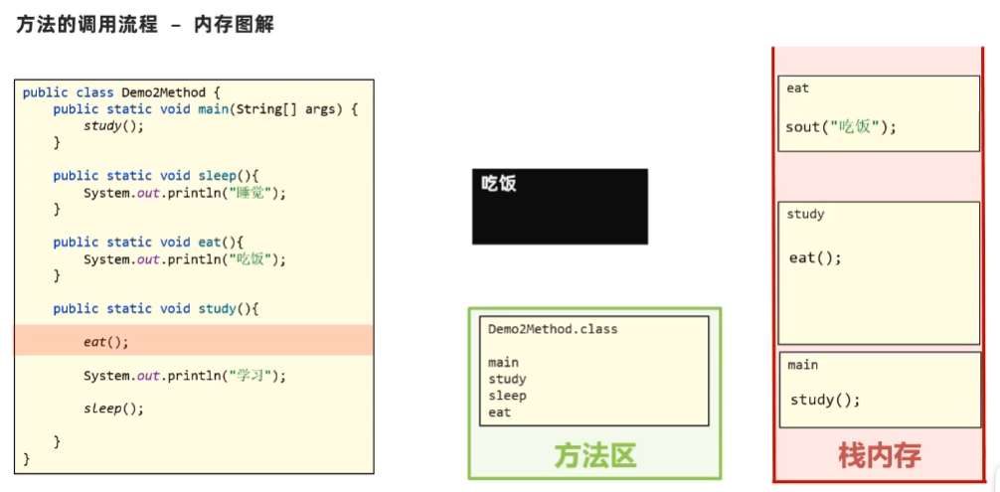

### 3. 方法的参数传递机制

1. 基本类型的参数传递（整数，浮点，字符，布尔）

   **只涉及到了内存里面的方法区和栈内存**，因为他没有new一个对象

   关键词：**值传递**；	原因：定义的基本类型，均是直接存储的是数据。

   在传输实参给方法的形参时，传的时实参变量中存储的值，而不是实参本身。

   形参的变化不会影响实参。

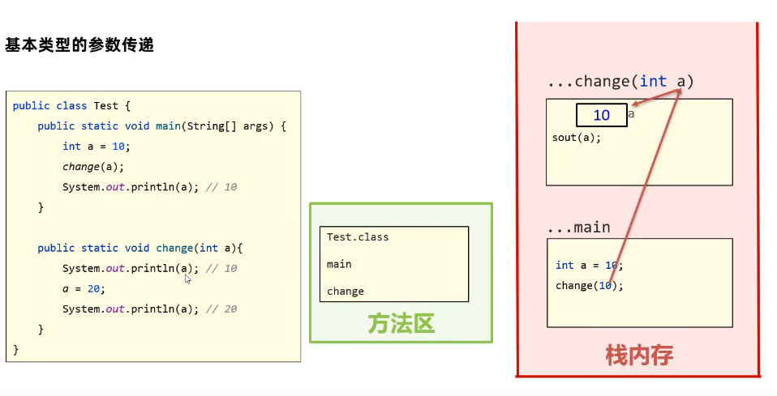

2. 引用类型的参数传递（数组，String）

   这个涉及到了java里面所有的内存，方法区，栈内存，堆内存。

   关键词：值传递

   但是形参引起的变化会改变实参，为什么呢？

   因为引用类型存储的是堆内存里面对象的地址，传递的时候也是传递的是地址，形参实参均指向一个地址，所有说形参的变换会导致实参里面的变化。因为他们两个都仅仅是指向撒，最终的数据是堆内存里面的。

   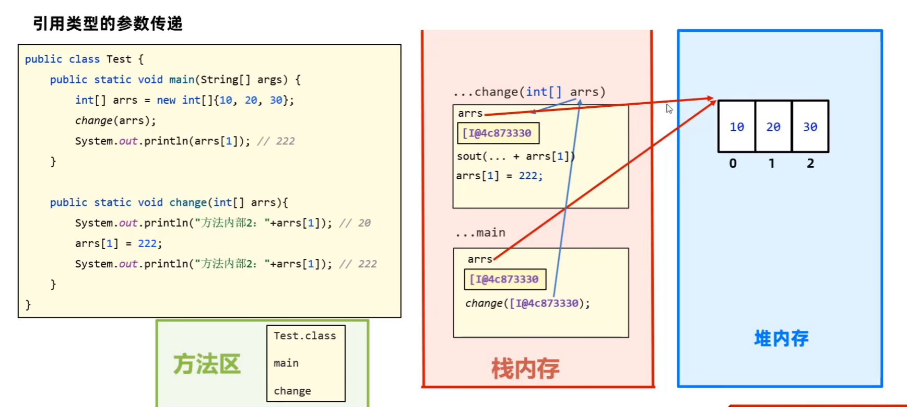

   

###4. 方法重载

同一个类中，出现多个**方法名称**相同，但是**形参列表**不同，这些方法就是重载方法。（不用管修饰符和返回值类型）

### 5. return关键字的单独使用

return；

-------->可以立即跳出并且结束当前方法的执行。return的单独使用可以用在void任何方法中。

# 面对对象编程

面向：就是拿或者找的意思

对象：就是东西的意思

面对对象编程：拿东西过来编程

## 设计类并创建对象

必须先设计类，才能获得对象。类：就是设计图纸，对象就是设计出来的实例。

在编程时，新建一个.class文件，然后写完类的内容，再新建一个.class文件，main方法就可以直接使用 这个类去创建对象

```java
public class 类名{
    1. 成员变量（代表属性，一般是名词）
    2. 成员方法（代表行为，一般是动词）
    3. 构造器
    4. 代码块
    5. 内部类  
}

//创建对象与对象数组。
类名 对象名 = new 构造器();
类名[] 对象数组名 = new 构造器[100]//和创建数组类似，类本身也是一个类型。里面存储的是每个对象的堆内存地址，初始值为null。

example：
//定义类：
  public class Car{
    //属性，成员变量
    String name;
    double price;
    //行为,方法
    public void start(){
      
    }
    public void run(){
      
    }
  }
//获得类的对象：
Car mycar = new Car();
mycar.name = "大蹦";
mycar.price = 1000;
mycar.start();
mycar.run();
//创建对象数组
Car[] Carshop = new Car[100];//Carshop= [null, null, null, .....]
```

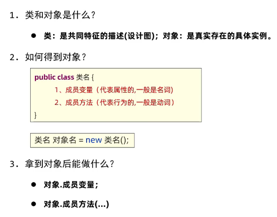

注意事项：

一个java文件中可以定义多个class类，并且只有一个类是public修饰，并且public修饰的类名必须成为代码文件名。

实际开发中，建议还是一个文件定义一个class类。

## 对象的内存图

###1. 两个对象的内存图：

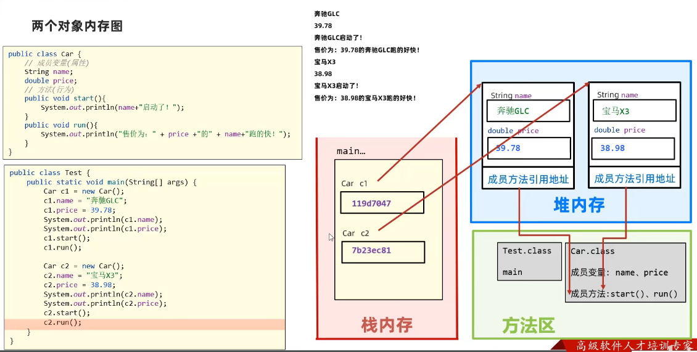

1. 对象放在堆内存中。对象里的方法还是放在方法区内。
2. Car c = new Car();  c变量名存储的是对象在堆内存中的地址。

### 2. 两个变量指向同一个对象

即把一个对象S1，直接赋值给另一个相同的对象类型S2.

这个和数组的类似，对象名都是存储的对象的堆内存地址。

## 构造器

重点了，一定注意！

第一点：前面不是说了，要获得对象，先要创建一个类嘛，然后通过Car mycar = new Car();  获得我们的对象mycar，存储堆内存里面的对象数据的地址。但是这个对象是由这个Car（）类，创建的吗？ 答案是：NO。他是由这个Car（）类里面的构造器创建的。啊，那里有构造器啊，我木有写啊，也没有看到相关的代码啊！那是因为在你创建类的时候，java会自动给你创建一个默认的无参数构造器，并且不会显示出来代码！   它有点类似于Python里面的__init__函数，是用来初始化配置的，只不过python里面的是显式的，这个是隐式的，下面会细讲。 

### 1. 构造器的作用

用于初始化一个类的对象，并且返回对象的地址。

前面的这段获得对象的代码Car mycar = new Car()，里面的new的后面是这个类嘛？不，他是类里面的构造器！

- 无参数构造器：默认存在的，初始化对象时，成员变量均采用默认值。
- 有参构造器：自己写，在初始化对象的时候，可以为对象属性赋值。
- 注意：假如你写了有参构造器，那么java默认的这个无参构造器会自动清除！如果需要无参的，就需要自己再去创建了。

```java
//构造器的定义形式
修饰符	类名（形参列表）{
  ...
}

//Example
public class Car(){
  ...
  // 无参数构造器。（默认存在，隐式）
  public Car(){
    ...
  }
  // 有参数构造器
  public Car(String name, String price){
    ...
  }
}
```

快捷键：定义完成员变量后，直接右键generate，选择Constructor  ，选择要赋值的成员变量，一键生成有参构造器！

## this关键字

作用：在成员方法和构造器中使用；代表当前对象的地址，用于访问当前对象的成员变量，方法。

```java
public class Car(){
  String name;
  double price;
  //构造器与this共同使用
  public Car(String name, double price){
    this.name = name;
    this.price = price;
  }
  
  //这样也可以赋值成功，但是很不好看，不专业 ！所以出现了this的使用
    public Car(String n, double p){
		name = n;
		price = p;
  }
}
```

# 面对对象的三大特征

## 封装

简言之：”合理隐藏，合理暴露“。  很简单，就是在原来类的简单定义上面，将成员变量进行封装（private）一下，然后加两个对象访问成员变量的方法！

作用：增加程序代码的安全性。并且适当的封装可以提高效率，让程序更容易理解与维护

封装实现步骤：

- 对成员变量使用  private 关键字修饰进行隐藏，private修饰后该属性就只能在当前类中访问。
- 然后提供public修饰的getter、setter方法暴露其赋值与取值。

举个例子就知道了：

```java
//Define class
public class Car(){
  //对属性private
  private String name;
  private double price;
  //提供各个属性的getter、setter方法
  //name
  public void setName(String name){
    this.name = name;
  }
  public String getName(){
    return name;
  }
  //price
  public void setPrice(double price){
    this.price = price;
  }
  public double getPrice(){
    return price;
  }
}
```

快捷键：定义完成员变量后，直接右键generate，选择Getter and Setter 生成所有成员变量的两个方法！

### JavaBean

其实就是把前面的类啊，对象啊，构造器，this等 合并上封装全部整合起来，定义了一套标准的实体类的写法，以后所有的类都按照这种写法就行了！

1. 成员变量用private修饰；
2. 每个成员变量提供对应的Getter、Setter方法；
3. 必须提供一个无参构造器；（重点罗）


# String类

定义：java.lang.String类代表字符串，String类定义的变量可以用于指向字符串，然后操作该字符串。

Java程序中所有的字符串文字（如“abac”）都是此类的对象！（只是简写了而已，就像基本类型一样，但它还是一个类啊，我们定义的那个叫对象，所以前面一直说字符串是引用类型的变量）

**创建字符串对象的两种方式：**

- 第一种：直接使用 “  ” 定义。

```java
String name = "heima";
//正常我们创建对象的写法是：Car mycar = new Car();
```

- 第二种：使用类里面的构造器创建

  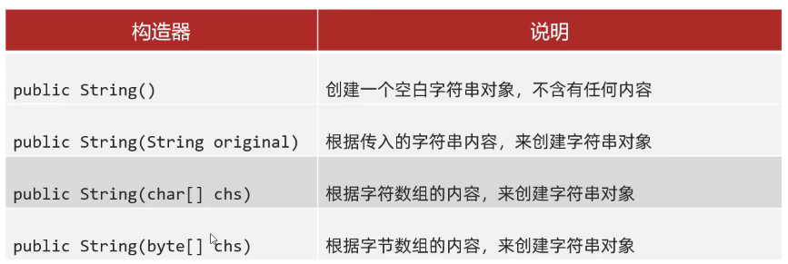

  其中byte这里，因为byte类型范围是-128-128，它会把字节数组里面的整数全部转化成相应的字符！

```java
String name = new String();//不用
String name = new String("heima");//不用

//第三种
char[] ch = new char[]{'A','B','c'};
String name = new String(ch);

//第四种
byte[] bt = new byte[]{97,98,99};
String name = new String(bt);
name.sout
>>>abc
```

**这两种定义方式的区别**

- 以 “  ” 方式给出的字符串对象，会在常量池里面，并且相同的字符串内容只会存储一份。

- 通过构造器new出来的对象，每new一次会产生一个新的对象，就算是字符串内容相同也会产生新的对象，存储在堆内存里面

  ```java
  String s1 = "abc";
  String s2 = "abc";
  sout(s1 == s2); //true
  
  char[] chs = new char[]{'a', 'b', 'c'};
  String s3 = new String(chs);
  String s4 = new String(chs);
  sout(s3 == s4);  //False
  ```

  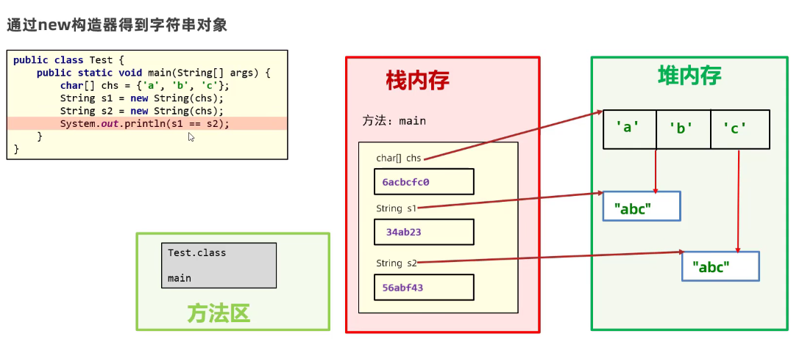

**注意**：String是不可变字符串类型，因为它的对象在创建后不能被更改！因为String变量每次的修改其实都是产生并指向了新的字符串对象，原来的字符串对象没有发生改变。

## String对象内存原理

- 以双引号 “  ” 给出的字符串对象，存储在堆内存中的字符串常量池；（看见了 “  ” 的就一定会在常量池里面创建一个对象，不管位置在哪里
- 其他情况的字符串对象均存储在堆内存中（不在字符串常量池）；
- java存在编译优化机制，在程序编译时，"a" + "b" + "c" 会直接转化成  "abc"  !（仅限于这种一模一样的）

**Example1：**

```java
public static void main(Stringp[] args){
  String name = "传智";//第一步
  name += "教育";// 第二步
  name += "中心";// 第三步
}
```

第一步：传智以 ”  ”形式给出，所以放在字符串常量池！name对象存储其地址。

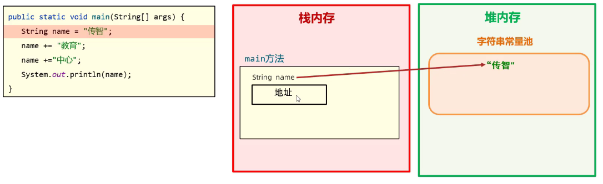

第二步：”教育“也存放在字符串常量池，然后name这边进行了 “+” 的字符串运算，结果放在堆内存里面，然后新的字符串数据的地址，给name存储。这就说明了为什么String类型是不可变字符串，因为他的对象创建后，在堆内存的数据就不会被删除了，只会出现重新指向的情况！

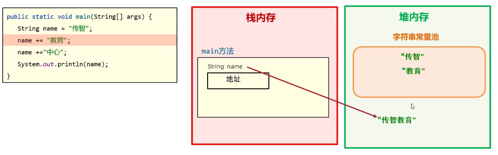

第三步：

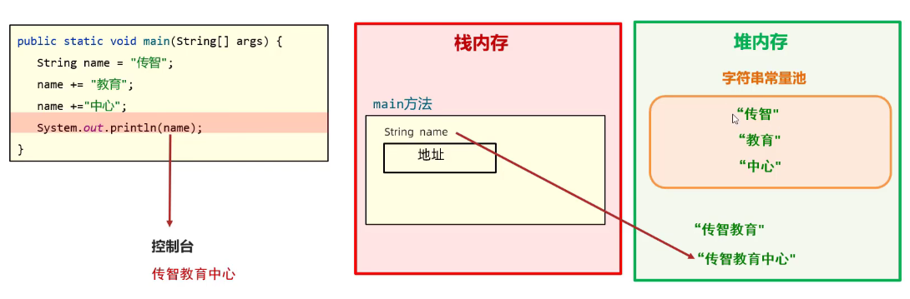

**Example2：**

这行代码 创建了几个对象？

```java
String s = new String("abc");
```

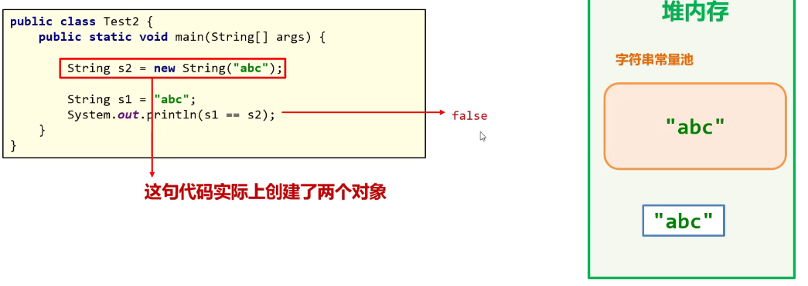

## String类常用API

1. **比较字符串内容（boolean）**

|                     方法名                      |                             说明                             |
| :---------------------------------------------: | :----------------------------------------------------------: |
|     public boolean equals ( String another)     | 该字符串对象与指定字符串对象比较，只关心字符串内容是否完完全全一致 |
| public boolean equalsIgnoreCase(String another) |         也是比较内容，但忽略大小写，常用于验证码！！         |

为什么不用 == 来比较？因为字符串对象是引用类型，不是直接存储数据，再加上其内存的独特性，完全不能用==比较，根本判断不对！

2. **返回字符串长度**

   ```java
   public int length()
   ```

   

3. **获取字符串某个索引位置的字符**

   ```java
   public char charAt(int index)
   ```

   

4. **将当前字符串转换成字符数组返回**

   ```java
   public String toCharArray()
   ```

   

5. **根据开始和结束的索引进行截取，得到新的字符串（左闭右开）**

   ```java
   public String substring(int beginIndex, int endIndex)
   ```

6. **从传入的索引处截取，一直截取到末尾处，得到新的字符串**

   ```java
   public String substring(int beginIndex)
   ```

7. **将字符串里面的某一段值，用新给的值替换掉，返回新的字符串**

   ```java
   public String replace(String target, String replacement)
   ```

8. **切割字符串，得到一个字符串数组并返回（常用 " , "  " ; "  等）**

   ```java
   public String[] split(String s)//"," ";"
   ```

9. **判断该字符串内容里是否含有传入的字符串内容**

   ```java
   public boolean contains(String s)
   ```

   

10. **判断该字符串是否以输入的字符串内容开始**

    ```java
    public boolean startsWith(String s)
    ```

# ArrayList 集合

## 1. 快速入门


```java
ArrayList list = new ArrayList();
list.add("java");
list.add(17);
list.add(17.5);
list.add(True);
sout(list);
list.add(1,"插入中国");
System.out.println(list);
>>>
    [java, 17, 17.5, true]
    [java, 插入中国, 17, 17.5, true]
```

## 2. 泛型（统一集合内的元素类型）

ArrayList<E>：其实就是一个**泛型类**，可以在编译阶段约束集合对象只能操作某种数据类型。并不是所有类都支持泛型，要看类的后面有没有这个<E> .

**举例：**

-  ArrayList<String> ：此集合只能操作字符串类型的元素。 
-  ArrayList<Integer>：此集合只能操作整数类型的元素。int是基本类型不支持，Integer是整数的引用类型。

注意：**集合中只能存储引用类型，不支持基本数据类型。**

```java
ArrayList<String> list1 = new ArrayList(); //List1内只能添加String类型
```

## 3.ArrayList常用方法

其中E——表示其集合泛型设置的 元素类型。

public E get(int index) 		返回指定索引处的元素

public int size()	 		返回集合中的元素的个数

public E remove(int index) 		删除指定索引处的元素，返回被删除的元素

public boolean remove(Object o) 		删除指定的元素，返回删除是否成功；有重复的只删除前面那个

public E set(int index,E element) 		修改指定索引处的元素，返回被修改的元素

注意：直接用其对象调用方法即可，他会修改到其对象的内容。

## 4. ArrayList存储自定义类型（类）

自定义类型是什么？ 类就是一种类型啊，String也是一个类啊！**类就是一种类型！**

其实简单来说，就是用集合去存储我们的多个对象名，方便遍历使用。集合中存储的元素并不是对象本身，而是对象的地址。

```java
Movie 是我们创建的影片类；
movie1是我们创建的第一个对象；
movie2是我们创建的第一个对象；
movie3是我们创建的第一个对象；

  ArrayList<Movie> mymovies = new ArrayList<>();
	mymovies.add(movie1);
	mymovies.add(movie2);
	mymovies.add(movie3);
	mymovies.add(new Movie("肖生客的救赎",9,"罗冰四")); //简单，没有创建对象名变量	
	mymovies.add(new Movie("《阿甘正传》", 9.5 , "汤姆.汉克斯"));

   //遍历集合中的影片对象并展示出来
        for (int i = 0; i < movies.size(); i++) {
            Movie movie = movies.get(i);
            System.out.println("片名：" + movie.getName());
            System.out.println("评分：" + movie.getScore());
            System.out.println("主演：" + movie.getActor());
```

## 5. ArrayList遍历删除

因为集合的大小是随着你的每次删除而变化的，每次删除之后，集合内的数据索引会马上发生变化! 索引在后面的元素会直接放到前面来。

假如你要删除98, 77, 66, 89, 79, 50, 100中，小于80的数据，直接从0开始遍历删除的话就会出现只删除了77，79的情况！

解决办法：**从集合后面遍历然后删除，可以避免漏掉元素。**

## 6. ArrayList应用：元素搜索

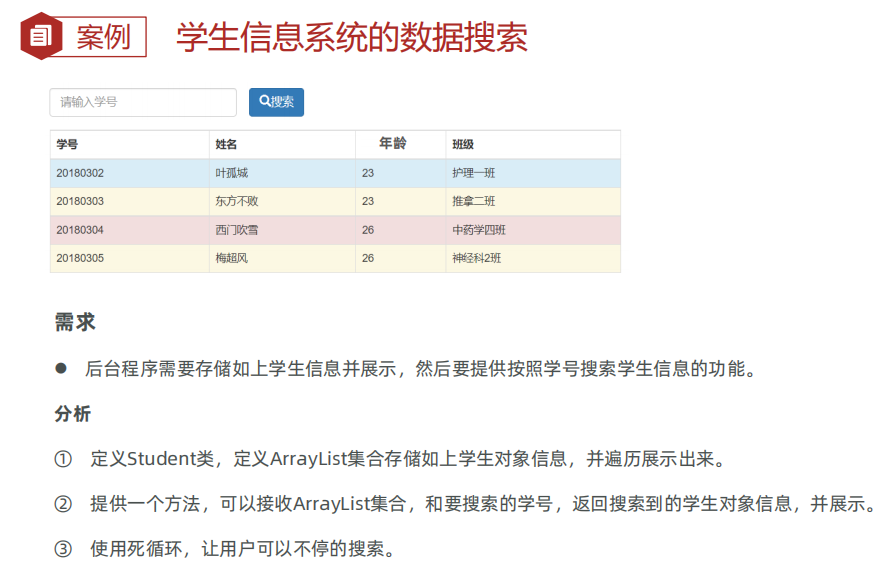

```java
public class Student {
    private String studyId;
    private String name;
    private int age;
    private String className;
  
  	.....Getter,Setter,Construtor
}

public class ArrayListTest6 {
    public static void main(String[] args) {
        // 1、定义一个学生类，后期用于创建对象封装学生数据
        // 2、定义一个集合对象用于装学生对象
        ArrayList<Student> students = new ArrayList<>();
        students.add(new Student("20180302","叶孤城",23,"护理一班"));
        students.add(new Student("20180303","东方不败",23,"推拿二班"));
        students.add(new Student( "20180304","西门吹雪",26,"中药学四班"));
        students.add(new Student( "20180305","梅超风",26,"神经科2班"));
        System.out.println("学号\t\t名称\t年龄\t\t班级");

        // 3、遍历集合中的每个学生对象并展示其数据
        for (int i = 0; i < students.size(); i++) {
            Student s = students.get(i);
            System.out.println(s.getStudyId() +"\t\t" + s.getName()+"\t\t"
                    + s.getAge() +"\t\t" + s.getClassName());
        }

        // 4、让用户不断的输入学号，可以搜索出该学生对象信息并展示出来（独立成方法）
        Scanner sc = new Scanner(System.in);
        while (true) {
            System.out.println("请您输入要查询的学生的学号：");
            String id = sc.next();
            Student s = getStudentByStudyId(students, id);
            // 判断学号是否存在
            if(s == null){
                System.out.println("查无此人！");
            }else {
                // 找到了该学生对象了，信息如下
                System.out.println(s.getStudyId() +"\t\t" + s.getName()+"\t\t"
                        + s.getAge() +"\t\t" + s.getClassName());
            }
        }
    }

    /**
      根据学号，去集合中找出学生对象并返回。
     * @param students
     * @param studyId
     * @return
     */
    public static Student getStudentByStudyId(ArrayList<Student> students, String studyId){
        for (int i = 0; i < students.size(); i++) {
            Student s = students.get(i);
            if(s.getStudyId().equals(studyId)){
                return s;
            }
        }
        return null; // 查无此学号！
    }
}
```

# static修饰符

static是静态的意思，可以修饰成员变量和成员方法。静态的东西都是最最最先加载的，没在类创建的同时加载，比对象里面的任何东西都早！注意：静态的东西只能处理静态的哦！

## 静态成员变量

从现在类的成员变量分为两类：

- 静态成员变量：static修饰，**属于类**的东西，堆内存中只存储一份，随着类的创建同时产生，可以被共享访问、修改。也是可以被对象访问！

  调用方式：类名.静态成员变量（仅仅限于在该类的内部使用的时候，可以不加类名）；对象.静态成员变量（不要用这种哦，很不专业）

- 实例成员变量：无static修饰，就是我们一般写的那个，属于**每个对象的东西**（记住，类有多个对象哦）。

静态成员变量用于表示：在线人数等需要被共享的信息。

注意哦：对象名也是一个变量哦，它也可以作为静态成员变量！还有静态集合哦，这几个才用的多！

**内存原理：**

1. 类编译完，在方法区生成.class的时候，会同时在堆内存创建该类的静态变量区，加载我们的静态成员变量。

2. 后面创建的每个类的对象，都会自动指向该静态变量区哦

   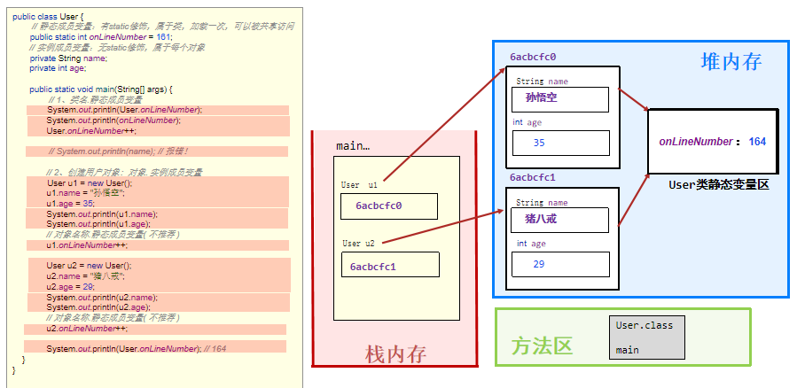

## 静态成员方法

类的成员方法从现在开始分为两种：

- 静态成员方法（有static修饰，属于类），随着类的创建同时在方法区里面加载，建议用类名访问，也可以用对象访问。

  调用：类名.静态成员方法（仅仅限于在该类的内部使用的时候，可以不加类名）

- 实例成员方法（无static修饰，属于对象），只能用对象触发访问。

  调用：对象.实例成员方法

静态成员方法用于：以执行一个通用功能为目的，或需要方便访问，可以申明成静态方法 

## static访问时权限

- 静态方法只能访问静态的成员，不可以直接访问实例成员。
- 实例方法可以访问静态的成员，也可以访问实例成员。
- 静态方法中是不可以出现this关键字的。 

只要记住：静态的是属于类的，只能访问属于类的，不能访问对象的；但对象是类的儿子，所以对象可以访问类的。

静态的东西是属于类的，类自己的东西之间肯定可以相互访问，因为类有无数个对象，类区访问实例的成员，方法，我怎么知道它是访问的哪个对象的呢，对不对！；但因为对象是我类的儿子，我不能太狠心，爸爸买的车（变量和方法）也可以借儿子开开，但爸爸并不是很乐意，最好不要找我借车开！this代表的意义是当前最近的对象啊，跟我类里面的东西有什么关系呢。

## static的应用

### 1. 工具类

工具类中定义的都是一些静态方法，每个方法都是以完成一个共用的功能为目的。

- 工具类的好处：

  一是调用方便，二是提高了代码复用（一次编写，处处可用）

- 为什么工具类中的方法不用实例方法做？ 

  实例方法需要创建对象调用，此时用对象只是为了调用方法，这样只会浪费内存。

- 工具类的定义**注意**

  建议将工具类的构造器进行私有，工具类无需创建对象。

  里面都是静态方法，直接用类名访问即可。

```java
// 静态工具类
public class VerifyTool {
    /**
       私有构造器
     */
    private VerifyTool(){
    }

    /**
      静态方法
     */
    public static String createCode(int n){
        // 1、使用String开发一个验证码
        String chars = "abcdefghijklmnopqrstuvwxyzABCDEFGHIJKLMNOPQRSTUVWXYZ0123456789";
        // 2、定义一个变量用于存储5位随机的字符作为验证码
        String code = "";
        // 3、循环
        Random r = new Random();
        for (int i = 0; i < n; i++) {
            int index = r.nextInt(chars.length());
            // 4、对应索引提取字符
            code += chars.charAt(index);
        }
        return code;
    }
}
//	测试类
public class Register {
    public static void main(String[] args) {
        // 验证码：
        System.out.println("验证码：" + VerifyTool.createCode(5));
    }
} 
```

### 2. 静态代码块

- 代码块是类的5大成分之一（成员变量、构造器，方法，**代码块**，内部类），    定义在**类中方法外**。   

- 在Java类下，使用 { } 括起来的代码被称为代码块 。

- 代码块分为 

  **静态代码块:** 
  格式：static{}
  特点：static关键字修饰，随着类的加载而加载，并且自动触发、**有且仅执行一次**（意			思是这个代码里面的内容，只会自动执行一次，后面不能被调用了，与静态成			员变量，方法不同，他们被加载后，可以被无数次调用）
  使用场景：类初始化的时候**静态数据**初始化的操作，以便后续使用。（只能处理静态）

   构造代码块（了解，用的少）：
  格式：{}
  特点：每次创建对象，调用构造器执行时，都会执行该代码块中的代码，并且在构造器执行前执行
  使用场景：初始化实例资源。

使用范例：

```java
public class TestDemo1 {

    public static String schoolName;
    
    static{
        System.out.println("==静态代码块被触发执行==");
        schoolName = "黑马程序员";
    }

    public static void main(String[] args) {
        System.out.println("=========main方法被执行输出===========");
        System.out.println(schoolName);
    }
}
```

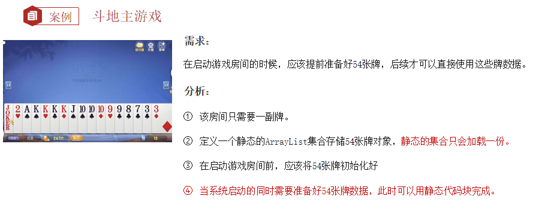

```java
public class StaticCodeTest3 {
    /**
       模拟初始化牌操作
         点数: "3","4","5","6","7","8","9","10","J","Q","K","A","2"
         花色: "♠", "♥", "♣", "♦"
       1、准备一个容器，存储54张牌对象，这个容器建议使用静态的集合。静态的集合只加载一次。
     */
    public static ArrayList<String> cards = new ArrayList<>();

    /**
       2、在游戏启动之前需要准备好54张牌放进去，使用静态代码块进行初始化
     */
    static{
        // 3、加载54张牌进去。
        // 4、准备4种花色：类型确定，个数确定了
        String[] colors = {"♠", "♥", "♣", "♦"};
        // 5、定义点数
        String[] sizes = {"3","4","5","6","7","8","9","10","J","Q","K","A","2"};
        // 6、先遍历点数、再组合花色
        for (int i = 0; i < sizes.length; i++) {
            // sizes[i]
            for (int j = 0; j < colors.length; j++) {
                cards.add(sizes[i] + colors[j]);
            }
        }
        // 7、添加大小王
        cards.add("小🃏");
        cards.add("大🃏");
    }

    public static void main(String[] args) {
        System.out.println("新牌：" +  cards);
    }
}
```

### 3.单例设计模式

- **什么是设计模式（Design pattern）**
  		开发中经常遇到一些问题，一个问题通常有n种解法的，但其中肯定有一种解法是最优的，这个最优的解法被人总结出来了，称之为设计模式。
    		设计模式有20多种，对应20多种软件开发中会遇到的问题，学设计模式主要是学2点：第一：这种模式用来解决什么问题。第二：遇到这种问题了，该模式是怎么写的，他是如何解决这个问题的。

- **单例模式**

  ​		可以保证系统中，应用该模式的这个类永远只有一个实例，即**一个类永远只能创建一个对象。**
  ​		例如任务管理器对象我们只需要一个就可以解决问题了，可以节省内存空间。

- **单例的实现方式：**

​                饿汉单例模式。懒汉单例模式。

- **饿汉单例模式**

  即像要饿死了一样，我希望午饭已经提取给我准备好了，我可以直接吃！，即在用类获取对象的时候，对象已经提前为你创建好了。有一点注意哦，对象名也是一个变量哦

  设计步骤：
  		定义一个类，把构造器私有。
  		定义一个静态变量存储一个对象。(静态对象)

  ```java
  // 饿汉类
  public class SingleInstance1 {
      /**
         定义一个静态变量存储一个对象即可 :属于类，与类一起加载一次
       */
      public static SingleInstance1 instance = new SingleInstance1();
    
      private SingleInstance1(){
      }
  }
  
  // 测试类
  public class Test {
      public static void main(String[] args) {
          SingleInstance1 s1 = SingleInstance1.instance;
          SingleInstance1 s2 = SingleInstance1.instance;
          SingleInstance1 s3 = SingleInstance1.instance;
          System.out.println(s1);
          System.out.println(s2);
          System.out.println(s3);
          System.out.println(s1 == s2); 	//true
      }
  }
  ```

- ​	**懒汉模式**

  即我都要饿死了，但我太懒了，菜都洗好了，但不提前区做饭，硬要等到12点了再去做饭；在真正需要该对象的时候，才去创建一个对象(延迟加载对象)。

  设计步骤：
  		定义一个类，把构造器私有。
  		定义一个静态变量存储一个对象。
  		提供一个返回单例对象的方法

  ```java
  // 懒汉类
  public class SingleInstance2 {
      /**
         2、定义一个静态的成员变量用于存储一个对象，一开始不要初始化对象，因为人家是懒汉
       */
      private static SingleInstance2 instance;
  
      private SingleInstance2(){
      }
  
      /**
        3、提供一个方法暴露，真正调用这个方法的时候才创建一个单例对象
       */
      public static SingleInstance2 getInstance(){
          if(instance == null){
              // 第一次来拿对象，为他做一个对象
              instance = new SingleInstance2();
          }
          return instance;
      }
  }
  // Test class
  public class Test2 {
      public static void main(String[] args) {
          // 得到一个对象
          SingleInstance2 s1 = SingleInstance2.getInstance();
          SingleInstance2 s2 = SingleInstance2.getInstance();
          System.out.println(s1 == s2);
      }
  }
  ```

# 继承

- 关键字：extends（**两个类**之间的关系）子类，父类。所以类都是Object的子类。

- 注意：子类可以继承父类的属性和行为，但是子类不能继承父类的构造器和静态成员。

​			子类可以继承父类的私有成员，只是说不能访问，就像你爸给你了保险箱，但是没有给密码哦，但也					算是你继承下来了呀。父类有两个儿子，一个是对象（多生子，爸爸不喜欢，不想去拿他的东西），					一个是子类（比爸爸流批多了的儿子，把爸爸什么东西都学会了，还自学了很多）

- 有争议的点：子类是否继承了父类的静态成员？

  ​	答案是：没有！是共享关系！

  ​	前面说了静态成员是属于这个类自己的，是独特的东西，但是子类可以直接使用父类的静态成员，对象也可以直接用类的静态成员，但不要这么搞哦。

## 1. 内存原理

子类在创建的时候，会在堆内存里面创建一片区域，然后这片里面会再划分一个父类空间(super)和一个子类空间(this)！

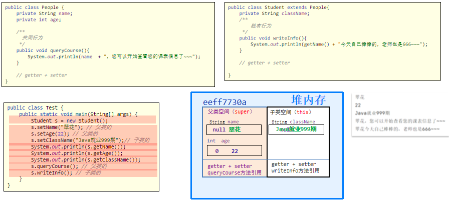

## 2. 继承后，成员访问的特点

- 就近原则，先找子类里面的，再找父类里面的。

- super.成员——调用父类的成员；

  this.成员——调用子类的成员；

## 3. 方法重写

子类出现了和父类中一模一样的方法声明，我们就称子类这个方法是重写的方法。（方法名+形参要一模一样）；但要是**已经继承过来**的方法哦！当你有了之后，你再去重新搞一个一模一样的才叫重写。

**@Override重写注解**

## 4. 继承后，子类构造器的特点

- 子类中所有的构造器默认都会先访问父类中**无参构造器**，再执行自己。

- 为什么？
         子类在初始化的时候，有可能会使用到父类中的数据，如果父类没有完成初始化，子类将无法使用父类的数据。
         **子类初始化之前，一定要调用父类构造器先完成父类数据空间的初始化。**

子类构造器的第一行语句默认都是：**super( )**，不写也存在。

当子类想要调用父类的**有参构造器**时，直接用super.(.....)就行，作用是可以初始化继承过来的父类数据。

## 5. this 和super

this引用的是本类对象，super引用的是父类对象。代码中最好用this，super来明确标识。专业优雅！

# 包，权限修饰符

**包：**

就是import呗，很简单，但建立package的规则要是：公司域名倒写，全部小写。

导包注意：

- 相同包下的类可以直接访问，不同包下的类必须导包,才可以使用！导包格式：import 包名.类名;
- 假如一个类中需要用到不同类，而这个两个类的名称是一样的，那么默认只能导入一个类，另一个类要**带包名**访问。

**权限修饰符**

可以修饰成员变量，方法，构造器，内部类。

| **修饰符** | **同一 个类中** | **同一个包中其他类** | **不同包下的子类** | **不同包下的无关类** |
| ---------- | --------------- | -------------------- | ------------------ | -------------------- |
| private    | √               |                      |                    |                      |
| 缺省       | √               | √                    |                    |                      |
| protected  | √               | √                    | √                  |                      |
| public     | √               | √                    | √                  | √                    |

# final关键字

- final 关键字是最终的意思，可以修饰（方法，变量，类）
- 修饰方法：表明该方法是最终方法，不能被重写。
- 修饰变量：表示该变量第一次赋值后，不能再次被赋值(有且仅能被赋值一次)。
- 修饰类：表明该类是最终类，不能被继承。

**final修饰变量的注意**

- final修饰的变量是基本类型：那么变量存储的**数据值**不能发生改变。

- final修饰的变量是引用类型：那么变量存储的**地址值**不能发生改变，但是地址指向的对象内容是可以发生变化的。

# 常量

1. 被 public static final 修饰的成员变量，必须有初始值。

2. 命名规范：英文单词全部大	public static final SCHOOL_NAME= ”西南交大“；
3. 在编译阶段会进行“宏替换”，把使用常量的地方全部替换成真实的字面量。
4. 用处：做信息标志和分类，**但是**虽然可以实现可读性，但是入参值不受约束，代码相对不够严谨，所以有了枚举类。

# 枚举

- 枚举是Java中的一种特殊类型

- 枚举的作用："是为了做信息的标志和信息的分类"。

  入参约束严谨，代码优雅，是最好的信息分类技术！建议使用!

定义枚举类的格式：

```java
修饰符 enum 枚举名称{
            第一行都是罗列枚举类实例的名称。
}
enum Season{
  SPRING , SUMMER , AUTUMN , WINTER
}
```

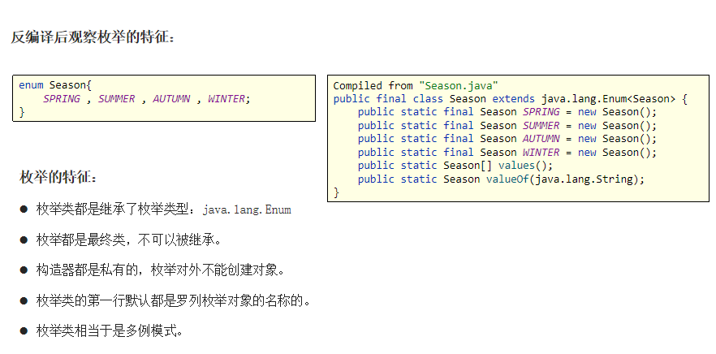

Example:

```java
/**
   做信息标志和分类
 */
public enum Orientation {
    UP, DOWN, LEFT, RIGHT;
}

//	主类
public class EnumDemo2 {
    public static void main(String[] args) {
        // 1、创建一个窗口对象（桌子）
        JFrame win = new JFrame();
        // 2、创建一个面板对象（桌布）
        JPanel panel = new JPanel();
        // 3、把桌布垫在桌子上
        win.add(panel);
        // 4、创建四个按钮对象
        JButton btn1 = new JButton("上");
        JButton btn2 = new JButton("下");
        JButton btn3 = new JButton("左");
        JButton btn4 = new JButton("右");
        // 5、把按钮对象添加到桌布上去
        panel.add(btn1);
        panel.add(btn2);
        panel.add(btn3);
        panel.add(btn4);
        // 6、显示窗口
        win.setLocationRelativeTo(null);
        win.setSize(300,400);
        win.setVisible(true);


        btn1.addActionListener(new AbstractAction() {
            @Override
            public void actionPerformed(ActionEvent e) {
                move(Orientation.UP) ; // 让玛丽往上跳
            }
        });
        btn2.addActionListener(new AbstractAction() {
            @Override
            public void actionPerformed(ActionEvent e) {
                move(Orientation.DOWN) ; // 让玛丽往下跳
            }
        });
        btn3.addActionListener(new AbstractAction() {
            @Override
            public void actionPerformed(ActionEvent e) {
                move(Orientation.LEFT) ; // 让玛丽往左跑
            }
        });
        btn4.addActionListener(new AbstractAction() {
            @Override
            public void actionPerformed(ActionEvent e) {
                move(Orientation.RIGHT) ; // 让玛丽往右跑
            }
        });
    }

    public static void move(Orientation o){
        // 控制玛丽移动
        switch (o) {
            case UP:
                System.out.println("玛丽往上飞了一下~~");
                break;
            case DOWN:
                System.out.println("玛丽往下蹲一下~~");
                break;
            case LEFT:
                System.out.println("玛丽往左跑~~");
                break;
            case RIGHT:
                System.out.println("玛丽往→跑~~");
                break;
        }
    }
}
```

# **抽象类()**

在Java中abstract是抽象的意思，如果一个类中的某个方法的具体实现不能确定，就可以申明成abstract修饰的抽象方法（**不能写方法体了**，即后面不要再加上{  }了）这个类必须用abstract修饰，被称为抽象类。

注意：抽象类不能创建对象，他就是一个充当模板的作用！就是用来被继承的！！

​			只有抽象类和抽象方法哦，其他的东西不能被abstract修饰。

```java
public abstract class Animal{
  public abstract void run()
}
```

- 如果定义了抽象方法，那这个类必须定义为抽象类；但定义一个抽象类里面不一定要有抽象方法。（抽象类中不一定有抽象方法，有抽象方法的类一定是抽象类）

- 一个类如果继承了抽象类，那么这个类必须重写完抽象类的全部抽象方法，否则这个类也必须定义成抽象类。
- 作用：就是用来被子类继承、充当模板的、同时也可以提高代码复用。在一定程度上约束了我这个类的子类必须要有哪几个方法！！！！

Example：

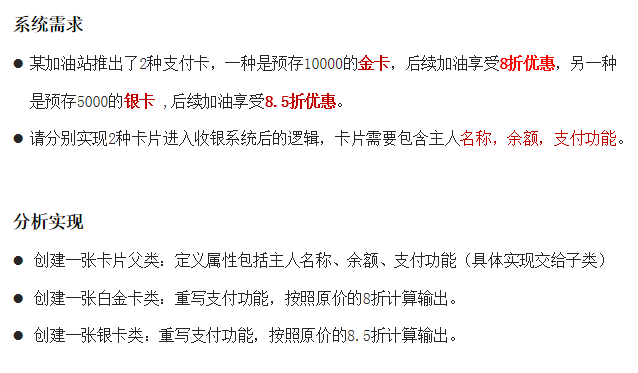

## 应用：模板方法

在抽象类里面，我们不仅定义了抽象方法，我们还定义模板方法！即我们将一个通用的功能写在里面，并且用final 修饰，子类都要用的。然后我们将模板方法中不能决定的功能定义成抽象方法，让具体子类去实现。

final修饰的原因：模板方法是给子类直接使用的，不是让子类重写的，一旦子类重写了模板方法就失效了。

```java
public abstract class Animal{
  public abstract void run()
  public final void login(){
    ........
  }
}
```

## 接口


# 多态

# 常用API

## Object类（所有类的爸爸）

下面Object提供的方法的原因就在于，让子类去重写，本身没有什么意义！

快捷键 Ctrl + O

### 1. toString（）


### 2. equals（）

- 默认是与另外一个对象，比较两者的地址是否一样；
- 让子类重写，以比较2个子类对象的内容是否相同；

## Objects类

Objects 类是 final 修饰的类，不可继承，内部方法都是 **static 方法**，从 jdk1.7 开始才引入了 Objects 类。

这个类与Object还是继承关系，这个类是从1.7开始有的。

### equals(s1，s2)(静态方法）

直接比较两个子类对象的内容是否相同。这个方法安全性最高！！！！

# 内部类


# 处理时间


