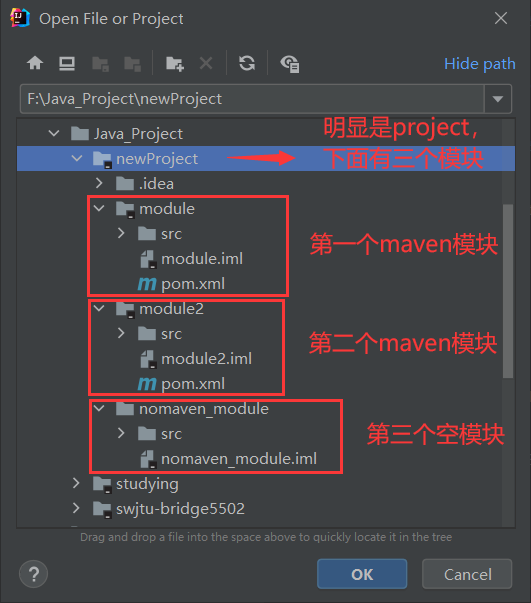

# java常用方法

```java
// 获取对象的数据类型，是什么对象
String s1 = "1212"
s1.getClass().getSimpleName()

// 比较两个未知对象是否相等,有非空校验。
Objects.equals(s1, s2)
 
 // 操作集合和数组用Stream流
  超级好用YYDS
// 获取对象的类的类型
  user instanceof Business（判断user对象是否为Business类的，返回值为boolea）
```


# Java 与Python的不同点

1. print输出方式

   ```java
   //Python
   x = torch.tensor([1, 3, 4])
   print(f"the tensor: \n {x} \n")//推荐这种输出
   print("the tensor:\n", x)
   print("using {} device".format(device))
     
   //Java
   int a = 5;
   System.out.println("a的值是：\n\" + a);
   ```

2. python的变量不需要new，而java在使用一个变量时，一定要先定义变量的类型。

   原因在于，Java的运行方法，有内存、地址的概念。python类似于Matlab，所有的变量都是直接存的数据。

   ```java
   //python
   name = "quanzhou"
   myname = name
   print(myname)
   
   //java
   String name = "quanzhou";
   String myname = name;
   sout(myname);
   并且java这里还会报一个警告，“Local variable 'myname' is redundant”
   因为字符串是引用类型的变量，存的是地址，现在是两个均指向了一个地址，有一个多余
   ```

   

#ABC

1. **javac——编译工具；java——执行工具。文件名=类名**

   HelloWorld：javac HelloWorld.java      》》.class文件

   ​						java HelloWorld

   

2. **JDK里面包含了JRE；JRE中有相关的库和JVM。**

   

   

###**字面量**

   即数据在程序中的书写格式。\n------换行；\t-------空格   

###**变量**

   定义格式： double money = 50 或者 double money

   注意：定义变量可以无初始值，但使用变量前一定要先有值。

  **成员变量（类中）与局部变量的区别（重点）**


###**数据的类型**

   1字节=8位二进制。

   **引用类型**主要指数组和字符串（String），因为他们存储的是地址，而不是具体数据。

   **基本数据类型**：

计算机中数据的最小组成单位：8个二进制位为一组，来保存数据，叫做一个字节byte。其中，每个二进制位称为一个比特bit，即1byte = 8bit。


###**AscII编码表**

**字符（char类型）**在计算机内的存储是二进制形式；

ASCII编码表就是每个字符的约定二进制编号


   并且其他的数据，例如**声音图片视频**均是在计算机里面按照二进制方式存储的。

###**关键字，标识符**


标识符：也就是变量名，类名的命名要求，要以数字，字母，__开头，不能用关键字。 

​		变量名称：驼峰模式，首字母小写，如 int javaNumber = 8；

​		类名称：驼峰，首字母大写，如 HelloWorld.java

### 注释

- 单行注释：//
- 多行注释：/*    */
- 文档注释：/**    */

**API**

Application Programming Interface（应用程序编程接口）

其实就是指：Java写好的程序（功能代码），我们可以直接调用。

# IDEA

## 区分Project和Module

- Project:（用open打开）

  ​		有.idea文件，无.iml文件、src文件夹、pom.xml。idea文件夹存放项目的配置信息

- Module:（用new打开）

  ​		有.iml文件（每个模块都有一个自己的）

- Example
  1. **使用open打开工程**（选工程名文件夹）



​				**2. 使用new导入模块**（选.iml文件）（这个简单，只有模块才有.iml文件，直接找到，选中就可以打开）


##快捷语句：

​	main；sout；

```java
main:
public static void main(String[] args) {
        
    }

sout:
System.out.println();
```


##快捷键：

- ​	**crtl+D**——直接复制当行语句到下一行；
- ​	**Crtl+ALT+L**——格式化；
- ​	**ALT+Shift+↑**——上下移动当前代码；
- ​	**Crtl + ALT +T** ——先选取代码部分，然后按住，可以将代码用**循环语句**包住66666；
- ​    **ALT + Enter**——快速提示，很多地方用到，异常抛出
- ​    **ALT + Insert** ——提示插入的东西
- ​    **Shift + F6** ——选择所有同名的变量，一起更改
- ​    **Ctrl + F12** ——查看实体类内在的成员
- ​    **Ctrl + H**——查看接口的实现类
- ​    **Ctrl + O**，展示出Object中可以重写的方法！！！
- ​    **Ctrl+Alt+V**——自动补全代码
- ​	for 循环的快速操作：arr是我们定义的数组，arr.for i 就可以直接遍历arr数组所有元素。即 " **变量名.for i** "
- ​    增强for——即 " **变量名.for**"


一键生成类中的有参构造器和Getter、Setter方法：

- 定义完成员变量后，直接右键generate，选择Constructor  ，选择要赋值的成员变量，一键生成有参构造器！
- 定义完成员变量后，直接右键generate，选择Getter and Setter 生成所有成员变量的两个方法！

##编写程度的顺序

第一步：创建工程new project（一定是empty）

第二步：创建模块new module

第三步：创建包new package

第四步：创建类new class


##模块工程操作

- **删除模块**操作：module要直接从磁盘里面删除，否则删不干净

- **导入模块**操作：

  ​	1. 关联导入，找目标模块文件夹下的小黑点**.iml文件**（项目文件里面没有此模块代码）


​			2. 创建导入

​				即自己先创建模块，然后再复制代码到自己的src下面。

​				复制的是别人模块src下的代码文件夹，一定注意。

- **打开工程**：

open，注意也是找小黑点，是工程文件夹的小黑点


# Foundation

## 混淆点

### 方法的调用

1. JavaBean里面方法。

   ​		对象调用类里面的成员变量，成员方法的方式：**对象名 . 属性（方法）**

2. 有主函数的类里的方法！

   ​		这个类里面的方法，直接调用其方法名就行了。

###方法的修饰符问题

- 完整的方法定义格式为：

  ​		修饰符  返回值类型  方法名  （形参列表）{

    			方法体代码；

  ​	  		return返回值；

  ​		}

- 然后你会发现在main函数中调用的方法修饰符必须为 public static ，方法必须为静态；而在类里面写方法的时候，修饰符为  public  就行了。原因如下：

  ​		用static修饰的方法，无须产生类的实例对象就可以调用该方法。没有static修饰的方法，需要产生一个类的实例对象才可以调用该方法。static变量是存储在静态存储区的，不需要实例化。在main函数中调用函数只能调用静态的。如果要调用非静态的，那么必须要先实例化对象，然后通过对象来调用非静态方法。


## print写法

使用 + 来连接字符串、数字、变量等输出

```java
int i = 5;
sout("请输入第" + 1 + "个员工名字")//请输入第1个员工名字
sout("请输入第" + i + "个员工名字")

System.out.println(winnumber[i])//输出这个后自动换行
System.out.print(winnumber[i] + "\t")//输出这个后不换行，后面的紧接着输出
```


## 类型转换

### 自动类型转换

因为程序中经常存在不同类型的变量赋值给其他类型的变量，所以要进行类型转换。char是2个字节，int是4个字节


### 表达式的自动类型转换


```java
byte a = 10;
int b = 20;
double c  = 18;
double z = a + b + c;//a+b+c表达式的输出类型为double
System.out.println(z);
//错误情况
byte i = 2;
byte j = 10;
byte k = i + j;//表达式中，byte是先转换成int，再参与运算的
System.out.println(k);
```

### 强制类型转换

强行将大范围类型的变量，数据赋值给小范围类型的变量。转换后可能会有数据缺失。浮点类型——整型，直接丢弃小数部分。

```java
int a = 20;
byte b = a;//这样会错误，因为a是大范围，b是小范围
byte b = (byte)a;
```


## 运算符

###  基本运算符

两个整数相除结果还是整数，因为表达式的最终类型由式子里面最高类型决定（自动类型转换原理）.

```java
a = 10;
b = 3;
c = a / b;
sout(c)>>>3
sout(a * 1.0 / b)>>>3.333333333
```

"+"符号在与字符串运算时作为连接符，结果仍为一个**字符串**。注意字符与字符串的区别，字符在计算机里面就是一个数字类型，当可以一起算时，字符就变成数字进行运算，不能算时，就还是以字符的形式输出。

​		口诀：“能算则算，不能算就在一起”

```java
 int a =5;
sout("abc" + a);//abc5
sout("abc" + 'a')//abca
sout(a + 'a')//102
sout("abc" + a + 'a')//abc5a
sout(a + "" + 'a')//5a
sout
```

### 扩展赋值运算符

唯一注意的点就是：这种运算符隐含了强制类型转换。这与表达式的自动类型转换有一点区别，例如

```java
byte a = 10;
byte b = 20;
int i = a + b;//a + b输出为int类型
a += b;//输出a为byte类型，而不是int。因为他相当于a = (byte)(a + b)
//一定记住扩展赋值运算符，输出类型与前面那个数据类型相同
```


### 逻辑运算符

注意：运算完结果是一个布尔类型数据。True   /    False


### 三元运算符

格式：条件表达式？值1：值2

​		if 表达式==True，则返回值1，否则返回值2。

```java
int score = 98;
String rs = score>=60 ? "Pass":"Fail";
```

## 键盘录入技术

```java
import java.util.Scanner
  
Scanner sc = new Scanner(System.in);
	int age = sc.nextInt();
	String name = sc.next();//输入字符串
```

## 流程控制

### 顺序结构

即按照代码顺序从上往下执行。

### 分支结构

1. if 语句

```java
if(条件表达式){
  语句;
}
//python
if 条件表达式:
	语句
```

2. switch

   注意事项：

   switch（）里面的表达式只能是 **byte，short， int， char**，枚举，String，不支持float，double，long。

   case给的值不允许出现重复，而且只能是字面量，不能是变量。即可以是"aa", ’a'，不能说int a = 5；这个a。

   记得break，否则出现穿透，把下面case的结果都执行。

```java
//表达式！=条件表达式
switch(表达式/变量){
  case 值1 :
    执行语句....；
    break;
  case 值2 :
    执行语句....;
    break;
  default:
    执行语句....;
}
```


### 循环结构

1.  for语句

```java
for(int i =0; i< 3; i++){
  sout("hello world")
}

//python
for i in range(5):
	aaaaa
```

2.  while

```java
while(){
  
}
```

3.   do - while

```java
do{
  
}while();
```

4. **死循环**

```java
while(true){
  sout("si diao la")
}

break ————立即退出该次循环
```

###break，continue

break: 跳出并且结束当前循环的执行。

continue：用于跳出当前循环的当次循环，进入下一次循环

## Random

```java
import java.util.Random;

Random r = new Random();
int number = r.nextInt(10);//0 ~ 9 的随机数，不包含10.
sout("随机产生了：" + number)
```

## 数组

记住：数组变量名称存储的是数组第一个对象的内存地址，所以数组是引用类型。

计算机编号都是从0开始，matlab不是计算机编号。


1.  初始化时赋值（静态初始化）

```java
String names[] = {'a', 'b', 'c'};// 等价于String names = new int[]{'a', 'b', 'c'}
sout(names);// [I@7699a589，数组名称存储的是，数组对象第一个数据的内存地址（与c++一样）
sout(names[0]);
int len = arr.length;//数组长度
```

2. 先初始化，后赋值（动态初始化）

```java
int arr[] = new int[3];//也会在内存中，先创建数组对象，和静态是一样的，只不过数据都是初始值。
arr[0] = 100;
sout(arr[0]);
```

动态初始化时，各类型数组元素的默认值为：


## 数组的内存图

例子：


### 方法区

字节码文件，方法，类，加载时进入的内存

###  栈

方法运行时所进入的**内存变量**在这里

### 堆内存

**new出来的东西**（对象）会在这块内存中开辟空间，并产生地址

### 常见问题

1. 访问的元素位置超过最大索引。
2. 数组变量中没有存储数组的地址，而是null，则访问时会出现NullPointerException

## 方法

注意：方法与方法之间是平级的， 不能嵌套定义，只能相互调用。

return执行之后，后面的语句均不会再执行。


### 两种基本的定义


每个方法都有返回值类型，voi代表没有返回值， 但并不是说，该方法没有返回值类型。

```java
//第一种
public static void fun1(int a, int b){
  int c = a + b;
  sout(c);
}
//第二种
public static char getchar(){
  return 'a';
}
```

###  方法的内存原理

定义的所有方法，包括主方法，还有次方法，运行的时候

1. 类文件编译成.class文件

2. 所有的方法到方法区里面，
3. 按照main（）里面顺序按个到栈内存去执行，涉及到了堆内存的就再去堆内存里面；
4. 注意当运行完一个方法后，java会自动清除掉该方法。


### 方法的参数传递机制

1. 基本类型的参数传递（整数，浮点，字符，布尔）

   **只涉及到了内存里面的方法区和栈内存**，因为他没有new一个对象

   关键词：**值传递**；	原因：定义的基本类型，均是直接存储的是数据。

   在传输实参给方法的形参时，传的时实参变量中存储的值，而不是实参本身。

   形参的变化不会影响实参。


2. 引用类型的参数传递（数组，String）

   这个涉及到了java里面所有的内存，方法区，栈内存，堆内存。

   关键词：值传递

   但是形参引起的变化会改变实参，为什么呢？

   因为引用类型存储的是堆内存里面对象的地址，传递的时候也是传递的是地址，形参实参均指向一个地址，所有说形参的变换会导致实参里面的变化。因为他们两个都仅仅是指向撒，最终的数据是堆内存里面的。

   

   

###方法重载

同一个类中，出现多个**方法名称**相同，但是**形参列表**不同，这些方法就是重载方法。（不用管修饰符和返回值类型）

### return关键字的单独使用

return；

-------->可以立即跳出并且结束当前方法的执行。return的单独使用可以用在void任何方法中。

# 面对对象编程

面向：就是拿或者找的意思

对象：就是东西的意思

面对对象编程：拿东西过来编程

## 设计类并创建对象

必须先设计类，才能获得对象。类：就是设计图纸，对象就是设计出来的实例。

在编程时，新建一个.class文件，然后写完类的内容，再新建一个.class文件，main方法就可以直接使用 这个类去创建对象

```java
public class 类名{
    1. 成员变量（代表属性，一般是名词）
    2. 成员方法（代表行为，一般是动词）
    3. 构造器
    4. 代码块
    5. 内部类  
}

//创建对象与对象数组。
类名 对象名 = new 构造器();
类名[] 对象数组名 = new 构造器[100]//和创建数组类似，类本身也是一个类型。里面存储的是每个对象的堆内存地址，初始值为null。

example：
//定义类：
  public class Car{
    //属性，成员变量
    String name;
    double price;
    //行为,方法
    public void start(){
      
    }
    public void run(){
      
    }
  }
//获得类的对象：
Car mycar = new Car();
mycar.name = "大蹦";
mycar.price = 1000;
mycar.start();
mycar.run();
//创建对象数组
Car[] Carshop = new Car[100];//Carshop= [null, null, null, .....]
```


注意事项：

一个java文件中可以定义多个class类，并且只有一个类是public修饰，并且public修饰的类名必须成为代码文件名。

实际开发中，建议还是一个文件定义一个class类。

## 对象的内存图

### 两个对象的内存图：


1. 对象放在堆内存中。对象里的方法还是放在方法区内。
2. Car c = new Car();  c变量名存储的是对象在堆内存中的地址。

### 两个变量指向同一个对象

即把一个对象S1，直接赋值给另一个相同的对象类型S2.

这个和数组的类似，对象名都是存储的对象的堆内存地址。

## 构造器

重点了，一定注意！

第一点：前面不是说了，要获得对象，先要创建一个类嘛，然后通过Car mycar = new Car();  获得我们的对象mycar，存储堆内存里面的对象数据的地址。但是这个对象是由这个Car（）类，创建的吗？ 答案是：NO。他是由这个Car（）类里面的构造器创建的。啊，那里有构造器啊，我木有写啊，也没有看到相关的代码啊！那是因为在你创建类的时候，java会自动给你创建一个默认的无参数构造器，并且不会显示出来代码！   它有点类似于Python里面的__init__函数，是用来初始化配置的，只不过python里面的是显式的，这个是隐式的，下面会细讲。 

### 构造器的作用

用于初始化一个类的对象，并且返回对象的地址。

前面的这段获得对象的代码Car mycar = new Car()，里面的new的后面是这个类嘛？不，他是类里面的构造器！

- 无参数构造器：默认存在的，初始化对象时，成员变量均采用默认值。
- 有参构造器：自己写，在初始化对象的时候，可以为对象属性赋值。
- 注意：假如你写了有参构造器，那么java默认的这个无参构造器会自动清除！如果需要无参的，就需要自己再去创建了。

```java
//构造器的定义形式
修饰符	类名（形参列表）{
  ...
}

//Example
public class Car(){
  ...
  // 无参数构造器。（默认存在，隐式）
  public Car(){
    ...
  }
  // 有参数构造器
  public Car(String name, String price){
    ...
  }
}
```

快捷键：定义完成员变量后，直接右键generate，选择Constructor  ，选择要赋值的成员变量，一键生成有参构造器！

## this关键字

作用：在成员方法和构造器中使用；代表当前对象的地址，用于访问当前对象的成员变量，方法。

```java
public class Car(){
  String name;
  double price;
  //构造器与this共同使用
  public Car(String name, double price){
    this.name = name;
    this.price = price;
  }
  
  //这样也可以赋值成功，但是很不好看，不专业 ！所以出现了this的使用
    public Car(String n, double p){
		name = n;
		price = p;
  }
}
```

# 面对对象的三大特征

# 封装

简言之：”合理隐藏，合理暴露“。  很简单，就是在原来类的简单定义上面，将成员变量进行封装（private）一下，然后加两个对象访问成员变量的方法！

作用：增加程序代码的安全性。并且适当的封装可以提高效率，让程序更容易理解与维护

封装实现步骤：

- 对成员变量使用  private 关键字修饰进行隐藏，private修饰后该属性就只能在当前类中访问。
- 然后提供public修饰的getter、setter方法暴露其赋值与取值。

举个例子就知道了：

```java
//Define class
public class Car(){
  //对属性private
  private String name;
  private double price;
  //提供各个属性的getter、setter方法
  //name
  public void setName(String name){
    this.name = name;
  }
  public String getName(){
    return name;
  }
  //price
  public void setPrice(double price){
    this.price = price;
  }
  public double getPrice(){
    return price;
  }
}
```

快捷键：定义完成员变量后，直接右键generate，选择Getter and Setter 生成所有成员变量的两个方法！

## JavaBean

其实就是把前面的类啊，对象啊，构造器，this等 合并上封装全部整合起来，定义了一套标准的实体类的写法，以后所有的类都按照这种写法就行了！

1. 成员变量用private修饰；
2. 每个成员变量提供对应的Getter、Setter方法；
3. 必须提供一个无参构造器；（重点罗）


# String类

定义：java.lang.String类代表字符串，String类定义的变量可以用于指向字符串，然后操作该字符串。

Java程序中所有的字符串文字（如“abac”）都是此类的对象！（只是简写了而已，就像基本类型一样，但它还是一个类啊，我们定义的那个叫对象，所以前面一直说字符串是引用类型的变量）。

​	**+ 号**用于字符串拼接，拼接前会把与字符串相加的任何类型转成字符串，再拼接成一个新的字符串； 

**创建字符串对象的两种方式：**

- 第一种：直接使用 “  ” 定义。

```java
String name = "heima";
//正常我们创建对象的写法是：Car mycar = new Car();
```

- 第二种：使用类里面的构造器创建

  

  其中byte这里，因为byte类型范围是-128-128，它会把字节数组里面的整数全部转化成相应的字符！

```java
String name = new String();//不用
String name = new String("heima");//不用

//第三种
char[] ch = new char[]{'A','B','c'};
String name = new String(ch);

//第四种
byte[] bt = new byte[]{97,98,99};
String name = new String(bt);
name.sout
>>>abc
```

**这两种定义方式的区别**

- 以 “  ” 方式给出的字符串对象，会在常量池里面，并且相同的字符串内容只会存储一份。

- 通过构造器new出来的对象，每new一次会产生一个新的对象，就算是字符串内容相同也会产生新的对象，存储在堆内存里面

  ```java
  String s1 = "abc";
  String s2 = "abc";
  sout(s1 == s2); //true
  
  char[] chs = new char[]{'a', 'b', 'c'};
  String s3 = new String(chs);
  String s4 = new String(chs);
  sout(s3 == s4);  //False
  ```

  

**注意**：String是不可变字符串类型，因为它的对象在创建后不能被更改！因为String变量每次的修改其实都是产生并指向了新的字符串对象，原来的字符串对象没有发生改变。

## String对象内存原理

- 以双引号 “  ” 给出的字符串对象，存储在堆内存中的字符串常量池；（看见了 “  ” 的就一定会在常量池里面创建一个对象，不管位置在哪里
- 其他情况的字符串对象均存储在堆内存中（不在字符串常量池）；
- java存在编译优化机制，在程序编译时，"a" + "b" + "c" 会直接转化成  "abc"  !（仅限于这种一模一样的）

**Example1：**

```java
public static void main(Stringp[] args){
  String name = "传智";//第一步
  name += "教育";// 第二步
  name += "中心";// 第三步
}
```

第一步：传智以 ”  ”形式给出，所以放在字符串常量池！name对象存储其地址。


第二步：”教育“也存放在字符串常量池，然后name这边进行了 “+” 的字符串运算，结果放在堆内存里面，然后新的字符串数据的地址，给name存储。这就说明了为什么String类型是不可变字符串，因为他的对象创建后，在堆内存的数据就不会被删除了，只会出现重新指向的情况！


第三步：


**Example2：**

这行代码 创建了几个对象？

```java
String s = new String("abc");
```


## String类常用API

1. **比较字符串内容（boolean）**

|                     方法名                      |                             说明                             |
| :---------------------------------------------: | :----------------------------------------------------------: |
|     public boolean equals ( String another)     | 该字符串对象与指定字符串对象比较，只关心字符串内容是否完完全全一致 |
| public boolean equalsIgnoreCase(String another) |         也是比较内容，但忽略大小写，常用于验证码！！         |

为什么不用 == 来比较？因为字符串对象是引用类型，不是直接存储数据，再加上其内存的独特性，完全不能用==比较，根本判断不对！

2. **返回字符串长度**

   ```java
   public int length()
   ```

   

3. **获取字符串某个索引位置的字符**

   ```java
   public char charAt(int index)
   ```

   

4. **将当前字符串转换成字符数组返回**

   ```java
   public String toCharArray()
   ```

   

5. **根据开始和结束的索引进行截取，得到新的字符串（左闭右开）**

   ```java
   public String substring(int beginIndex, int endIndex)
   ```

6. **从传入的索引处截取，一直截取到末尾处，得到新的字符串**

   ```java
   public String substring(int beginIndex)
   ```

7. **将字符串里面的某一段值，用新给的值替换掉，返回新的字符串**

   ```java
   public String replace(String target, String replacement)
   ```

8. **切割字符串，得到一个字符串数组并返回（常用 " , "  " ; "  等）**

   ```java
   public String[] split(String s)//"," ";"
   ```

9. **判断该字符串内容里是否含有传入的字符串内容**

   ```java
   public boolean contains(String s)
   ```

   

10. **判断该字符串是否以输入的字符串内容开始**

    ```java
    public boolean startsWith(String s)
    ```

# ArrayList 集合

## 快速入门


```java
ArrayList list = new ArrayList();
list.add("java");
list.add(17);
list.add(17.5);
list.add(True);
sout(list);
list.add(1,"插入中国");
System.out.println(list);
>>>
    [java, 17, 17.5, true]
    [java, 插入中国, 17, 17.5, true]
```

## 泛型（统一集合内的元素类型）

ArrayList<E>：其实就是一个**泛型类**，可以在编译阶段约束集合对象只能操作某种数据类型。并不是所有类都支持泛型，要看类的后面有没有这个<E> .

**举例：**

-  ArrayList<String> ：此集合只能操作字符串类型的元素。 
-  ArrayList<Integer>：此集合只能操作整数类型的元素。int是基本类型不支持，Integer是整数的引用类型。

注意：**集合中只能存储引用类型，不支持基本数据类型。**

```java
ArrayList<String> list1 = new ArrayList(); //List1内只能添加String类型
```

## ArrayList常用方法

其中E——表示其集合泛型设置的 元素类型。

**public E get(int index)** 		返回指定索引处的元素

**public int size()**	 		返回集合中的元素的个数

**public E remove(int index)** 		删除指定索引处的元素，返回被删除的元素

**public boolean remove(Object o)** 		删除指定的元素，返回删除是否成功；有重复的只删除前面那个

**public E set(int index,E element)** 		修改指定索引处的元素，返回被修改的元素

注意：直接用其对象调用方法即可，他会修改到其对象的内容。

## ArrayList存储自定义类型（类）

自定义类型是什么？ 类就是一种类型啊，String也是一个类啊！**类就是一种类型！**

其实简单来说，就是用集合去存储我们的多个对象名，方便遍历使用。集合中存储的元素并不是对象本身，而是对象的地址。

```java
Movie 是我们创建的影片类；
movie1是我们创建的第一个对象；
movie2是我们创建的第一个对象；
movie3是我们创建的第一个对象；

  ArrayList<Movie> mymovies = new ArrayList<>();
	mymovies.add(movie1);
	mymovies.add(movie2);
	mymovies.add(movie3);
	mymovies.add(new Movie("肖生客的救赎",9,"罗冰四")); //简单，没有创建对象名变量	
	mymovies.add(new Movie("《阿甘正传》", 9.5 , "汤姆.汉克斯"));

   //遍历集合中的影片对象并展示出来
        for (int i = 0; i < movies.size(); i++) {
            Movie movie = movies.get(i);
            System.out.println("片名：" + movie.getName());
            System.out.println("评分：" + movie.getScore());
            System.out.println("主演：" + movie.getActor());
```

## ArrayList遍历删除

因为集合的大小是随着你的每次删除而变化的，每次删除之后，集合内的数据索引会马上发生变化! 索引在后面的元素会直接放到前面来。

假如你要删除98, 77, 66, 89, 79, 50, 100中，小于80的数据，直接从0开始遍历删除的话就会出现只删除了77，79的情况！

解决办法：**从集合后面遍历然后删除，可以避免漏掉元素。**

## ArrayList应用：元素搜索


```java
public class Student {
    private String studyId;
    private String name;
    private int age;
    private String className;
  
  	.....Getter,Setter,Construtor
}

public class ArrayListTest6 {
    public static void main(String[] args) {
        // 1、定义一个学生类，后期用于创建对象封装学生数据
        // 2、定义一个集合对象用于装学生对象
        ArrayList<Student> students = new ArrayList<>();
        students.add(new Student("20180302","叶孤城",23,"护理一班"));
        students.add(new Student("20180303","东方不败",23,"推拿二班"));
        students.add(new Student( "20180304","西门吹雪",26,"中药学四班"));
        students.add(new Student( "20180305","梅超风",26,"神经科2班"));
        System.out.println("学号\t\t名称\t年龄\t\t班级");

        // 3、遍历集合中的每个学生对象并展示其数据
        for (int i = 0; i < students.size(); i++) {
            Student s = students.get(i);
            System.out.println(s.getStudyId() +"\t\t" + s.getName()+"\t\t"
                    + s.getAge() +"\t\t" + s.getClassName());
        }

        // 4、让用户不断的输入学号，可以搜索出该学生对象信息并展示出来（独立成方法）
        Scanner sc = new Scanner(System.in);
        while (true) {
            System.out.println("请您输入要查询的学生的学号：");
            String id = sc.next();
            Student s = getStudentByStudyId(students, id);
            // 判断学号是否存在
            if(s == null){
                System.out.println("查无此人！");
            }else {
                // 找到了该学生对象了，信息如下
                System.out.println(s.getStudyId() +"\t\t" + s.getName()+"\t\t"
                        + s.getAge() +"\t\t" + s.getClassName());
            }
        }
    }

    /**
      根据学号，去集合中找出学生对象并返回。
     * @param students
     * @param studyId
     * @return
     */
    public static Student getStudentByStudyId(ArrayList<Student> students, String studyId){
        for (int i = 0; i < students.size(); i++) {
            Student s = students.get(i);
            if(s.getStudyId().equals(studyId)){
                return s;
            }
        }
        return null; // 查无此学号！
    }
}
```

# static修饰符

static是静态的意思，可以修饰成员变量和成员方法。静态的东西都是最最最先加载的，没在类创建的同时加载，比对象里面的任何东西都早！注意：静态的东西只能处理静态的哦！

## 静态成员变量

从现在类的成员变量分为两类：

- 静态成员变量：static修饰，**属于类**的东西，堆内存中只存储一份，随着类的创建同时产生，可以被共享访问、修改。也是可以被对象访问！

  调用方式：类名.静态成员变量（仅仅限于在该类的内部使用的时候，可以不加类名）；对象.静态成员变量（不要用这种哦，很不专业）

- 实例成员变量：无static修饰，就是我们一般写的那个，属于**每个对象的东西**（记住，类有多个对象哦）。

静态成员变量用于表示：在线人数等需要被共享的信息。

**注意哦：**对象名也是一个变量哦，它也可以作为静态成员变量！还有静态集合哦，这几个才用的多！

**内存原理：**

1. 类编译完，在方法区生成.class的时候，会同时在堆内存创建该类的静态变量区，加载我们的静态成员变量。

2. 后面创建的每个类的对象，都会自动指向该静态变量区哦

   

## 静态成员方法

类的成员方法从现在开始分为两种：

- 静态成员方法（有static修饰，属于类），随着类的创建同时在方法区里面加载，建议用类名访问，也可以用对象访问。

  调用：类名.静态成员方法（仅仅限于在该类的内部使用的时候，可以不加类名）

- 实例成员方法（无static修饰，属于对象），只能用对象触发访问。

  调用：对象.实例成员方法

静态成员方法用于：以执行一个通用功能为目的，或需要方便访问，可以申明成静态方法 

## static访问时权限

- 静态方法只能访问静态的成员，不可以直接访问实例成员。
- 实例方法可以访问静态的成员，也可以访问实例成员。
- 静态方法中是不可以出现this关键字的。 

只要记住：静态的是属于类的，只能访问属于类的，不能访问对象的；但对象是类的儿子，所以对象可以访问类的。

静态的东西是属于类的，类自己的东西之间肯定可以相互访问，因为类有无数个对象，类区访问实例的成员，方法，我怎么知道它是访问的哪个对象的呢，对不对！；但因为对象是我类的儿子，我不能太狠心，爸爸买的车（变量和方法）也可以借儿子开开，但爸爸并不是很乐意，最好不要找我借车开！this代表的意义是当前最近的对象啊，跟我类里面的东西有什么关系呢。

## static的应用

### 工具类

工具类中定义的都是一些静态方法，每个方法都是以完成一个共用的功能为目的。

- 工具类的好处：

  一是调用方便，二是提高了代码复用（一次编写，处处可用）

- 为什么工具类中的方法不用实例方法做？ 

  实例方法需要创建对象调用，此时用对象只是为了调用方法，这样只会浪费内存。

- 工具类的定义注意

  建议将工具类的**构造器进行私有**，工具类无需创建对象。

  里面都是静态方法，直接用类名访问即可。

```java
// 静态工具类
public class VerifyTool {
    /**
       私有构造器
     */
    private VerifyTool(){
    }

    /**
      静态方法
     */
    public static String createCode(int n){
        // 1、使用String开发一个验证码
        String chars = "abcdefghijklmnopqrstuvwxyzABCDEFGHIJKLMNOPQRSTUVWXYZ0123456789";
        // 2、定义一个变量用于存储5位随机的字符作为验证码
        String code = "";
        // 3、循环
        Random r = new Random();
        for (int i = 0; i < n; i++) {
            int index = r.nextInt(chars.length());
            // 4、对应索引提取字符
            code += chars.charAt(index);
        }
        return code;
    }
}

//	测试类
public class Register {
    public static void main(String[] args) {
        // 验证码：
        System.out.println("验证码：" + VerifyTool.createCode(5));
    }
} 
```

### 静态代码块

- 代码块是类的5大成分之一（成员变量、构造器，成员方法，**代码块**，内部类），定义在**类中方法外**。   

- 在Java类下，使用 **{ }** 括起来的代码被称为代码块 。

- 代码块分为 

  **静态代码块:** 
  格式：static{  }
  特点：static关键字修饰，随着类的加载而加载，并且自动触发、**有且仅执行一次**（意			思是这个代码里面的内容，只会自动执行一次，后面不能被调用了，与静态成			员变量，方法不同，他们被加载后，可以被无数次调用）
  使用场景：**类初始化的时候静态数据初始化的操作**，以便后续使用。（只能处理静态）

   **构造代码块**（了解，用的少）：
  格式：{  }
  特点：每次创建对象，调用构造器执行时，都会执行该代码块中的代码，并且在构造器执行前执行
  使用场景：初始化实例资源。

使用范例：

```java
public class TestDemo1 {

    public static String schoolName;
    
    static{
        System.out.println("==静态代码块被触发执行==");
        schoolName = "黑马程序员";
    }

    public static void main(String[] args) {
        System.out.println("=========main方法被执行输出===========");
        System.out.println(schoolName);
    }
}
```


```java
public class StaticCodeTest3 {
    /**
       模拟初始化牌操作
         点数: "3","4","5","6","7","8","9","10","J","Q","K","A","2"
         花色: "♠", "♥", "♣", "♦"
       1、准备一个容器，存储54张牌对象，这个容器建议使用静态的集合。静态的集合只加载一次。
     */
    public static ArrayList<String> cards = new ArrayList<>();

    /**
       2、在游戏启动之前需要准备好54张牌放进去，使用静态代码块进行初始化
     */
    static{
        // 3、加载54张牌进去。
        // 4、准备4种花色：类型确定，个数确定了
        String[] colors = {"♠", "♥", "♣", "♦"};
        // 5、定义点数
        String[] sizes = {"3","4","5","6","7","8","9","10","J","Q","K","A","2"};
        // 6、先遍历点数、再组合花色
        for (int i = 0; i < sizes.length; i++) {
            // sizes[i]
            for (int j = 0; j < colors.length; j++) {
                cards.add(sizes[i] + colors[j]);
            }
        }
        // 7、添加大小王
        cards.add("小🃏");
        cards.add("大🃏");
    }

    public static void main(String[] args) {
        System.out.println("新牌：" +  cards);
    }
}
```

### 单例设计模式

- **什么是设计模式（Design pattern）**
  		开发中经常遇到一些问题，一个问题通常有n种解法的，但其中肯定有一种解法是最优的，这个最优的解法被人总结出来了，称之为设计模式。
    		设计模式有20多种，对应20多种软件开发中会遇到的问题，学设计模式主要是学2点：第一：这种模式用来解决什么问题。第二：遇到这种问题了，该模式是怎么写的，他是如何解决这个问题的。

- **单例模式**

  ​		可以保证系统中，应用该模式的这个类永远只有一个实例，即**一个类永远只能创建一个对象。**
  ​		例如任务管理器对象我们只需要一个就可以解决问题了，可以节省内存空间。

- **单例的实现方式：**

​                饿汉单例模式。懒汉单例模式。

- **饿汉单例模式**

  即像要饿死了一样，我希望午饭已经提取给我准备好了，我可以直接吃！，即在用类获取对象的时候，对象已经提前为你创建好了。有一点注意哦，对象名也是一个变量哦

  设计步骤：
  		定义一个类，把构造器私有。
  		定义一个静态变量存储一个对象。(静态对象)

  ```java
  // 饿汉类
  public class SingleInstance1 {
      /**
         定义一个静态变量存储一个对象即可 :属于类，与类一起加载一次
       */
      public static SingleInstance1 instance = new SingleInstance1();
    
      private SingleInstance1(){
      }
  }
  
  // 测试类
  public class Test {
      public static void main(String[] args) {
          SingleInstance1 s1 = SingleInstance1.instance;
          SingleInstance1 s2 = SingleInstance1.instance;
          SingleInstance1 s3 = SingleInstance1.instance;
          System.out.println(s1);
          System.out.println(s2);
          System.out.println(s3);
          System.out.println(s1 == s2); 	//true
      }
  }
  ```

- ​	**懒汉模式**

  即我都要饿死了，但我太懒了，菜都洗好了，但不提前区做饭，硬要等到12点了再去做饭；在真正需要该对象的时候，才去创建一个对象(延迟加载对象)。

  设计步骤：
  		定义一个类，把构造器私有。
  		定义一个静态变量存储一个对象。
  		提供一个返回单例对象的方法

  ```java
  // 懒汉类
  public class SingleInstance2 {
      /**
         2、定义一个静态的成员变量用于存储一个对象，一开始不要初始化对象，因为人家是懒汉
       */
      private static SingleInstance2 instance;
  
      private SingleInstance2(){
      }
  
      /**
        3、提供一个方法暴露，真正调用这个方法的时候才创建一个单例对象
       */
      public static SingleInstance2 getInstance(){
          if(instance == null){
              // 第一次来拿对象，为他做一个对象
              instance = new SingleInstance2();
          }
          return instance;
      }
  }
  // Test class
  public class Test2 {
      public static void main(String[] args) {
          // 得到一个对象
          SingleInstance2 s1 = SingleInstance2.getInstance();
          SingleInstance2 s2 = SingleInstance2.getInstance();
          System.out.println(s1 == s2);
      }
  }
  ```

# 继承

- 关键字：**extends**（**两个类之间的关系**）子类，父类。**所以类都是Object的子类。**

- 注意：子类可以继承父类的属性和行为，但是子类不能继承父类的构造器和静态成员。

​	子类可以继承父类的私有成员，只是说不能访问，就像你爸给你了保险箱，但是没有给密码哦，但也算是你继承下来了呀。父类有两个儿子，一个是对象（多生子，爸爸不喜欢，不想去拿他的东西），一个是子类（比爸爸流批多了的儿子，把爸爸什么东西都学会了，还自学了很多）

- **有争议的点：**子类是否继承了父类的静态成员？

  ​	答案是：没有！是共享关系！

  ​	前面说了静态成员是属于这个类自己的，是独特的东西，但是子类可以直接使用父类的静态成员，对象也可以直接用类的静态成员，但不要这么搞哦。

## 内存原理

子类在创建的时候，会在堆内存里面创建一片区域，然后这片里面会再划分一个父类空间(super)和一个子类空间(this)！


##  继承后，成员访问的特点

- 就近原则，先找子类里面的，再找父类里面的。

- super.成员——调用父类的成员；

  this.成员——调用子类的成员；

## 方法重写

子类出现了和父类中一模一样的方法声明，我们就称子类这个方法是重写的方法。（方法名+形参要一模一样）；但要是**已经继承过来**的方法哦！当你有了之后，你再去重新搞一个一模一样的才叫重写。

**@Override重写注解**

## 继承后，子类构造器的特点

- 子类中所有的构造器默认都会先访问父类中**无参构造器**，再执行自己。

- 为什么？
         子类在初始化的时候，有可能会使用到父类中的数据，如果父类没有完成初始化，子类将无法使用父类的数据。
         **子类初始化之前，一定要调用父类构造器先完成父类数据空间的初始化。**

子类构造器的第一行语句默认都是：**super( )**，不写也存在。

当子类想要调用父类的**有参构造器**时，直接用super.(.....)就行，作用是可以初始化继承过来的父类数据。

## this 和super

this引用的是本类对象，super引用的是父类对象。代码中最好用this，super来明确标识。专业优雅！

# 包，权限修饰符

**包：**

就是import呗，很简单，但建立package的规则要是：公司域名倒写，全部小写。

导包注意：

- 相同包下的类可以直接访问，不同包下的类必须导包,才可以使用！导包格式：import 包名.类名;
- 假如一个类中需要用到不同类，而这个两个类的名称是一样的，那么默认只能导入一个类，另一个类要**带包名**访问。

**权限修饰符**

可以修饰成员变量，方法，构造器，内部类。

| **修饰符** | **同一 个类中** | **同一个包中其他类** | **不同包下的子类** | **不同包下的无关类** |
| ---------- | --------------- | -------------------- | ------------------ | -------------------- |
| private    | √               |                      |                    |                      |
| 缺省       | √               | √                    |                    |                      |
| protected  | √               | √                    | √                  |                      |
| public     | √               | √                    | √                  | √                    |

# final关键字

- final 关键字是最终的意思，可以修饰（方法，变量，类）
- 修饰方法：表明该方法是最终方法，不能被重写。
- 修饰变量：表示该变量第一次赋值后，不能再次被赋值(有且仅能被赋值一次)。
- 修饰类：表明该类是最终类，不能被继承。

**final修饰变量的注意**

- final修饰的变量是基本类型：那么变量存储的**数据值**不能发生改变。

- final修饰的变量是引用类型：那么变量存储的**地址值**不能发生改变，但是地址指向的对象内容是可以发生变化的。

# 常量

1.  **public static final** 修饰的成员变量，必须有初始值。

2. 命名规范：英文单词全部大	public static final SCHOOL_NAME= ”西南交大“；
3. 在编译阶段会进行“宏替换”，把使用常量的地方全部替换成真实的字面量。
4. 用处：做信息标志和分类，**但是**虽然可以实现可读性，但是入参值不受约束，代码相对不够严谨，所以有了枚举类。

# 枚举

- 枚举是Java中的一种特殊类型

- 枚举的作用："是为了做信息的标志和信息的分类"。

  入参约束严谨，代码优雅，是最好的信息分类技术！建议使用!

定义枚举类的格式：

```java
修饰符 enum 枚举名称{
            第一行都是罗列枚举类实例的名称。
}
enum Season{
  SPRING , SUMMER , AUTUMN , WINTER
}
```


Example:

```java
/**
   做信息标志和分类
 */
public enum Orientation {
    UP, DOWN, LEFT, RIGHT;
}

//	主类
public class EnumDemo2 {
    public static void main(String[] args) {
        // 1、创建一个窗口对象（桌子）
        JFrame win = new JFrame();
        // 2、创建一个面板对象（桌布）
        JPanel panel = new JPanel();
        // 3、把桌布垫在桌子上
        win.add(panel);
        // 4、创建四个按钮对象
        JButton btn1 = new JButton("上");
        JButton btn2 = new JButton("下");
        JButton btn3 = new JButton("左");
        JButton btn4 = new JButton("右");
        // 5、把按钮对象添加到桌布上去
        panel.add(btn1);
        panel.add(btn2);
        panel.add(btn3);
        panel.add(btn4);
        // 6、显示窗口
        win.setLocationRelativeTo(null);
        win.setSize(300,400);
        win.setVisible(true);


        btn1.addActionListener(new AbstractAction() {
            @Override
            public void actionPerformed(ActionEvent e) {
                move(Orientation.UP) ; // 让玛丽往上跳
            }
        });
        btn2.addActionListener(new AbstractAction() {
            @Override
            public void actionPerformed(ActionEvent e) {
                move(Orientation.DOWN) ; // 让玛丽往下跳
            }
        });
        btn3.addActionListener(new AbstractAction() {
            @Override
            public void actionPerformed(ActionEvent e) {
                move(Orientation.LEFT) ; // 让玛丽往左跑
            }
        });
        btn4.addActionListener(new AbstractAction() {
            @Override
            public void actionPerformed(ActionEvent e) {
                move(Orientation.RIGHT) ; // 让玛丽往右跑
            }
        });
    }

    public static void move(Orientation o){
        // 控制玛丽移动
        switch (o) {
            case UP:
                System.out.println("玛丽往上飞了一下~~");
                break;
            case DOWN:
                System.out.println("玛丽往下蹲一下~~");
                break;
            case LEFT:
                System.out.println("玛丽往左跑~~");
                break;
            case RIGHT:
                System.out.println("玛丽往→跑~~");
                break;
        }
    }
}
```

# **抽象类()**

在Java中abstract是抽象的意思，如果一个类中的某个方法的具体实现不能确定，就可以申明成abstract修饰的抽象方法（**不能写方法体了，即后面不要再加上{  }了**）这个类必须用abstract修饰，被称为抽象类。

注意：**抽象类不能创建对象**，他就是一个充当模板的作用！**就是用来被继承的！！**

​			只有抽象类和抽象方法哦，其他的东西不能被abstract修饰。

```java
public abstract class Animal{
  public abstract void run();
}
```

- **抽象类中不一定有抽象方法，有抽象方法的类一定是抽象类**

- 一个类如果继承了抽象类，那么这个类必须重写完抽象类的全部抽象方法，否则这个类也必须定义成抽象类。
- 作用：就是用来被子类继承、充当模板的、同时也可以提高代码复用。在一定程度上约束了我这个类的子类必须要有哪几个方法！！！！

**Example：**


## 应用：模板方法

在抽象类里面，我们不仅定义了**抽象方法**，我们还**定义模板方法**！即我们将一个通用的功能写在里面，并且用**final 修饰**，子类都要用的。然后我们将模板方法中不能决定的功能定义成抽象方法，让具体子类去实现。

final修饰的原因：模板方法是给子类直接使用的，不是让子类重写的，一旦子类重写了模板方法就失效了。

```java
public abstract class Animal{
  public abstract void run();
  // 模板方法
  public final void login(){
    ........
  }
}
```

# 接口(重要)

其实，接口就是抽象类，进一步扩展出来的，定义了一个更加规范优雅的形式而已。

接口就和我们的排插插口一样，是一种规范！

## 定义：

```java
格式：
public interface 接口名 {
       // 常量
       // 抽象方法。记住没有方法体哦
} 
```

- JDK8之前接口中只能是**抽象方法和常量**，没有其他成分了。
- 接口不能实例化。
- 接口中的成员都是public修饰的，写不写都是，因为规范的目的是为了公开化。

## 用法：多实现

接口是用来被类**实现（implements）**的，实现接口的类称为**实现类。**实现类可以理解成所谓的子类。

```java
修饰符 class 实现类 implements 接口1, 接口2, 接口3 , ... {
  .......
}

实现的关键字：implements
```

注意哦：前面说了接口是进化的抽象类，所以它依然带着抽象类的基本特征，一个类实现接口，必须重写所有的抽象方法。

## 继承关系：多继承

- 类和类的关系：单继承。
- 类和接口的关系：多实现。
- 接口和接口的关系：**多继承**，一个接口可以同时继承多个接口。

## JDK8新增非抽象方法

1. 默认方法

- 类似之前写的普通实例方法：必须用**default**修饰；

- 需要用接口的**实现类的对象**来调用

  ```java
  default void run(){
    	System.out.println("--开始跑--");
  }
  ```

2. 静态方法

   默认会public修饰，必须**static**修饰。**接口的静态方法必须用本身的接口名来调用**.

   ```java
   static void inAddr(){   
       System.out.println("我们都在黑马培训中心快乐的学习Java!");
   }
   ```

我们自己在开发中很少使用，通常是**Java源码涉及**到的，我们需要理解、识别语法、明白调用关系即可。

## 注意事项

1、接口不能创建对象

2、一个类实现多个接口，多个接口中有同样的静态方法不冲突。

3、一个类继承了父类，同时又实现了接口，父类中和接口中有同名方法，默认用父类的

4、一个类实现了多个接口，多个接口中存在同名的默认方法，不冲突，这个类重写该方法即可。

5、一个接口继承多个接口，是没有问题的，如果多个接口中存在规范冲突则不能多继承。

# 多态

- **多态的定义：**

  ​		同类型的对象，执行同一个行为，会表现出不同的行为特征。有点难理解啊！！！

- **注意：**

​				多态这种情况只针对**有继承/实现**关系的。**一定有方法重写**。

​				并不是说，抽象类/接口创建对象了啊！！！这没有创建对象，new的是子类/实现类的对象啊，很容易出问题，千万注意了。

- **使用形式**：将**子类/实现类**的对象地址 赋给**父类/接口**，来让父类/接口表现出不同的行为。

  ```java
  父类类型   对象名称 = new  子类构造器;
    接口    对象名称 = new  实现类构造器;
  ```

- **成员访问规则**

  成员方法：取子类/实现类里面的 重写的成员方法；

  成员变量：只看父类/接口

  其实很好理解，多态的目的就是想让一个类型的对象可以表现出不同的行为，它只注重行为撒，就是将子类或实现类的行为给父类罢了，但父类里面一定要有这个行为，不然你给谁呢，对吧

简单说就是这种情况：

```java
public abstract class Animal{
  	public abstract void run();//注意无方法体哦
  	public	int age = 5;
}
public class Dog extends Animal{
  	@Override
  	public void run(){
      sout("我是狗跑的快")
    }
  	public int age = 10;
}

Animal a = new Dog(); //将子类的对象赋给父类
a.run()
sout(a.age)
>>>>>>我是狗跑得快
>>>>>>5
```

## 好处：

- 在多态形式下，右边对象可以实现解耦合，便于扩展和维护。

```java
Animal a = new Dog();
a.run(); // 后续业务行为随对象而变，后续代码无需修改
```

- 定义方法的时候，使用父类型作为参数，该方法就可以接收这父类的一切子类对象，体现出多态的扩展性与便利。

**多态下会产生的一个问题:**

- 多态下不能使用子类的独有功能

## 多态下引用数据类型的类型转换（一般不用）

**目的：**解决上面多态下不能使用子类的独有功能的问题。

引用数据类型的类型转换有两种：自动类型转换、强制类型转换。

自动类型转换（从子到父)：子类对象赋值给父类类型的变量指向。

强制类型转换（从父到子)：

```java
        // 自动类型转换
        Animal a = new Dog();
        a.run();
//      a.lookDoor(); // 多态下无法调用子类独有功能

        // 注意：多态下直接强制类型转换，可能出现类型转换异常
        // Tortoise t1 = (Tortoise) a;
        // 建议强制转换前，先判断变量指向对象的真实类型，再强制类型转换。
        if(a instanceof Tortoise){
          
            Tortoise t = (Tortoise) a;
            t.layEggs();
        }else if(a instanceof Dog){
          
            Dog d1 = (Dog) a;
            d1.lookDoor();
        }
```

# 内部类

概述：内部类就是定义在一个类里面的类，作用有很多，例如说我一个汽车对象，汽车里面有发动机，我们就把发动机定义成一个类，放在里面等等。有几种类型，我们不用管，只要掌握匿名内部类就好了。

**局部内部类：**放在方法、代码块、构造器等执行体中。

匿名内部类是局部内部类的一种形式。

##  匿名内部类

- 本质上是一个没有名字的局部内部类，定义在**方法中、代码块中等执行体**等。
- 作用：方便创建子类对象，最终目的为了简化代码编写。
- **在多态的基础，引出**

**Example：** 说不清楚，看用法

```java
public class Test {
    public static void main(String[] args) {
      // 抽象类是不能创建对象的哦，这个也不是创建抽象类对象哦，只是说java省略了中间创建一个子类的过程，因为我们只需要调用里面的方法嘛，创建一个子类有点多余
        Animal a = new Animal(){
            @Override
            public void run() {
                System.out.println("老虎跑的块~~~");
            }
        };
        a.run();
      
    }
}

这是一个内部类
//class Tiger extends Animal{
//    @Override
//    public void run() {
//        System.out.println("老虎跑的块~~~");
//    }
//}

// 定义一个抽象类（接口也可以）
interface Animal{
    public abstract void run();
}
```

**特点总结：**

- 匿名内部类是一个没有名字的内部类。
- 匿名内部类写出来就会产生一个匿名内部类的对象。
- 匿名内部类的对象类型相当于是当前new的那个的类型的子类类型。

## 匿名内部类的使用形式（语法）

具体使用在后面，现在只是看看语法。

**例子：**某个学校需要让老师，学生，运动员一起参加游泳比赛

思路：1. 首先定义一个游泳接口，大家要都会游泳才能参加撒。

2. 老师，学生，运动员为实现子类。（匿名内部类就是省略这一步）
3. 定义游泳的函数（多态形式，可以传任意实现类对象）

```java
interface Swimming{
    void swim();
}
public class Test2 {
  
    public static void go(Swimming s){
        System.out.println("开始。。。");
        s.swim();
        System.out.println("结束。。。");
    }
  
    public static void main(String[] args) {
      // 匿名内部类学习对象
        Swimming s = new Swimming() {
            @Override
            public void swim() {
                System.out.println("学生快乐的自由泳🏊‍");
            }
        };
        go(s);
      
			// 匿名内部类老师对象
        go(new Swimming() {
            @Override
            public void swim() {
                System.out.println("老师泳🏊的贼快~~~~~");
            }
        });
}
  

```

# 常用API

## Object类（所有类的爸爸）

下面Object提供的方法的原因就在于，**让子类去重写**，本身没有什么意义！

**快捷键 Ctrl + O**，展示出Object中可以重写的方法！！！

| 方法名                              |                             说明                             |
| ----------------------------------- | :----------------------------------------------------------: |
| public String **toString()**        | 默认是返回当前对象在堆内存中的地址信息:  类的全限名@内存地址 |
| public boolean **equals(Object o)** | 默认是比较当前对象与另一个对象的地址是否相同，相同返回true，不同返回false |

### toString()

直接输出**任何引用类型的变量**，都会自动调用其toString（）方法。

```java
public static void main(String[] args) {
    Student s = new Student("周雄", '男', 19);
    // String rs = s.toString();
    // System.out.println(rs);

    System.out.println(s.toString());

    // 直接输出对象变量，默认可以省略toString调用不写的
    System.out.println(s);
}
>>>>>
  com.itheima.d9_api_object.Student@1b6d3586
```

可见，原本的toString()方法并没有什么卵用，因为我们不需要得到它的地址啊，相比我们开发者希望看到的是对象的内容数据而不是对象的地址信息。

所以我们**在子类里面**对该方法进行重写。**Alt + Insert**

```java
@Override
public String toString() {
    return "Student{" +
            "name='" + name + '\'' +
            ", sex=" + sex +
            ", age=" + age +
            '}';
}
```

###  equals()

原方法很垃圾啊，要比较地址我们完全可以用 “   ==  ”就可以了啊，搞这么复杂。所以说我们开发中，希望比较的是两个对象的成员内容是否相同！！ 

在**子类里面**我们对该方法重写。用到了**多态和引用类型强转**哦  **Alt + Insert**

```java
@Override
public boolean equals(Object o) {
    // 1、判断是否是同一个对象比较，如果是返回true。
    if (this == o) return true;
    // 2、如果o是null返回false  如果o不是学生类型返回false  ...Student !=  ..Pig
    if (o == null || this.getClass() != o.getClass()) return false;
    // 3、说明o一定是学生类型而且不为null
    Student student = (Student) o;
    return this.sex == student.sex && this.age == student.age && Objects.equals(this.name, student.name);
}
```

### HashCode()

返回对象地址对应的哈希值，就没了，没有什么用，需要重写，因为我们想要对象内容对应的哈希值才行。**主要用于Set集合体系**

## Objects类

Objects 类是 **final 修饰**的类，不可继承，内部方法都是 **static 方法**，从 jdk1.7 开始才引入了 Objects 类。

这个类与Object还是**继承关系**。

| 方法名                                           | 说明                                                         |
| ------------------------------------------------ | ------------------------------------------------------------ |
| public static boolean equals(Object a, Object b) | 比较两个对象的，底层会先进行非空判断，从而可以避免空指针异常。再进行equals比较 |
| public static boolean isNull(Object obj)         | 判断变量是否为null ,为null返回true ,反之                     |

### equals(s1，s2)

这个方法安全性最高！！！！

因为它验证了s1\s2是否为NUll，做了非空校验。所以说我们看到官方重写的equals（）方法里面用到了这个！

## StringBuilder类

StringBuilder是一个**可变的字符串类**，我们可以把它看成是一个对象容器。

- 作用：提高字符串的操作效率，如拼接、修改等。
- 原因：因为String是不可变字符串，所以我们在使用它的时候，很不方便，在内存中创建的对象无法消除，=所以加入了这个类，我们建立这个类的对象StringBuilder先代替String，在完成拼接，修改等等之后，再把最终结果转成String，这样就不会浪费内存

**构造器：**

| 名称                                 | 说明                                           |
| ------------------------------------ | ---------------------------------------------- |
| public **StringBuilder()**           | 创建一个空白的可变的字符串对象，不包含任何内容 |
| public **StringBuilder(String str)** | 创建一个指定字符串内容的可变字符串对象         |

常用方法：

| 方法名称                                    | 说明                                                |
| ------------------------------------------- | --------------------------------------------------- |
| public StringBuilder **append(String类型)** | 添加数据并返回StringBuilder对象本身                 |
| public StringBuilder **reverse()**          | 将对象的内容反转                                    |
| public int **length()**                     | 返回对象内容长度                                    |
| public String **toString()**                | 通过toString()就可以实现把StringBuilder转换为String |

```java
public class Test {
  public static void main(String[] args) {
    StringBuilder sb = new StringBuilder();
    sb.append("a");
    sb.append("b");
    sb.append("c");
    System.out.println(sb);
    String result = sb.toString();
  }
}
```

## System类

System也是一个工具类，代表了当前系统，提供了一些与系统相关的方法。

| 方法名                                                       | 说明                                         |
| ------------------------------------------------------------ | -------------------------------------------- |
| public static void exit(int status)                          | 终止当前运行的 Java 虚拟机，非零表示异常终止 |
| public static long currentTimeMillis ( )                     | 返回当前系统的时间毫秒值形式                 |
| public static void arraycopy(数据源数组, 起始索引, 目的地数组, 起始索引, 拷贝个数) | 数组拷贝                                     |

## BigDecimal类

大数据对象 用于解决浮点型运算精度失真的问题


```java
// 包装浮点型数据成为大数据对象 BigDeciaml（固定写法）
BigDecimal a1 = BigDecimal.valueOf(0.5)

  //然后我们再调用这个对象的  加减乘除  方法进行运算
```

| 方法名                                                       | 说明 |
| ------------------------------------------------------------ | ---- |
| public BigDecimal add(BigDecimal b)                          | 加法 |
| public BigDecimal subtract(BigDecimal b)                     | 减法 |
| public BigDecimal multiply(BigDecimal b)                     | 乘法 |
| public BigDecimal divide(BigDecimal b)                       | 除法 |
| public BigDecimal divide (另一个BigDecimal对象，精确几位，舍入模式) | 除法 |

# 日期与时间

## Date类（日期对象）

构造器：

| 名称                   | 说明                                             |
| ---------------------- | ------------------------------------------------ |
| public Date()          | 创建一个Date对象，存储的是系统当前此刻日期时间。 |
| public Date(long time) | 把时间毫秒值转换成Date日期对象。                 |

Date的常用方法：

| 名称                           | 说明                                             |
| ------------------------------ | ------------------------------------------------ |
| public long getTime()          | 返回从1970年1月1日  00:00:00走到此刻的总的毫秒数 |
| public void setTime(long time) | 设置日期对象的时间为当前时间毫秒值对应的时间     |

控制台输出：

1. Date对象：Thu Dec 30 14:55:35 CST 2021

2. 时间毫秒值：1640847335012

   这谁看的懂啊，所以用下面这个

## SimpleDateFormat类

可以去完成日期时间的格式化操作。

通过调用该类的final方法，将Date对象或者时间毫秒值转换成指定格式的字符串。

1. 将**日期对象和时间毫秒值转换成自定义格式的字符串**

| 构造器                                      | 说明                                     |
| ------------------------------------------- | ---------------------------------------- |
| public **SimpleDateFormat(String pattern)** | 构造一个SimpleDateFormat，使用指定的格式 |

| 格式化方法                                  | 说明                              |
| ------------------------------------------- | --------------------------------- |
| public final String **format(Date date)**   | 将日期格式化成日期/时间字符串     |
| public final String **format(Object time)** | 将时间毫秒值式化成日期/时间字符串 |


```java
 				// 1、日期对象
        Date d = new Date();
        System.out.println(d);

        // 2、创建simpledateformat对象 (指定最终格式化的形式)
        SimpleDateFormat sdf = new SimpleDateFormat("yyyy年MM月dd日 HH:mm:ss EEE a");
        // 3、开始格式化日期对象成为喜欢的字符串形式
        String rs = sdf.format(d);
        System.out.println(rs);
```

2. **解析字符串时间成为日期对象**。

   因为计算机只能读取Date对象或者时间毫秒值，才能进行运算。
   
   | 解析方法                             | 说明                                 |
   | ------------------------------------ | ------------------------------------ |
   | public Date **parse(String source)** | 从给定字符串的开始解析文本以生成日期 |

```java
				//注意格式化类的时间设置格式要入输入的一模一样哦，但java还是会报错，直接抛出去就好了
				String dateStr = "2021年08月06日 11:11:11";
        SimpleDateFormat sdf = new SimpleDateFormat("yyyy年MM月dd日 HH:mm:ss");
				// 调用方法
        Date d = sdf.parse(dateStr);
        // 往后走2天 14小时 49分 06秒
        long time = d.getTime() + (2L*24*60*60 + 14*60*60 + 49*60 + 6) * 1000;
        System.out.println(sdf.format(time));
```

## Calendar类

- Calendar代表了系统此刻日期对应的日历对象。
- **Calendar是一个抽象类，不能直接创建对象。**

Calendar日历类创建日历对象的方法：

| 方法名                                    | 说明             |
| ----------------------------------------- | ---------------- |
| public static Calendar **getInstance( )** | 获取当前日历对象 |

然后现在得到的对象，打印出来是一个很长的看不懂的，所以我们要用他的方法取出我们需要的数据。

| 方法名                                    | 说明                        |
| ----------------------------------------- | --------------------------- |
| public int **get(int field)**             | 取日期中的某个字段信息。    |
| public void **set(int field,int value)**  | 修改日历的某个字段信息。    |
| public void **add(int field,int amount)** | 为某个字段增加/减少指定的值 |
| public final Date **getTime()**           | 拿到此刻日期对象。          |
| public long **getTimeInMillis()**         | 拿到此刻时间毫秒值          |

注意：calendar是可变日期对象，一旦修改后其对象本身表示的时间将产生变化。

**Example:**

```java
				// 1、拿到系统此刻日历对象
				Calendar cal = Calendar.getInstance();
				System.out.println(cal);
        // 2、获取日历的信息:public int get(int field)：取日期中的某个字段信息。
        int year = cal.get(Calendar.YEAR);
        System.out.println(year);

        int mm = cal.get(Calendar.MONTH) + 1;
        System.out.println(mm);

        int days = cal.get(Calendar.DAY_OF_YEAR) ;
        System.out.println(days);
```

# JDK8新增日期类(后面补充)

第十三讲

# 包装类

其实就是8种基本数据类型对应的引用类型！！！因为很多地方都无法使用基本数据类型。

| 基本数据类型 | 引用数据类型 |
| ------------ | ------------ |
| byte         | Byte         |
| short        | Short        |
| int          | Integer      |
| long         | Long         |
| char         | Character    |
| float        | Float        |
| double       | Double       |
| boolean      | Boolean      |

- Java为了实现一切皆对象，为8种基本类型提供了对应的引用类型。
- 后面的集合和泛型其实也只能支持包装类型，不支持基本数据类型。

为了方便，java提供了很便利的东西，**基本类型的数据变量与引用类型的变量可以直接相互赋值，**如下：

```java
int a = 10;
Integer a1 = 20;
//
int b = a1;
Integer b1 = a;
```

## **包装类的特有功能**:

- 包装类的变量的默认值**可以是null**，容错率更高。

- 可以把字符串类型的数值转换成真实的数据类型（真的很有用），就是下面两个静态方法，一个Integer的一个Double的

  ​		Integer.parseInt(“字符串类型的整数”)

  ​		Double.parseDouble(“字符串类型的小数”)。

```java
        String number = "23";
        //转换成整数
        int age = Integer.parseInt(number);

        String number1 = "99.9";
        //转换成小数
        double score = Double.parseDouble(number1);
```

# 正则表达式regex

提供的匹配规则，必须一模一样，不能改！！！

**注意：**java对反斜杠特别特别敏感，\ ，也叫转义字符。特别是我们在使用正则表达式的时候，假如我们直接在正则表达式里面写"\d"，则无法识别，他会把\d看出是一个整体，懂吧。解决办法就是，在前面再加一个\，用来告诉java，我这个\后面的\就是一个\，不是什么其他的。

```java
qqnumber.matches("\d")  //不识别\d
qqnumber.matches("\\d")  // OK
"123.abc".matches("\\d{3,10}.[a-z]")	//错误，这里的.被当成了任意字符
"123.abc".matches("\\d{3,10}\\.[a-z]")
```

- **字符类(默认匹配一个字符)**

  ```java
  [abc]	       		只能是a, b, 或c
  [^abc]	        除了a, b, c之外的任何字符
  [a-zA-Z]        a到z A到Z，包括（范围）
  [a-d[m-p]]	    a到d，或m通过p：（[a-dm-p]联合）
  [a-z&&[def]]	  d, e, 或f(交集)
  [a-z&&[^bc]]	  a到z，除了b和c：（[ad-z]减法）
  [a-z&&[^m-p]]   a到z，除了m到p：（[a-lq-z]减法）
  [0-9]						0-9
    
  1[3-9]\d{9} 		首位为1，第二位3-9，后面9位随便
  ```

- **预定义的字符类(默认匹配一个字符)**（为了便利，给我们提供的，不然按照上面写死）

  ```
  .			任何字符(\\.)
  \d		一个数字： [0-9]
  \D		非数字： [^0-9]
  \s		一个空白字符： [ \t\n\x0B\f\r]
  \S		非空白字符： [^\s]
  \w		[a-zA-Z_0-9] 数字、字母、下划线
  \W	 	[^\w] 一个非单词字符
  ```

- **贪婪的量词（配合匹配多个字符）**

  ```
  X?					X , 一次或根本不
  X*					X，零次或多次
  X+					X , 一次或多次
  X {n}				X，正好n次
  X {n, }			X，至少n次
  X {n,m}			X，至少n但不超过m次
  ```

## 字符串对象

字符串对象提供了匹配正则表达式的方法。

```java
String类的方法：
				public boolean matches (String regex)
  					：判断是否匹配正则表达式，匹配返回true，不匹配返回false。
```

**Example:**

```java
// 判断输入的字符串是否为数字，且6-20位
String qq = "12233434";
String ww = "sasasa1212";
System.out.println(qq.matches("\\d{6, 20}"));
System.out.println(qq.matches("\\d{6, }")); //至少6位

        // 只能是 a  b  c
        System.out.println("z".matches("[abc]")); // false
        // 不能出现a  b  c
        System.out.println("z".matches("[^abc]")); // true

        System.out.println("a".matches("\\d")); // false
        System.out.println("333".matches("\\d")); // false
        System.out.println("z".matches("\\w")); // true
        System.out.println("2".matches("\\w")); // true
        System.out.println("21".matches("\\w")); // false
        System.out.println("你".matches("\\w")); //false
        System.out.println("你".matches("\\W")); // true
        System.out.println("---------------------------------");
        //  以上正则匹配只能校验单个字符。

        // 校验密码
        // 必须是数字 字母 下划线 至少 6位
        System.out.println("2442fsfsf".matches("\\w{6,}"));
        System.out.println("244f".matches("\\w{6,}"));

        // 验证码 必须是数字和字符  必须是4位
        System.out.println("23dF".matches("[a-zA-Z0-9]{4}"));
        System.out.println("23_F".matches("[a-zA-Z0-9]{4}"));
        System.out.println("23dF".matches("[\\w&&[^_]]{4}"));
        System.out.println("23_F".matches("[\\w&&[^_]]{4}"));
```

```java
				// 校验手机号。首位为1，第二位3-9，后面9位随便
				phone.matches("1[3-9]\\d{9}")
        // 校验邮箱格式
        //  3268847dsda878@163.com
        //  3268847dsda878@pci.com.cn
email.matches("\\w{1,30}@[a-zA-Z0-9]{2,20}(\\.[a-zA-Z0-9]{2,20}){1,2}")
        // 判断座机号码格式是否正确   027-3572457  0273572457
        tel.matches("0\\d{2,6}-?\\d{5,20}")
```

## **正则表达式在字符串方法中的使用**：

| 方法名                                                       | 说明                                                         |
| ------------------------------------------------------------ | ------------------------------------------------------------ |
| public String **replaceAll(String regex,                    String newStr)** | 对正则表达式匹配到的内容进行替换                             |
| public String[ ] **split(String regex)**                     | 将正则表达式匹配到的内容作为分割字符串，反回一个字符串数组。 |

```java
String names = "小路dhdfhdf342蓉儿43fdffdfbjdfaf小何";
// 匹配到的内容当作分隔符，
String[] arrs = names.split("\\w+");
for (int i = 0; i < arrs.length; i++) {
    System.out.println(arrs[i]);
}

String names2 = names.replaceAll("\\w+", "  ");
System.out.println(names2);
```

## 正则表达式支持爬取信息

regex中 | 代表或的意思。

```java
    String rs = "来黑马程序学习Java,电话020-43422424，或者联系邮箱" +
            "itcast@itcast.cn,电话18762832633，0203232323" +
            "邮箱bozai@itcast.cn，400-100-3233 ，4001003232";

    // 需求：从上面的内容中爬取出 电话号码、座机和邮箱。
    // 1、定义爬取规则，字符串形式
    String regex = "(\\w{1,30}@[a-zA-Z0-9]{2,20}(\\.[a-zA-Z0-9]{2,20}){1,2})|" 
      + "(1[3-9]\\d{9})|" 
      + "(0\\d{2,6}-?\\d{5,20})|"
      + "(400-?\\d{3,9}-?\\d{3,9})";

    // 2、把这个爬取规则编译成匹配对象。
    Pattern pattern = Pattern.compile(regex);

    // 3、得到一个内容匹配器对象
    Matcher matcher = pattern.matcher(rs);

    // 4、开始找了
    while (matcher.find()) {
        String rs1 = matcher.group();
        System.out.println(rs1);
    }
```

# Arrays类（数组）

 **数组操作工具类**，专门用于操作数组元素的。可以是**普通数组**也可以是**对象数组哦**。

**集合的排序**，用Collections工具类。

Arrays类的常用**API**：

| 方法名                                                       | 说明                                                         |
| ------------------------------------------------------------ | ------------------------------------------------------------ |
| public static String **toString(类型[] a)**                  | 返回数组的内容（字符串形式）                                 |
| public static void **sort(类型[] a)**                        | 对数组进行默认升序排序                                       |
| public static <T> void **sort(类型[]   a, Comparator<? super T>   c)** | **(引用类型）**使用比较器对象自定义排序                      |
| public static int **binarySearch(int[] a, int key)**         | 前提：数组已经排序。二分搜索数组中的数据，存在返回索引，不存在返回-1 |

```java
int[] arr = {10, 2, 55, 23, 24, 100};
//
String rs = Arrays.toString(arr);
//
Arrays.sort(arr); //数组对象传递的是！！！！地址
//
int index = Arrays.binarySearch(arr, 55);
```

- **注意注意**

Arrays.toString()用于普通数组的时候，例如in[]，String[]，直接返回的是其数组的内容，但是当是一个对象数组的时候，打印的是地址。原因在于toString的源码是：拿到我这个数组的地址后，取该数组的每一个值出来a[i]然后加上”，”后再append下一个a[i+1].学会看源码。

## Comparator比较器

**重要API：自定义排序**,   只能为引用类型！！因为他觉得如果你是基本类型，那么按照官网的就已经给你排序好了，一般需要自己排序的都是对象，即引用类型的数据。Comparator比较器是**一个函数式接口**！！！！可以用Lambda表达式

按照下面这个官方的规则，则会按照升序排序。


- 有一点看不懂原理，其实没有关系，只要记住一个道理：

  但是注意一定返回的是整数才可以哦，如果遇到double类型，就使用

```java
return o1 - o2; // 升序	
return o2 - o1; //  降序
return Double.compare(o1, o2) //double类型
```

Comparator比较器对象简介：

```java
// API
public static <T> void sort(类型[] a, Comparator<? super T> c)
  
// Comparator比较器对象。
        int[] ages = {34, 12, 42, 23};
        Arrays.sort(ages);
        System.out.println(Arrays.toString(ages));

        Integer[] ages1 = {34, 12, 42, 23};
        Arrays.sort(ages1, new Comparator<Integer>() {
            @Override
            public int compare(Integer o1, Integer o2) {
                return o2 - o1; //  降序
            }
        });
//Lambda简化函数式接口
        Arrays.sort(ages1,(o1, o2) -> o2-o1);
        System.out.println(Arrays.toString(ages1));

```

**对象数组进行排序：**

```java
// 对象数组排序
        Student[] students = new Student[3];
        students[0] = new Student("吴磊",23 , 175.5);
        students[1] = new Student("谢鑫",18 , 185.5);
        students[2] = new Student("王亮",20 , 195.5);
        System.out.println(Arrays.toString(students));//记得在Students里面重写toString，否则打印的是地址
        Arrays.sort(students, new Comparator<Student>() {
            @Override
            public int compare(Student o1, Student o2) {
              	return Double.compare(o2.getHeight(), o1.getHeight()); 
            }
        });
        System.out.println(Arrays.toString(students));

//lambda化简,前提是函数式接口
			Arrays.sort(students, (o1, o2) -> Double.compare(o1.getHeight(),o2.getHeight()));
```


# Lambda表达式(函数式接口)

 Lambda表达式是JDK 8开始后的一种新语法形式。

-  作用：简化匿名内部类的代码写法。

**Lambda表达式的简化格式**：参数类型可省略不写

```java
(匿名内部类被重写方法的形参列表) -> {
  被重写方法的方法体代码。
}

注：-> 是语法形式，无实际含义。
```

注意：Lambda表达式只能简化**函数式接口的匿名内部类的写法形式**

**函数式接口**:  首先必须是接口、其次接口中有且仅有一个抽象方法的形式

```java
		//一般简化形式，就是看不懂！
    go(() -> {
      System.out.println("学生游泳很开心~~~")
    });
```

```java
@FunctionalInterface // 一旦加上这个注解必须是函数式接口，里面只能有一个抽象方法
interface Swimming{
    void swim();
}
//静态方法
public static void go(Swimming s){
        System.out.println("开始。。。");
        s.swim();
        System.out.println("结束。。。");
}
//main
public static void main(String[] args) {
//正常匿名内部类写法
       Swimming s1 = new Swimming() {
           @Override
            public void swim() {
               System.out.println("老师游泳贼溜~~~~~");
           }
        };
//Lambda简化后写法
        Swimming s1 = () -> {
          System.out.println("老师游泳贼溜~~~~~")
        };
        go(s1);
        go(() -> {
          System.out.println("学生游泳很开心~~~")
        });
}
```

## 终极简化规则

- 如果**只有一个参数**，(   )也可以省略。

  ```java
  lists.forEach(s->{
    	.........
  })
  ```

- 如果方法体代码**只有一行代码**。可以省略大括号不写,同时要省略分号！如果这行代码还是一个return语句，则必须扔掉return，否则bug。

  ```java
  lists.stream().filter(s -> s.startsWith("张"));
  ```

# 集合

特点：大小不固定、可以动态增删、类型也不确定。是一个容器。**大小动态变化**

**只能存储对象数据啊！！！！！**即引用类型。（基本类型就是换成包装类）

**支持泛型**

## 内存原理

集合也是一个对象！！大哥啊。这里关系有三层

- 第一层：集合变量存储的是，一个对象的地址（类似于像数组，但又不是）
- 第二层：这个类似数组的对象里面存储的是，每一条我Movie对象的地址
- 第三层：最后每一条Movie对象的地址指向真正的对象内容

所以说，假如均没有重写tostring的话，

打印集合对象变量————输出23afc5；就因为一些实现类的集合已经重写了tostring，所以说我们每次打印出来的是，集合存储的每个对象地址，3aab2c, 2aab2c, 1aab2c。然后如果这个存储的对象，已经重写了tostring，那么我们在打印它的地址的时候，就会输出内容了！

这就是为什么，当我们自己写Javabean的集合时候，直接打印集合对象变量时，输出的是，每个自定义类型的地址。


## 集合类体系结构


​										

**前期先掌握Collection集合体系**


```java
// 泛型
Collection<String> list = new ArrayList<>(); // 涉及多态
// 无泛型，随便放什么类型
Collection list = new ArrayList();
```

## 集合的并发修改异常问题

当我们从集合中找出某个元素并删除的时候可能出现一种并发修改异常问题。原因在于因为集合的大小是随着你的每次删除而变化的，每次删除之后，集合内的数据索引会马上发生变化! 索引在后面的元素会直接放到前面来。

**哪些遍历存在问题？**

- 迭代器    遍历集合且   直接用集合删除元素的时候可能出现。
- 增强for    循环遍历集合且   直接用集合删除元素的时候可能出现。
- Lambda表达式遍历，其底层原理就是forEach嘛

**解决办法**

- 迭代器    遍历集合     但是用迭代器自己的删除方法操作可以解决。

  it.remove (  ) 删除当前迭代器取到的元素，并且让迭代器不后移。

  ```java
  //迭代器
   Iterator<String> it = list.iterator();
   while(it.hasNext()){
        String ele = it.next();
        if (Objects.equals(ele,"Java")){
            it.remove();
  		}
  }
  ```

- forEach  无法解决这个问题！！！

- 对于**List集合**，因为可以使用for循环，所以可以采用for循环，倒着删除的办法解决

# Collection集合

## Collection的常用API

首先，前面不是说了接口的特点嘛，只有抽象方法和常量，这怎么会有API呢。原因在于JDK8在接口里面加了非抽象方法，分别是默认方法default（实现类调用）和静态方法static（接口调用）。

为什么学习这个最大的接口的API呢？ 因为Collection是单列集合的祖宗接口，它的功能是全部单列集合都可以继承使用的。也就是说，学会它的方法后，它下面的所有实现类都可以直接用！！！！

常用API如下：（注意public是抽象方法哦，）

| 方法名称                                       | 说明                             |
| ---------------------------------------------- | -------------------------------- |
| public boolean **add (E e)**                   | 把给定的对象添加到当前集合中     |
| public void **clear( )**                       | 清空集合中所有的元素             |
| public boolean **remove (E e)**                | 把给定的对象在当前集合中删除     |
| public boolean **contains (Object obj)**       | 判断当前集合中是否包含给定的对象 |
| public boolean **isEmpty ( )**                 | 判断当前集合是否为空             |
| public int **size( )**                         | 返回集合中元素的个数。           |
| public Object[ ] **toArray ( )**               | 把集合中的元素，存储到数组中     |
| boolean **addAll(Collection<? extends E> c);** | 将另外一个集合的元素全部拷贝过来 |

- remove (E e)

  只删除第一个相同的集合元素

## 遍历方式

注意哦：遍历是将集合里面的值拷贝给另外一个变量，变量的值发生改变了和集合内部元素无关系啊！

### 方式一：迭代器

迭代器在Java中的代表是Iterator，迭代器是集合的**专用遍历方式**。

- **获取迭代器**

  | collection的方法名称      | 说明                                                        |
  | ------------------------- | ----------------------------------------------------------- |
  | **Iterator<E>iterator()** | 返回集合中的迭代器对象，该迭代器对象默认指向当前集合的0索引 |

```java
Collection<String> list = new ArrayList<>(); 
Iterator<String> it = list.iterator();
```

| Iterator常用方法名称 | 说明                                                         |
| -------------------- | ------------------------------------------------------------ |
| boolean hasNext ( )  | 询问当前位置是否有元素存在，存在返回true ,不存在返回false    |
| E next()             | 获取当前位置的元素，并同时将迭代器对象移向下一个位置，注意防止取出越界。 |

```java
Iterator<String> it = lists.iterator();
while(it.hasNext()){
  String ele = it.next();
  System.out.println(ele);
}
```

### 方式二：增强for循环ForEach

既可以遍历集合也可以遍历数组！！！！！！

JDK5后面出现的，内部原理相对于一个迭代器，遍历集合相对于是迭代器的简化写法。

- **格式：**

  ```java
  for(元素数据类型 变量名 : 数组或者Collection集合) {
           //在此处使用变量名即可，该变量名就是元素
  }
  ```

  ```java
  Collection<String> list = new ArrayList<>();
  ...
  for(String ele : list) {
     System.out.println(ele);
  }
  ```

- **注意：**修改ele的值不会影响到集合中的元素

### 方式三：lambda表达式

JDK8开始的，更简单，更直接的遍历集合！！！底层也是forEach

- **Collection结合Lambda遍历的API**

| 方法名称                                          | 说明               |
| ------------------------------------------------- | ------------------ |
| default void forEach(Consumer<? super T> action): | 结合lambda遍历集合 |

```java
Collection<String> lists = new ArrayList<>();
...
// 直接使用这个API
lists.forEach(new Consumer<String>() {
    @Override
    public void accept(String s) {
      System.out.println(s);
    }
});
// 加上lambda表达式后
list.forEach( s -> sout(s));
```

## 存储自定义类型的对象

即我们自己创建的对象。

Collection集合没有重写tostring，但是ArrayList里面重写了toString，注意任何类都是有tostring方法的。

```java
public class Movie{
      private String name;
	  	private double score;
  		private String acotr;
  // ........
}
// Collection集合
Collection <Movie> movies = new ArrayList<>();
movies.add(new Movie(“《肖生克的救赎》”, 9.7 ,  “罗宾斯”));
System.out.println(movies);//打印的集合里面元素地址。

for (Movie movie : movies) {
  	System.out.println("片名：" + movie.getName());
  	System.out.println("评分：" + movie.getScore());
  	System.out.println("主演：" + movie.getAcotr());
}
```


## 使用场景总结

1. 如果希望元素可以重复，又有索引，索引查询要快？

   ​	**用ArrayList集合，基于数组的。（用的最多）**

2. 如果希望元素可以重复，又有索引，增删首尾操作快？
        **用LinkedList集合，基于链表的。**

3. 如果希望增删改查都快，但是元素不重复、无序、无索引。
       **用HashSet集合，基于哈希表的。**

4. 如果希望增删改查都快，但是元素不重复、有序、无索引。
      **用LinkedHashSet集合，基于哈希表和双链表。**

5. 如果要对对象进行排序。
      **用TreeSet集合，基于红黑树。后续也可以用List集合实现排序。**
      
      

## 常见数据结构（略过）

- 数据结构是计算机底层存储、组织数据的方式。是指数据相互之间是以什么方式排列在一起的。
- 通常情况下，精心选择的数据结构可以带来更高的运行或者存储效率

**常见的数据结构：**栈  队列   数组   链表  二叉树   二叉查找树   平衡二叉树   红黑树

1. **栈**

   ​		先进后出

2. **队列**

   ​		先进先出

3. **数组**

   ​		查询速度快：查询数据通过地址值和索引定位，查询任意数据耗时相同。（元素在								内存中是连续存储的）

   ​		删除效率低：（非动态变化）要将原始数据删除，同时后面每个数据前移。

   ​		添加效率极低：（非动态变化）添加位置后的每个数据后移，再添加元素。

4. **链表**

   ​		链表中的元素是在内存中不连续存储的，每个元素节点包含数据值和下一个元素的地址。

   ​		

   ​		链表查询慢——无论查询哪个数据都要从头开始找。

   ​		链表增删相对快

   

5. **二叉树**

   

   

6. **二叉查找树**

   

   

7. **平衡二叉树**

   

8. **红黑树**

   红黑树是一种自平衡的二叉查找树，是计算机科学中用到的一种数据结构。

   每一个节点可以是红或者黑；红黑树不是通过高度平衡的，它的平衡是通过“红黑规则”进行实现的。

   

## List系列集合

都按照下面这种多态的写法，不要问为什么，这就是Java！Bro！我们只要掌握Collection的API，然后掌握LIst的API，Set的API就行了。

```java
List<String> list = new ArrayList<>();
List<String> list = new LinkedList<>();
```


### List集合API

List集合因为**支持索引**，所以多了很多索引操作的**独特api**，其他Collection的功能List也都继承了。

| 方法名称                                         | 说明                                   |
| ------------------------------------------------ | -------------------------------------- |
| void **add(int index,E element)**                | 在此集合中的指定索引插入指定的元素     |
| E **remove(int index)**                          | 删除指定索引处的元素，返回被删除的元素 |
| E **set(int index,E element)**                   | 修改指定索引处的元素，返回被修改的元素 |
| E **get(int index)**                             | 返回指定索引处的元素                   |
| List<E> **subList(int fromIndex, int toIndex);** | 按照索引范围截取集合元素               |

- **List的实现类的底层原理**

 ArrayList底层是**基于数组**实现的，根据查询元素快，增删相对慢。

LinkedList底层**基于双链**表实现的，查询元素慢，增删首尾元素是非常快的

**Example：**

```java
List<String> list = new ArrayList<>();
```

### 循环方式

迭代器 

增强for循环

Lambda表达式

for循环（因为List集合存在索引）

```java
        for (int i = 0; i < lists.size(); i++) {
            System.out.println(lists.get(i));
        }
```

### ArraysList

基本使用在前面讲过了，这里只说一下集合的底层原理。

-  ArrayList底层是基于数组实现的：根据索引定位元素快，增删需要做元素的移位操作。（已经自动帮你做了这个工作，但对于数组而言是没有做这个工作的，所以说LIst增删麻烦）

-  第一次创建集合并添加第一个元素的时候，在底层创建一个默认长度为10的数组。


​		当你往集合里面添加元素后，例如加了一个a，然后集合长度就会发生变化，知道了吧。那问题来了，假如插入的元素超过10怎么办，java已经给我们想好了，当超过的时候，会直接扩容到1.5倍数。

### LinkedList

底层数据结构是**双链表，查询慢**，首尾操作的速度是极快的，所以多了很多**首尾操作的特有API。**

**LinkedList集合的特有功能：**

| 方法名称                      | 说明                                |
| ----------------------------- | ----------------------------------- |
| public void **addFirst(E e)** | 在该列表开头插入指定的元素Push()    |
| public void **addLast(E e)**  | 将指定的元素追加到此列表的末尾      |
| public E **getFirst()**       | 返回此列表中的第一个元素            |
| public E **getLast()**        | 返回此列表中的最后一个元素          |
| public E **removeFirst()**    | 从此列表中删除并返回第一个元素pop() |
| public E **removeLast()**     | 从此列表中删除并返回最后一个元素    |

## Set系列集合

**Set集合的功能上基本上与Collection的API一致**

**Set系列集合的底层就是Map实现的**

```java
Set<String> set = new HashSet<>();
Set<String> set = new TreeSet<>();
```


**无序**：存取顺序不按照你写的顺序

**不重复：**当添加了相同的元素时，会自动过滤，不添加

**无索引：**没有带索引的方法，所以不能使用普通for循环遍历，也不能通过索引来获取元素。

### HashSet

- HashSet集合底层采取**哈希表存储**的数据。
- **哈希表是一种对于增删改查数据性能都较好的结构。**
- JDK8开始后，哈希表采用数组+链表+红黑树组成。

**哈希值：**

​		是JDK根据对象的地址，按照某种规则算出来的int类型的数值。

​		Object类已经给我们写好了获取方法 public int hashCode()：返回对象的哈希值。

**JDK7原理：**


**如果存放的时候有位置冲突时：**就会形成链表


**JDK8的改进**

- 底层结构：哈希表（数组、
- 链表、红黑树的结合体）当挂在元素下面的数据过多时，查询性能降低，从JDK8开始后，当链表长度超过8的时候，自动转换为红黑树。
- 

#### **HashSet去重复原理**

前面我们看到了，HashSet去重复是根据地址值得到哈希值，然后相同位置，再调用equals方法进行判断这种。

那这就很没有实际价值。因为我随便创建两个内容一样的对象，他们的地址值肯定不一样啊，得到的哈希值大概率不一样，这不就重复了吗。所以说，我们要重写HashCode方法才行，就想Object里面的tostring一样。

**重写HashCode  和 equals**

```java
        Set<Student> sets = new HashSet<>();

        Student s1 = new Student("无恙", 20, '男');
        Student s2 = new Student("无恙", 20, '男');
        Student s3 = new Student("周雄", 21, '男');

        sets.add(s1);
        sets.add(s2);
        sets.add(s3);
//如果Student类没有重写的话，输出的就是三个人的信息，前两个一模一样
        System.out.println(sets);
```

#### LinkedHashSet

是HashSet的子类呀，对于HashSet改变了一个东西，有序指的是保证存储和取出的元素顺序一致

### TreeSet

- 不重复、无索引、可排序
- 可排序：按照元素的大小默认升序（有小到大）排序。
- **TreeSet集合底层是基于红黑树的数据结构**实现排序的，增删改查性能都较好。
- **注意：TreeSet集合是一定要排序的，可以将元素按照指定的规则进行排序。**

**排序规则：**

- 对于数值类型：Integer , Double，官方默认按照大小进行升序
- 对于字符串类型：默认按照首字符的编号升序排序。
- 对于自定义类型如Student对象，TreeSet无法直接排序。TreeSet自带有参数构造器，可以设置Comparator接口对应的比较器对象，来定制比较规则。

```java
Set<Student> set = new TreeSet<>((o1, o2) -> o1.getAge()- o2.getAge());
```

## Collections集合工具类

- java.utils.Collections:是集合工具类
- 作用：Collections并不属于集合，是用来操作集合的工具类。

**API：**

| 方法名称                                                     | 说明                         |
| ------------------------------------------------------------ | ---------------------------- |
| public static <T> boolean **addAll**(Collection<? super T> c, T... elements) | 给集合对象批量添加元素       |
| public static void **shuffle**(List<?> list)                 | 打乱List集合元素的顺序       |
| public static <T> void **sort**(List<T> list)                | 将集合中元素按照默认规则排序 |
| public static <T> void **sort**(List<T> list，Comparator<? super T> c) | 将集合中元素按照指定规则排序 |

```java
//        
List<String> names = new ArrayList<>();
        //names.add("楚留香");
        //names.add("胡铁花");
        //names.add("张无忌");
        //names.add("陆小凤");
        Collections.addAll(names, "楚留香","胡铁花", "张无忌","陆小凤");
        Collections.shuffle(names);

//排序
public static void main(String[] args) {
        List<Apple> apples = new ArrayList<>(); // 可以重复！
        apples.add(new Apple("红富士", "红色", 9.9, 500));
        apples.add(new Apple("青苹果", "绿色", 15.9, 300));
        apples.add(new Apple("绿苹果", "青色", 29.9, 400));
        apples.add(new Apple("黄苹果", "黄色", 9.8, 500));

        // sort方法自带比较器对象
       Collections.sort(apples, new Comparator<Apple>() {
           @Override
            public int compare(Apple o1, Apple o2) {
                return Double.compare(o1.getPrice() , o2.getPrice()); 
            }
        });
  
				// Lamdba表达式
    Collections.sort(apples, (o1,  o2)->Double.compare(o1.getPrice(), o2.getPrice()));
        System.out.println(apples);
}
```

## Collection体系的综合案例


# 补充：泛型深入

**泛型概述：**

- 泛型：是JDK5中引入的特性，可以在编译阶段约束操作的数据类型，并进行检查。
- 泛型的格式：<数据类型>;     注意：**泛型只能支持引用数据类型。**
- 集合体系的全部接口和实现类都是支持泛型的使用的。

**泛型可以在很多地方进行定义:**

​				类后面      	 ————	泛型类；

​				方法声明上	————	泛型方法；

​				接口后面		————	泛型接口；

## 自定义泛型类

- 定义类时同时定义了泛型的类就是泛型类。
- 泛型类的格式：修饰符 class 类名<泛型变量>{  }

```java
范例：public class MyArrayList<T> { 
		......
}
//此处泛型变量T可以随便写为任意标识，常见的如E、T、K、V等。 
//在后续操作中把出现泛型变量的地方全部替换成传输的真实数据类型。
```

- 作用：编译阶段可以指定数据类型，类似于集合的作用。

Example:

```java
// 泛型类 模仿ArrayList集合类
public class MyArrayList<E> {
    public void add(E e){
    }

    public void remove(E e){
    }
}

public class Test {
    public static void main(String[] args) {
        // 需求：模拟ArrayList定义一个MyArrayList ，关注泛型设计
        MyArrayList<String> list = new MyArrayList<>();
        list.add("Java");
        list.add("Java");
        list.add("MySQL");
        list.remove("MySQL");
        System.out.println(list);

        MyArrayList<Integer> list2 = new MyArrayList<>();
        list2.add(23);
        list2.add(24);
        list2.add(25);
        list2.remove(25);
        System.out.println(list2);
    }
}
```

## 自定义泛型方法

- 定义方法时同时定义了泛型的方法就是泛型方法。

- 泛型方法的格式：修饰符 <泛型变量> 方法返回值 方法名称(形参列表) { }

```java
范例： public <T> void show(T t){ 
		......
}
//此处泛型变量T可以随便写为任意标识，常见的如E、T、K、V等。 
//在后续操作中把出现泛型变量的地方全部替换成传输的真实数据类型。
```

**作用：方法中可以使用泛型接收一切实际类型的参数，方法更具备通用性。**

Example:

给你任何一个类型的数组，都能返回它的内容。也就是实现Arrays.toString(数组)的功能！

```java
public class demo2 {
    //泛型方法 无返回值
    public static <T> void MYToString(T[] t){
        System.out.println(Arrays.toString(t));
    }
    //泛型方法 返回值
    public static <T> T[] MYToString(T[] t){
        return Arrays.toString(t);
    }
  
    public static void main(String[] args) {
        String[] s = {"java","asasa"};
        MYToString(s);
        
    }


}
```

## 自定义泛型接口

- 使用了泛型定义的接口就是泛型接口。

- 泛型接口的格式：修饰符 interface 接口名称<泛型变量>{}

  ```java
  范例： public interface Data<E>{
    .....
  }
  ```

  **作用：泛型接口可以让实现类选择当前功能需要操作的数据类型**

  Example:

  教务系统，提供一个接口可约束一定要完成数据（学生，老师）的增删改查操作

  ```java
  public interface Data<E> {
      void add(E e);
      void delete(int id);
      void update(E e);
      E queryById(int id);
  }
  ```

## 泛型通配符、上下限

通配符：？——表示可以在“使用泛型”的时候代表一切类型。

泛型的上下限：

-  ? extends Car:     问号必须是Car或者其子类   泛型上限

-  ? super Car ：     必须是Car或者其父类   泛型下限

例子：开发一个极品飞车的游戏，所有的汽车都能一起参与比赛。

- 虽然BMW和BENZ都继承了Car但是ArrayList<BMW>和ArrayList<BENZ>与ArrayList<Car>没有关系的！!

```java
public class GenericDemo {
class Dog{
}
class BENZ extends Car{
}
class BMW extends Car{
}
// 父类
class Car{
}
      /**
       所有车比赛
     */
  //第一种情况，大家都不能比赛
    public static void go(ArrayList<Car> cars){
    }
  //第二种情况，只有宝马可以参加
    public static void go(ArrayList<BMW> cars){
    }
  //第三种情况，狗和汽车都可以参加
    public static void go(ArrayList<?> cars){
    }
  //第四种情况，只有汽车都可以参加
    public static void go(ArrayList<? extends Car> cars){
    }

  
    public static void main(String[] args) {
        ArrayList<BMW> bmws = new ArrayList<>();
        bmws.add(new BMW());
        bmws.add(new BMW());
        go(bmws);

        ArrayList<BENZ> benzs = new ArrayList<>();
        benzs.add(new BENZ());
        benzs.add(new BENZ());
        go(benzs);

        ArrayList<Dog> dogs = new ArrayList<>();
        dogs.add(new Dog());
        dogs.add(new Dog());
        // go(dogs);
    }

}
```


# 补充：可变参数

**可变参数：**

- 可变参数用在形参中可以接收多个数据。

- 可变参数的格式：数据类型...参数名称

  ```java
  //格式
  public static void sum(int...nums){
    
  }
  // 例子
  public class MethodDemo {
      public static void main(String[] args) {
  
          sum(); // 1、不传参数
          sum(10); // 2、可以传输一个参数
          sum(10, 20, 30); // 3、可以传输多个参数
          sum(new int[]{10, 20, 30, 40, 50}); // 4、可以传输一个数组
      }
      public static void sum(int...nums){
          // 注意：可变参数在方法内部其实就是一个数组。 nums
          System.out.println("元素个数：" + nums.length);
          System.out.println("元素内容：" + Arrays.toString(nums));
      }
  }
  ```

**可变参数的作用**

- 传输参数非常灵活方便。可以不传输参数，可以传输1个或者多个，也可以传输一个数组。
- 可变参数在方法内部本质上就是一个数组

**注意事项：**

- 一个形参列表中可变参数只能有一个
- 可变参数必须放在形参列表的最后面

# Map集合体系

Map里面存储的数据类型是？？？，无定义，知道不，根本就不是什么类型。后面Map是单独再弄了一个键值对对象，也就是键值对类型了。


- Map集合是一种双列集合，每个元素包含两个数据。
- Map集合的每个元素的格式：**key=value**(键值对元素)。
- Map集合也被称为**“键值对集合”。**

**格式：**collection集合重写的tostring用的是【】

Collection集合的格式: [元素1,元素2,元素3..]

Map集合的完整格式：{key1=value1 , key2=value2 , key3=value3 , ...}

## 特点

1. Map集合的特点都是由键决定的。

2. **Map集合的键是无序, 不重复，无索引**，值不做要求（可以重复）。

3. Map集合后面重复的键对应的值会覆盖前面键的值。

4. Map集合的键值对都可以为null。


- 使**用最多的Map集合是HashMap。**
- 重点掌握HashMap , LinkedHashMap , TreeMap。其他的后续理解。与LIst集合很相似

**HashMap:** 元素按照键是无序，不重复，无索引，值不做要求。（与Map体系一致）

**LinkedHashMap:** 元素按照键是有序，不重复，无索引，值不做要求。

**TreeMap：**元素按照建是排序，不重复，无索引的，值不做要求。

## 声明方式

```java
//键——String，值——Integer
Map<String, Integer> map = new HashMap<>();
```

## Map的API

```java
public interface Map<K,V>
K——键的泛型；V——值的泛型
```

| 方法名称                                | 说明                                   |
| --------------------------------------- | -------------------------------------- |
| V **put(K key,V value)**                | 添加元素                               |
| V **remove(Object key)**                | 根据键删除键值对元素                   |
| void **clear()**                        | 移除所有的键值对元素                   |
| boolean **containsKey(Object key)**     | 判断集合是否包含指定的键               |
| boolean **containsValue(Object value)** | 判断集合是否包含指定的值               |
| boolean **isEmpty()**                   | 判断集合是否为空                       |
| int **size()**                          | 集合的长度，也就是集合中键值对的个数   |
| V **get(Object key);**                  | 根据键获取值                           |
| Set<K> **keySet();**                    | 获取Map集合里面的键的集合，返回Set集合 |

| Collection<V> values();                           | 获取Map集合里面的值的集合，返回Collection集合 |
| ------------------------------------------------- | --------------------------------------------- |
| void **putAll(Map<? extends K, ? extends V> m);** | 将其他集合并到现在这个集合                    |

## 遍历方式

### 方式一：键找值

- 先获取Map集合的全部键的Set集合。

- 再遍历键的Set集合，然后通过键提取对应值。

用到两个API： keySet ( )和  get(Object key)

### 方式二：键值对类型

- 先把Map集合转换成Set集合，Set集合中每个元素都是**键值对实体类**了。其实就是说，Java给我们定一个类，这个类用来存储Map元素的键和值，然后把这个类的每个对象放到Set集合里面去。这个类名字是   Map.Entry<K,V>——键值对类型
- 遍历Set集合，然后提取键以及提取值。

用到API：

| 方法名称                            | 说明                     |
| ----------------------------------- | ------------------------ |
| Set<Map.Entry<K,V>>  **entrySet()** | 获取所有键值对对象的集合 |
| K getKey()                          | 获得键值对对象的键       |
| V getValue()                        | 获取键值对对象的值       |

```java
        Map<String,Integer> map = new HashMap<>();
        map.put("周杰伦",10);
        map.put("刘德华",12);
        map.put("林宥嘉",1231);
        Set<Map.Entry<String, Integer>> entrySet = map.entrySet();
        for (Map.Entry<String, Integer> stringIntegerEntry : entrySet) {
            System.out.println(stringIntegerEntry.getKey());
            System.out.println(stringIntegerEntry.getValue());
        }
```

### 方式三：Lambda

得益于JDK 8开始的新技术Lambda表达式，提供了一种更简单、更直接的遍历集合的方式。

底层原理是：键值对类型

**Map结合Lambda遍历的API**：也是forEach

| 方法名称                                                     | 说明                  |
| ------------------------------------------------------------ | --------------------- |
| default void **forEach(BiConsumer<? super K, ? super V> action)** | 结合lambda遍历Map集合 |

```java
maps.forEach((k , v) -> {
  System.out.println(k +"----->" + v);
});
```

### HashMap

- 特点都是由键决定的：无序、不重复、无索引

HashMap跟HashSet底层原理是一模一样的，都是**哈希表结构**，只是HashMap的每个元素包含两个值而已。

**实际上：Set系列集合的底层就是Map实现的**，只是Set集合中的元素只要键数据，不要值数据而已。

#### 去重复原理

这里仅仅对键进行了去重复撒。原理和前面的HashSet一样的，均依赖于两个东西，重写的hashCode和equals。我们现在直接用的hashMap集合，还有等等，都是早就重写了的。

但是重点注意**：自定义的对象，一定要重写hashCode和equals方法**，不然用HashMap来存储多个对象，就失效了

#### LinkedHashMap

**原理：**底层数据结构是依然哈希表，只是每个键值对元素又额外的多了一个双链表的机制记录存储的顺序。

对HashMap进行了修改，由键决定：有序、不重复、无索引。

有序指的是保证存储和取出的元素顺序一致

### TreeMap

- 由键决定特性：不重复、无索引、**一定要排序**

- 可排序：按照键数据的大小默认升序（有小到大）排序。只能对键排序

- 注意：TreeMap集合是一定要排序的，可以默认排序，也可以将键按照指定的规则进行排序

- TreeMap跟TreeSet一样底层原理是一样的。

**排序规则：**

他写了一个带有Comparator比较器对象的有参构造器，可以在创建对象的时候重写比较规则。

```java
Map<String,Integer> map1 = new TreeMap<>((o1, o2) -> o1.getage()-o2.getage())
```

# 补充：集合嵌套

简单说：就是我一个Map不是有键和值吗，我的键是唯一的，只能是一个数据；但是有可能我这个键对应了有很多个值啊，那怎么办呢，我们就可以将这很多个值放到一起变成一个List集合，然后这个List集合作为该键的值。

```java
// 集合嵌套
Map<String, List<String>> data =new HashMap<>();

List<String> s1 = new ArrayList<>();
Collections.addAll(s1,"A","C","D");
data.put("周权",s1);
System.out.println(data);
```


# 不可变集合（JDK9）

- 不可变集合，就是不可被修改的集合。不能**添加**，不能**删除**，不能**修改**
- 集合的数据项在创建的时候提供，并且在整个生命周期中都不可改变。否则报错。

## 创建方式

在List、Set、Map接口中，都存在of方法，可以创建一个不可变的集合。

| 方法名称                                 | 说明                               |
| ---------------------------------------- | ---------------------------------- |
| static <E> List<E> of(E…elements)        | 创建一个具有指定元素的List集合对象 |
| static <E> Set<E> of(E…elements)         | 创建一个具有指定元素的Set集合对象  |
| static <K , V>  Map<K，V> of(E…elements) | 创建一个具有指定元素的Map集合对象  |

# Stream流

在Java 8中，得益于Lambda所带来的函数式编程， 引入了一个全新的Stream流概念。

**目的：用于简化集合和数组操作的API。**

​			在Stream流中无法直接修改集合、数组中的数据。

**Stream流的三类方法**

- 获取Stream流方法

  创建一条流水线，并把数据放到流水线上准备进行操作

- 中间方法

  流水线上的操作。一次操作完毕之后，还可以继续进行其他操作。

- 终结方法

  一个Stream流只能有一个终结方法，是流水线上的最后一个操作

## 获取Stream流

### **Collection获取Stream流**

别人已经给我们写好了接口，直接调用Collection接口中的默认方法stream（）就可以

| Collection方法名称               | 说明                       |
| -------------------------------- | -------------------------- |
| default Stream<E> **stream ( )** | 获取当前集合对象的Stream流 |

支持链式编程，超级好用哦。下面是快速入门。

```java
// 找出lists集合里面姓张的，并且三个字的人
List<String> lists = new ArrayList<>();
Collections.addAll(lists,"张三丰","张无忌","周只能","张强");

//filter----过滤条件，支持Lambda
List<String> list4 = new ArrayList<>();
        lists.stream()
                .filter(s -> s.startsWith("张"))
                .filter(s -> s.length()==3)
                .forEach(s -> list4.add(s));
        System.out.println(list4);
```

### **Map合获取Stream流**

Map集合里面存储的是什么呢？没有明确的定义，这不是个什么类型，对不对。所以不能直接拿到Stream流。

我们可以分别拿到 **键流** 和 **值流**。或者说直接拿**键值对流**。

```java
Map<String, Integer> map = new HashMap<>();
//键流
Stream<String> keyStream = map.keySet().stream();
//值流
Stream<Integer> valueStream = map.values().stream();
//键值对流
Stream<Map.Entry<String, Integer>> keyvalueStream = map.entrySet().stream();
```

### **数组获取Stream流的方式**

借用数组工具类——Arrays。

| 获取方法名称                                      | 说明                            |
| ------------------------------------------------- | ------------------------------- |
| public static <T> Stream<T> **stream(T[] array)** | 获取当前数组的Stream流          |
| public static<T> Stream<T> **of(T... values)**    | 获取当前数组/可变数据的Stream流 |

```java
String[] name = {"张三丰","张无忌","周只能","张强"};
Stream<String> stream = Arrays.stream(name);
```

## Stream流API

也叫做是：中间方法。

| 名称                                                         | 说明                                           |
| ------------------------------------------------------------ | ---------------------------------------------- |
| Stream<T> **filter(Predicate<? super T> predicate)**         | 用于对流中的数据进行**过滤。**                 |
| Stream<T> **limit(long maxSize)**                            | 获取前几个元素                                 |
| Stream<T> **skip(long n)**                                   | 跳过前几个元素                                 |
| Stream<T> **distinct()**                                     | 去除流中重复的元素。依赖(hashCode和equals方法) |
| static <T> Stream<T> **concat(Stream a, Stream b)**          | **合并**a和b两个流为一个流                     |
| long **count();**                                            | 返回当前stream里面的元素个数                   |
| void **forEach(Consumer<? super T> action);**                | 对当前Stream流里面的元素进行遍历。             |
| <R> Stream<R> **map(Function<? super T, ? extends R> mapper);** | Map加工方法，对每个元素进行操作，看下面的使用  |
| Object[ ] **toArray();**                                     | 将stream流编程一个对象数组，返回Object数组     |

```java
        List<String> lists = new ArrayList<>();
        Collections.addAll(lists,"张三丰","张无忌","周只能","张强");

//filter原理，当返回的是false时表示舍弃该数据，一般我们写的是lambda表达式，所以注意一点，里面那行代码的返回值要是boolean类型
        lists.stream().filter(new Predicate<String>() {
            @Override
            public boolean test(String s) {
                return s.startsWith("张");
            }
        });
lists.stream().filter(s -> s.startsWith("张")).forEach(s -> System.out.println(s));

//map加工方法，给每个元素前面加一个黑马字符串
lists.stream().map(s -> "黑马"+s).forEach(s -> System.out.println(s));

```

## Stream终结方法

| 名称                              | 说明                         |
| --------------------------------- | ---------------------------- |
| void **forEach(Consumer action)** | 对此流的每个元素执行遍历操作 |
| long **count()**                  | 返回此流中的元素数           |

注意：终结操作方法，调用完成后流就无法继续使用了，原因是不会返回Stream了。

## 综合案例

课程里面

## 收集Stream流

前面不是说了，我们Stream流里面的数据，是从集合或数组里面拷贝过来的嘛，就有一个弊端，原始的集合内容不会被修改，其实这是一个普遍现象，包括for循环里面也是一样的，都是拷贝原理。所以这里提出了收集Stream流，真的不错，这就舒服了。

- **收集Stream流的含义：就是把Stream流操作后的结果数据转回到集合或者数组中去**

Stream流：方便操作集合/数组的手段。

集合/数组：才是开发中的目的。

**stream流里面提供了收集方法：**

| 名称                               | 说明                         |
| ---------------------------------- | ---------------------------- |
| R **collect(Collector collector)** | 开始收集Stream流，指定收集器 |

这里Collectors是一个工具类，提供了具体的收集方式！！！返回值值Collector

| 名称                                                         | 说明                   |
| ------------------------------------------------------------ | ---------------------- |
| public static <T> Collector **toList()**                     | 把元素收集到List集合中 |
| public static <T> Collector **toSet()**                      | 把元素收集到Set集合中  |
| public static Collector **toMap(Function keyMapper , Function valueMapper)** | 把元素收集到Map集合中  |

```java
List<String> lists = new ArrayList<>();
Collections.addAll(lists,"张三丰","张无忌","周只能","张强","张三丰");
//找出姓张的人，
Stream<String> sss = lists.stream().filter(s -> s.startsWith("张"));
// 将现在的Stream流收集到List集合
List<String> newList = sss.collect(Collectors.toList());
```

# 异常处理

异常：程序在“编译”或者“执行”的过程中可能出现的问题。

注意：语法错误不算在异常体系中。 比如:数组索引越界、空指针异常、 日期格式化异常，等…

**异常体系**：


**Error：**

系统级别问题、JVM退出等，代码无法控制。

**Exception：**java.lang包下，称为异常类，它表示程序本身可以处理的问题

- **RuntimeException及其子类**：运行时异常，编译阶段不会报错。 (空指针异常，数组索引越界异常) 

- **除RuntimeException之外所有的异常**：编译时异常，编译期必须处理的，否则程序不能通过编译。 (日期格式化异常)

## 运行时异常

RuntimeException及其子类，编译不报错，运行时报错。

常见例子：

- 数组索引越界异常:   ArrayIndexOutOfBoundsException

- 空指针异常 :   NullPointerException，直接输出没有问题，但是调用空指针的变量的功能就会报错。

-  数学操作异常：ArithmeticException

- 类型转换异常：ClassCastException

- 数字转换异常： NumberFormatException

运行时异常：一般是程序员业务没有考虑好或者是编程逻辑不严谨引起的程序错误，
自己的水平有问题！

## 编译时异常

这个很简单，就是我们写了代码，让java自动编译语句，仅仅仅仅只看了语法格式有没有问题，其他的检查不出来。

## Java默认异常处理机制

1. 默认会在出现异常的代码那里自动的创建一个异常对象：ArithmeticException。

2. 异常会从方法中出现的点这里抛出给调用者（main方法），最终抛出给JVM虚拟机。

3. 虚拟机接收到异常对象后，先在控制台直接输出异常栈信息数据。

4. 直接从当前执行的异常点干掉当前程序。

**坏处：后续代码没有机会执行了，因为程序已经死亡。**

## 编译异常处理机制

编译时异常是编译阶段就出错的，所以必须处理，否则代码根本无法通过。

**注意注意：**在方法里面，仅仅只会抛出一个异常，当里面的某行代码运行出现异常时，这个方法会立即抛出该异常，并且终止该方法里后续代码的执行！！！

**编译时异常的处理形式有三种：**

-  出现异常直接抛出去给调用者，调用者也继续抛出去。

-  出现异常自己捕获处理，不麻烦别人。

-   前两者结合，出现异常直接抛出去给调用者，调用者捕获处理

### 方式一：throws

出现异常直接抛出去给调用者，调用者也继续抛出去。最终抛给了虚拟机，

**适用范围：**方法，可以将方法内部出现的异常抛出去给本方法的调用者处理。

**评价：**这种方式并不好，发生异常的方法自己不处理异常，然后就会一层层往外抛，异常最终抛出去给虚拟机，，，将引起程序死亡。没有啥用的垃圾，就是仅仅让我们的编译通过，该有的问题还是有，该死机还是死机！！！

**格式：**Alt + Enter

```java
// 这样会规定具体是抛出什么类型异常
方法 throws 异常1 ，异常2 ，异常3 ..{
}
//代表可以抛出一切异常，
方法 throws Exception{
}
```

### 方式二：try....catch....

出现异常自己捕获处理，不麻烦别人。

**适用范围**：方法内部；

**评价：**还可以，发生异常的话，会让方法自己去处理，try后续的代码可以往下执行。但注意里面的代码就不执行了哦。但是我调用者，即main方法就无法知道我里面使用的方法有没有发生异常撒，你都自己处理了

```java
try{
  // 可能出现异常的代码！
}catch (Exception e){
  e.printStackTrace();      // 直接打印异常栈信息
}

Exception可以捕获处理一切异常类型！
```

### 方式三：前两者结合

方法直接将异通过throws抛出去给调用者; 调用者收到异常后直接捕获处理。

**评价：**最好，底层的异常抛出去给最外层，最外层集中捕获处理。如果只用第二个，那每个方法都写一个try catch不要写死啊！

简单说：我写的方法均采用throws来把里面的异常抛出来，这个时候就抛给了调用者，即main方法；然后在main方法里面，我们用try....catch....将其调用该方法的代码包起来。晓得了吧。一方面，main方法可以知道是哪个小兔崽子方法写出bug了，其次也不会直接抛给虚拟机，导致死机现象。

**Example：**

```java
    public static void main(String[] args) {
        System.out.println("程序开始。。。。");
        try {
            parseTime("2011-11-11 11:11:11");
            System.out.println("功能操作成功~~~");
        } catch (Exception e) {
            e.printStackTrace();
            System.out.println("功能操作失败~~~");
        }
        System.out.println("程序结束。。。。");
    }

    public static void parseTime(String date) throws Exception {
        SimpleDateFormat sdf = new SimpleDateFormat("yyyy、MM-dd HH:mm:ss");
        Date d = sdf.parse(date);
        System.out.println(d);

        InputStream is = new FileInputStream("D:/meinv.jpg");
    }
```

## 运行时异常处理机制

这种没有什么办法处理。因为他是运行时异常，但编译阶段不会出错，是运行时才可能出错的，所以编译阶段不处理也可以。

**按照规范建议还是**：建议在最外层调用处集中捕获处理即可。但我们不确定哪种方法可能出现异常对不对，讲实话，一般不用管这个的。

## 自定义异常

- **自定义异常的必要？**

Java无法为这个世界上全部的问题提供异常类。

如果企业想通过异常的方式来管理自己的某个业务问题，就需要自定义异常类了。

- **自定义异常的好处**

可以使用异常的机制管理业务问题，如提醒程序员注意。

同时一旦出现bug，可以用异常的形式清晰的指出出错的地方。

### 定义方法

- **自定义编译时异常**    

1. 定义一个异常类继承Exception.

2. 重写构造器。一个无参，一个message的有参

3. 在出现异常的地方用**throw new 自定义对象**抛出，

**作用：**编译时异常是编译阶段就报错，提醒更加强烈，一定需要处理！！！当我们想要强调某个地方一定需要某种格式或参数的情况下，即我一写，java马上就会给我标红，提醒我写的参数有问题；而不会等到我跑起来才出问题。

这里出现了一个新的关键字，throw；他与throws的区别如下：

| throw与throws | 适用范围                                                     |
| ------------- | ------------------------------------------------------------ |
| throws        | 用于方法的声明上，和方法参数写在一行，可以抛出方法内部的异常 |
| throw         | 在方法内部直接创建一个异常对象，并从此点抛出。一般用于自定义异常 |

Example：

```java
// 自定义一个异常类
public class MyException extends Exception{
    public MyException() {
    }
    public MyException(String message) {
        super(message);
    }
}

// 测试类
public class Test {
    public static void main(String[] args) {
        try {
            checkAge(9090);
        } catch (MyException e) {
            e.printStackTrace();
        }

    }
    public static void checkAge(int age) throws MyException {
        if (age<0 ||age >200){
            throw new MyException(age +"is 非法的兄弟");
        }else {
            System.out.println("GOOD");
        }
    }
}
```

- **自定义运行时异常**

1. 定义一个异常类继承RuntimeException.

2. 重写构造器。与前面一样。

3. 在出现异常的地方用throw new 自定义对象抛出!

**作用：**提醒不强烈，编译阶段不报错！！运行时才可能出现！！！一般不写这个，用处比较小。

# 日志框架

作用：系统在开发阶段或者上线后，一旦业务出现问题，需要有信息去定位，如何记录程序的运行信息？那个时候是没有控制台的。

|          | **输出语句**               | **日志技术**                         |
| -------- | -------------------------- | ------------------------------------ |
| 输出位置 | 只能是控制台               | 可以将日志信息写入到文件或者数据库中 |
| 取消日志 | 需要修改代码，灵活性比较差 | 不需要修改代码，灵活性比较好         |
| 多线程   | 性能较差                   | 性能较好                             |

## 日志技术体系


- **日志规范：**一些接口，提供给日志的实现框架设计的标准。

- **日志框架：**牛人或者第三方公司已经做好的日志记录实现代码，后来者直接可以拿去使用。

因为对Commons Logging的接口不满意，有人就搞了SLF4J。因为对Log4j的性能不满意，有人就搞了**Logback**。重点学习这个。

## Logback

Logback是由log4j创始人设计的另一个开源日志组件，性能比log4j要好，也是实现的slf4j接口的功能。

Logback主要分为三个技术模块：

-  **logback-core：** logback-core 模块为其他两个模块奠定了基础，必须有。

-  **logback-classic：**它是log4j的一个改良版本，同时它**完整实现了slf4j API。**

-  **logback-access** 模块与 Tomcat 和 Jetty 等 Servlet 容器集成，以提供 HTTP 访问日志功能

使用Logback需要使用哪几个模块，各自的作用是什么。

​	slf4j-api：日志规范

​	logback-core：基础模块。

​	logback-classic：它是log4j的一个改良版本，同时它完整实现了slf4j

### 快速入门

需求：导入Logback日志技术到项目中，用于纪录系统的日志信息

分析：

①：在项目下新建文件夹lib，导入Logback的相关jar包到该文件夹下，然后右键——add as Library添加到项目依赖库中去，他可不会自己进去啊。


②：将Logback的核心配置文件logback.xml直接拷贝到src目录下（必须是src下)。

③：在代码中获取日志的对象、

```java
public static final Logger LOGGER = LoggerFactory.getLogger("类对象");
```

④：使用日志对象LOGGER调用其方法输出不能的日志信息

```java
public class Test {
    //
    public  static final Logger LOOGER = LoggerFactory.getLogger("Test.class");

    public static void main(String[] args) {
        try {
            LOOGER.debug("main方法开始执行了");
            LOOGER.info("sdasdhuysagdayu");
            int a = 10;
            int b = 0;
            LOOGER.trace("a="+a);
            LOOGER.trace("b="+b);
            System.out.println("a/b=" + a/b);
            System.out.println("main方法全部执行完毕");
        } catch (Exception e) {
            e.printStackTrace();
            LOOGER.error("出现异常"+ e);
        }
    }

}
```

### 配置详解

**日志输出位置、格式设置：**

- 通过logback.xml 中的**< append>标签**可以设置输出位置和日志信息的详细格式。

- 通常可以设置2个日志输出位置：一个是控制台、一个是系统文件中

**输出到控制台的配置标志**

```xml
<appender name="CONSOLE" class="ch.qos.logback.core.ConsoleAppender">
```

**输出到系统文件的配置标志**

```xml
<appender name="FILE" class="ch.qos.logback.core.rolling.RollingFileAppender">
```

**日志级别设置:**

可以通过设置日志的输出级别来控制哪些日志信息输出或者不输出。

级别程度依次是：**TRACE < DEBUG < INFO < WARN < ERROR**  ; 默认级别是debug（忽略大小写），对应其方法。

作用：用于控制系统中哪些日志级别是可以输出的，只输出级别不低于设定级别的日志信息。

**ALL  和 OFF**分别是打印全部级别的全部日志信息，及关闭全部日志信息。


### 范例：

```xml
<?xml version="1.0" encoding="UTF-8"?>
<configuration>
    <!--
        CONSOLE ：表示当前的日志信息是可以输出到控制台的。
    -->
    <appender name="CONSOLE" class="ch.qos.logback.core.ConsoleAppender">
        <!--输出流对象 默认 System.out 改为 System.err-->
        <target>System.out</target>
        <encoder>
            <!--格式化输出：%d表示日期，%thread表示线程名，%-5level：级别从左显示5个字符宽度
                %msg：日志消息，%n是换行符-->
            <pattern>%d{yyyy-MM-dd HH:mm:ss.SSS} [%-5level]  %c [%thread] : %msg%n</pattern>
        </encoder>
    </appender>

    <!--
          File是输出的方向通向文件的
    -->
    <appender name="FILE" class="ch.qos.logback.core.rolling.RollingFileAppender">
        <encoder>
            <pattern>%d{yyyy-MM-dd HH:mm:ss.SSS} [%thread] %-5level %logger{36} - %msg%n</pattern>
            <charset>utf-8</charset>
        </encoder>
        <!--日志输出路径-->
        <file>C:/code/itheima-data.log</file>
        <!--指定日志文件拆分和压缩规则-->
        <rollingPolicy
                class="ch.qos.logback.core.rolling.SizeAndTimeBasedRollingPolicy">
            <!--通过指定压缩文件名称，来确定分割文件方式-->
            <fileNamePattern>C:/code/itheima-data2-%d{yyyy-MMdd}.log%i.gz</fileNamePattern>
            <!--文件拆分大小-->
            <maxFileSize>1MB</maxFileSize>
        </rollingPolicy>
    </appender>

    <!--

    level:用来设置打印级别，大小写无关：TRACE, DEBUG, INFO, WARN, ERROR, ALL 和 OFF
   ， 默认debug
    <root>可以包含零个或多个<appender-ref>元素，标识这个输出位置将会被本日志级别控制。
    -->
    <root level="ALL">
        <appender-ref ref="CONSOLE"/>
        <appender-ref ref="FILE" />
    </root>
</configuration>
```

# File、IO流(TODO)

前面做系统的时候，我们用集合存储数据，都是在内存里面，数据都是临时的，所以，我们希望把数据存储到磁盘里面，这样可以一直保存。

**方法：**

**1、先要定位文件**

​	File类可以定位文件：进行删除、获取文本本身信息等操作。**但是不能读写文件内容。**

**2、读写文件数据**

​	IO流技术可以对硬盘中的文件进行读写

先学会使用File类定位文件以及操作文件本身，然后学习IO流读写文件数据。


# File类

- File类在包java.io.File下、代表操作系统的文件对象（**文件、文件夹**）。

- File类提供了：定位文件，获取文件本身的信息、删除文件、创建文件（文件夹）等功能

## **创建File对象**

| 构造器名称                               | 说明                                       |
| ---------------------------------------- | ------------------------------------------ |
| public File(String pathname)             | 根据**文件路径**创建文件对象               |
| public File(String parent, String child) | 从**父路径和子路径**创建文件对象           |
| public File(File parent, String child)   | 根据**父路径文件对象和子路径**创建文件对象 |

注意：File对象可以是文件或者文件夹

​			File封装的对象仅仅是一个路径名，这个路径可以是存在的，也可以是不存在的。

**Java的相对路径，**是相对于工程而言的，而不是模块，当你使用相对路径时，会直接从该模块的上面工程开始往下找。工程相对于酒店，模块相对于房间。

## File—API

File对象的API

| 方法名称                            | 说明                                       |
| ----------------------------------- | ------------------------------------------ |
| public boolean **isDirectory()**    | 测试此抽象路径名表示的File是否为文件夹     |
| public boolean **isFile()**         | 测试此抽象路径名表示的File是否为文件       |
| public boolean **exists()**         | 测试此抽象路径名表示的File是否存在         |
| public String **getAbsolutePath()** | 返回此抽象路径名的绝对路径名字符串         |
| public String **getPath()**         | 将此抽象路径名转换为路径名字符串           |
| public String **getName()**         | 返回由此抽象路径名表示的文件或文件夹的名称 |
| public long **lastModified()**      | 返回文件最后修改的时间毫秒值               |

**File类创建文件的功能**

| 方法名称                            | 说明                 |
| ----------------------------------- | -------------------- |
| public boolean **createNewFile( )** | 创建一个新的空的文件 |
| public boolean **mkdir( )**         | 只能创建一级文件夹   |
| public boolean **mkdirs( )**        | 可以创建多级文件夹   |

**File类删除文件的功能**

| 方法名称                     | 说明                                   |
| ---------------------------- | -------------------------------------- |
| public boolean **delete( )** | 删除由此抽象路径名表示的文件或空文件夹 |

- delete方法默认**只能删除文件和空文件夹。**

- delete方法**直接删除不走回收站**

## 遍历File

| 方法名称                              | 说明                                                         |
| ------------------------------------- | ------------------------------------------------------------ |
| public String[] **list()**            | 获取当前目录下所有的"一级文件名称"到一个字符串数组中去返回。 |
| public File[] **listFiles()**  (常用) | 获取当前目录下所有的"一级文件对象"到一个文件对象数组中去返回（重点） |

listFiles方法注意事项：

- 当调用者不存在时，返回null

- 当调用者是一个文件时，返回null

- 当调用者是一个空文件夹时，返回一个长度为0的数组

- 当调用者是一个有内容的文件夹时，将里面所有文件和文件夹的路径放在File数组中返回

- 当调用者是一个有隐藏文件的文件夹时，将里面所有文件和文件夹的路径放在File数组中返回，包含隐藏内容

- 当调用者是一个需要权限才能进入的文件夹时，返回null

# 线程

## 概述

- 线程(thread)是一个程序内部的一条执行路径。
- 我们之前启动程序执行后，main方法的执行其实就是一条单独的执行路径

```java
public static void main(String[] args) {
  // 代码…
  for (int i = 0; i < 10; i++) {
    System.out.println(i);
  }
  // 代码...
}

```

- 程序中如果只有一条执行路径，那么这个程序就是单线程的程序。


## 多线程创建

**Thread类**

- Java是通过java.lang.Thread 类来代表线程的。 

- 按照面向对象的思想，Thread类应该提供了实现多线程的方式。

### 方式一：继承Thread类

1. 定义一个子类MyThread继承线程类java.lang.Thread，重写run()方法

2. 创建MyThread类的对象

3. 调用线程对象的start( )方法启动线程（启动后还是执行run方法的）要放在主线程之前哦

**优点：**编码简单

**缺点：**线程类已经继承Thread，无法继承其他类，不利于扩展，无返回值。void方法

```java
public class demo1 {
    public static void main(String[] args) {
        //2. 创建线程的对象
        Thread mythread = new Mythread();
        //3. 调用启动该线程的方法
        mythread.start();

        for (int i = 0; i < 5; i++) {
            System.out.println("主线程在输出");
        }

    }

}

/**
 1. 定义线程类，一般单独起一个类，这里为了方便就算了
 */
class Mythread extends Thread{
    @Override
    public void run() {
        for (int i = 0; i < 5; i++) {
            System.out.println("子线程在输出");
        }
    }
}
```

**1、为什么不直接调用了run方法，而是调用start启动线程。**

直接调用run方法会当成普通方法执行，此时相当于还是单线程执行。只有调用start方法才是启动一个新的线程执行。

**2、把主线程任务放在子线程之前了。**

这样主线程一直是先跑完的，相当于是一个单线程的效果了。

### 方式二：实现Runnable接口

1. 定义一个线程任务类MyRunnable实现Runnable接口，重写run()方法
2. 创建MyRunnable**任务对象**
3. 把MyRunnable任务对象交给Thread处理。
4. 调用线程对象的start()方法启动线程

**优点：**线程任务类只是实现接口，可以继续继承类和实现接口，扩展性强。

**缺点：**编程多一层对象包装，如果线程有执行结果不可以直接返回的。是void方法

**Thread创建方式**

| 构造器                                            | 说明                                         |
| ------------------------------------------------- | -------------------------------------------- |
| public **Thread(String name)**                    | 可以为当前线程指定名称                       |
| public **Thread(Runnable target)**                | 封装Runnable对象成为线程对象                 |
| public **Thread(Runnable target ，String name )** | 封装Runnable对象成为线程对象，并指定线程名称 |

```java
public class demo2 {
    public static void main(String[] args) {
        Runnable myRunnable = new MyRunnable();
        Thread t = new Thread(myRunnable, "新的线程名字");
        t.start();
        for (int i = 0; i < 5; i++) {
            System.out.println("=======主线程");
        }
    }
}
class MyRunnable implements Runnable{
    @Override
    public void run() {
        for (int i = 0; i < 5; i++) {
            System.out.println("子线程=====");

        }
    }
}
/**
* Lambada 化简上面代码
*/
public class demo3 {
    public static void main(String[] args) {
// 1. 子线程
        // Lamba化简一
        Runnable Myrun1 = () ->{
            for (int i = 0; i < 5; i++) {
                System.out.println("子线程=====");

            }
        };
        Thread t1 = new Thread(Myrun1, "新的线程名字");
        t1.start();
				// Lamba化简二
        Thread t2 = new Thread(()->{
            for (int i = 0; i < 5; i++) {
                System.out.println("子线程=====");

            }
        }, "新的线程名字");
        t2.start();

// 2. 主线程
        for (int i = 0; i < 5; i++) {
            System.out.println("=======主线程");
        }
    }
}
```

### 方式三：实现Callable和FutureTask接口

解决了前面两种无法得到返回值的问题，即我们是需要得到线程执行完之后的结果的。

Callable——泛型的函数式接口；FutureTask——泛型接口，他实现了**记住要声明返回值的类型哦**

1. 得到任务对象

   - 新定义一个类 实现Callable接口，重写call方法，封装要做的事情。

   - 用FutureTask把Callable对象封装成线程任务对象。

2. 把线程任务对象交给Thread处理。

3. 调用Thread的start方法启动线程，执行任务

4. 线程执行完毕后、通过FutureTask的get方法去获取任务执行的结果。

**FutureTask 的 API**

| 方法名称                               | 说明                                 |
| -------------------------------------- | ------------------------------------ |
| public **FutureTask<>(Callable call)** | 把Callable对象封装成FutureTask对象。 |
| public V **get() throws Exception**    | 获取线程执行call方法返回的结果。     |

```java
public class demo4 {
    public static void main(String[] args) {
        //3. 创建callable的任务对象
        Callable<String> mycall = new Mythread4(10);
        //4. 把callable任务对象交给 FutureTask对象
        //  FutureTask对象的作用1： 是Runnable的对象（实现了Runnable接口），可以交给Thread了
        //  FutureTask对象的作用2： 可以在线程执行完毕之后通过调用其get方法得到线程执行完成的结果
        FutureTask<String> f1 = new FutureTask<>(mycall);
        // 5. 交给线程处理
        Thread t1 = new Thread(f1);
        t1.start();

        // 6. 用FutureTask拿去线程执行完毕的结果
        try {
            String result = f1.get();
            System.out.println(result);
        } catch (InterruptedException | ExecutionException e) {
            e.printStackTrace();
        }
    }
}

/**
 * 1. 定义一个任务类，实现Callable接口，并且声明返回值的类型哦
 */
class Mythread4 implements Callable<String>{
    private int n;

    public Mythread4(int n) {
        this.n = n;
    }
    // 2. 重写call（）方法
    @Override
    public String call() throws Exception {
        int sum=0;
        for (int i = 0; i < n; i++) {
            sum = sum+i;
        }
        return "子线程的结果："+sum;

    }
}
```

## Thread-API

| 方法名称                                      | 说明                                                         |
| --------------------------------------------- | ------------------------------------------------------------ |
| String **getName()**                          | 获取当前线程的名称，默认线程名称是Thread-索引                |
| void **setName(String name)**                 | 将此线程的名称更改为指定的名称，通过构造器也可以设置线程名称 |
| public **static** Thread  **currentThread()** | 返回对当前正在执行的线程对象的引用                           |
| public **static** void **sleep(long time)**   | 让当前线程休眠指定的时间后再继续执行，单位为毫秒。           |
| public void **run()**                         | 线程任务方法（被重写的方法）                                 |
| public void **start()**                       | 线程**启动方法**                                             |

**对于第三个方法：** 

1. 此方法是Thread类的**静态方法**，可以直接使用Thread类调用。
2. 这个方法是在哪个线程执行中调用的，就会得到哪个线程对象。

| 构造器方法名称                                    | 说明                                         |
| ------------------------------------------------- | -------------------------------------------- |
| public **Thread(String name)**                    | 可以为当前线程指定名称                       |
| public **Thread(Runnable target)**                | 封装Runnable对象成为线程对象                 |
| public **Thread(Runnable target ，String name )** | 封装Runnable对象成为线程对象，并指定线程名称 |

## 线程安全

**多个线程同时操作同一个共享资源**的时候可能会出现业务安全问题，称为线程安全问题。

举例：

​		需求：小明和小红是一对夫妻，他们有一个共同的账户，余额是10万元。

​		如果小明和小红同时来取钱，而且2人都要取钱10万元，可能出现什么问题呢？

同时操作的话，银行可能被取走20万！！！

**线程安全的原因：**

- 存在多线程并发

- 同时访问共享资源

- 存在修改共享资源

为了解决当前线程安全问题，引出了下面的线程同步办法。

## 线程同步

让多个线程实现先后依次访问共享资源，这样就解决了安全问题。但注意这不是单线程哦，他是这样的，多个线程还是同步在运行，只是在最后我们访问到共享资源的时候才开始排队。就像两个人一起从家里去上厕所，两个人可以分别前往厕所，但是到了厕所门口需要排队。

**线程同步的核心思想**：

- **加锁：**创建一个**锁对象**，把共享资源进行上锁，每次只能一个线程进入访问完毕以后解锁，然后其他线程才能进来。

  

### 方式一：同步代码块

原理：每次只能一个线程进入，执行完毕后自动解锁，其他线程才可以进来执行。把出现线程安全问题的**核心代码给上锁。**

**同步锁对象的要求：**对于当前同时执行的线程来说是同一个对象即可

- 规范上：建议使用共享资源作为锁对象。（不能随便取哦，否则会影响其他无关线程的进行）

- 对于实例方法建议使用**this**作为锁对象。

- 对于静态方法建议使用**字节码（类名.class）**对象作为锁对象

```java
synchronized(同步锁对象) {
  操作共享资源的代码(核心代码)
}

    public void drawMoney( double money){
        String name = Thread.currentThread().getName();
        synchronized (this) {
            if (this.money>0){
                System.out.println(name+"来取钱成功,吐出"+money);
                this.money -=money;
                System.out.println("余额剩余："+ this.money);
            }else{
                System.out.println(name+"来取钱成功余额不足了哦");
            }
        }

    }
```

### 同步方式二：同步方法

作用：把出现线程安全问题的**核心方法给上锁。**

原理：每次只能一个线程进入，执行完毕以后自动解锁，其他线程才可以进来执行。

```java
修饰符 synchronized 返回值类型 方法名称(形参列表) {
  操作共享资源的代码
}
```

**同步方法底层原理:**

- 同步方法其实底层也是有隐式锁对象的，只是锁的范围是整个方法代码。
- 如果方法是实例方法：同步方法默认用this作为的锁对象。但是代码要高度面向对象！
- 如果方法是静态方法：同步方法默认用类名.class作为的锁对象。会锁住所有调用该方法的进程。范围更大

对比两种方法，锁住代码块效果更好，但是写法要复杂一点，其实一般开发还是同步方法比较好，实用。

### 方式三：Lock锁接口

- 为了更清晰的表达如何加锁和释放锁，JDK5以后提供了一个新的锁对象Lock，更加灵活、方便,是自己实现上锁与解锁操作

- Lock实现提供比使用synchronized方法和语句可以获得更广泛的锁定操作。

- Lock是接口不能直接实例化，这里采用它的实现类ReentrantLock来构建Lock锁对象。

  ```java
  public ReentrantLock()	获得Lock锁的实现类对象
    
  //Example: 
  		Lock lock = new ReentrantLock();
  ```

**Lock---API**

| 方法名称       | 说明                                   |
| -------------- | -------------------------------------- |
| void lock( )   | 上锁                                   |
| void unlock () | 解锁，这个必须配合try...finally...使用 |

```java
   public  synchronized void drawMoney( double money){
        String name = Thread.currentThread().getName();
     // 上锁
        lock.lock();
        try {
            if (this.money>0){
                System.out.println(name+"来取钱成功,吐出"+money);
                this.money -=money;
                System.out.println("余额剩余："+ this.money);
            }else{
                System.out.println(name+"来取钱成功余额不足了哦");
            }
        } finally {
          // 解锁
            lock.unlock();
        }
    }
```

## 线程池

  线程池就是一个可以复用线程的技术。如果用户每发起一个请求，后台就创建一个新线程来处理，下次新任务来了又要创建新线程，而创建新线程的开销是很大的，这样会严重影响系统的性能。


简单解释：首先，工作线程是我系统里面设置的三个固定线程，所有的任务由这三个来执行；任务队列就是我们系统接受到的所有任务，他们按照前后进来的顺序在排队；然后这三个人依次处理下面的任务。

## 线程池实现API

**java里面代表线程池的东西：**

​		JDK 5.0起提供了代表线程池的接口：**ExecutorService**

但注意这只是一个接口撒，基本东西不要忘记，所以我们是不是只能通过他的实现类来得到线程池对象啊！

**得到线程对象的方法：**

- 方式一：使用ExecutorService的实现类**ThreadPoolExecutor**自创建一个线程池对象

  

- 方式二：使用**Executors**（线程池的工具类）调用方法返回不同特点的线程池对象

### 方式一：ThreadPoolExecutor

- **ThreadPoolExecutor构造器的参数说明**

  ```java
  public ThreadPoolExecutor(int corePoolSize,
                            int maximumPoolSize,
                            long keepAliveTime,
                            TimeUnit unit,
                            BlockingQueue<Runnable> workQueue,
                            ThreadFactory threadFactory,
                            RejectedExecutionHandler handler)
  ```

  

详细解释一下各个参数：以饭店为例子。

```java
系统相当于是一个五星级大饭店；
  1. 核心线程——就是我们饭店的长期服务员，绝对不会跑路的，不然我饭店不就垮了嘛
  2. 临时线程——就是我们饭店的临时工，是不是，当我们饭店到了旺季，几个长期员工肯定忙不过来啊，这个时候就需要找一些临时工过来帮忙。临时线程数=最大线程数-核心线程数
  3. 最大线程数——就是我们饭店，最多能招的服务员的个数（也就是店里面所有的餐桌数，一个服务员只能招待一个桌子），长期工和临时工都算在里面，因为饭店资金肯定有限啊，不可能招无数个员工吧，对不对。系统硬件条件越好，招的人就越多。
  4. 临时线程最大存活时间——指的就是临时线程最大的空闲时间，超过了的话就结束这个。我们招的临时工，从他开始休息开始计时，经过这么长时间后，还是没有客人需要接待的话，我们饭店就把他辞了。不然让他在这里不干活，还拿工资那不是亏死洛对不对。
  5. 存活时间单位——指临时线程最大存活时间的时间单位，例如分，天等
  6. 任务队列——就是我们饭店外面摆的排队的椅子，当店里面位置全部坐满了后（一个位置对于一个服务员专门接待，跟海底捞似的），新来的客人就需要等待，等某一桌的人走了，就会马上空出来一个服务员，现在再去招待在外面排队的客人。
  7. 线程工厂——就是饭店的人力资源部门撒，负责去招聘服务员，店里面的服务员都是他招聘的。其实就是封装了前面的三个方法。
  8. 拒绝经理——饭店门口负责招待客人的经理（不是服务员哦），他负责管理监视着店里面的位置和外面排队的椅子。首先在内外全部都坐满了，然后先来又来了新的客人，拒绝经理就出动了，去指导新来的客人，因为现在没有位置给他坐，会让他走吧，或者提出其他建议，去别的地方啥的。
```

**注意要点：**

1. 临时线程什么时候创建啊？

   新任务提交时发现核心线程都在忙，任务队列也满了，并且还可以创建临时线程，此时才会创建临时线程。

   （饭店有十个桌子，五个排队椅，现在三个长期工都在招待客人，并且五个排队椅都坐满了，现在饭店才会招聘临时工。很聪明做法，这样可以尽量减少招聘临时工的数量，并且一次只找一个临时工，太尼玛聪明了）

2. 什么时候会开始拒绝任务？

   核心线程和临时线程都在忙，任务队列也满了，新的任务过来的时候才会开始任务拒绝。

   （饭店已经招了7个临时工，店里面全部坐满了，外面五个椅子也肯定是满的。即一起饭店内外有十五个客人，假如现在再来一个客人，就会放出拒绝经理）

**Example：**最后面两个参数是java做好的，我们就用这个就行

```java
ExecutorService pools = new ThreadPoolExecutor(3, 5, 8 , 
                           TimeUnit.SECONDS, 
                           new ArrayBlockingQueue<>(6),                                                Executors.defaultThreadFactory() , 
                           new ThreadPoolExecutor.AbortPolicy());
```

#### 处理Runnable任务

| ExecutorServic方法名称                  | 说明                                                         |
| --------------------------------------- | ------------------------------------------------------------ |
| void **execute(Runnable command)**      | 执行任务/命令，没有返回值，一般用来执行 Runnable 任务        |
| Future<T>  **submit(Callable<T> task)** | 执行任务，返回未来任务对象获取线程结果，一般拿来执行 Callable 任务 |
| void **shutdown()**                     | 等任务执行完毕后关闭线程池                                   |
| List<Runnable> **shutdownNow()**        | 立刻关闭，停止正在执行的任务，并返回队列中未执行的任务       |

**新任务拒绝策略：**

| 策略                                   | 详解                                                         |
| -------------------------------------- | ------------------------------------------------------------ |
| ThreadPoolExecutor.AbortPolicy         | 丢弃任务并抛出RejectedExecutionException异常。**是默认的策略** |
| ThreadPoolExecutor.DiscardPolicy：     | 丢弃任务，但是不抛出异常 这是不推荐的做法                    |
| ThreadPoolExecutor.DiscardOldestPolicy | 抛弃队列中等待最久的任务 然后把当前任务加入队列中            |
| ThreadPoolExecutor.CallerRunsPolicy    | 由主线程负责调用任务的run()方法从而绕过线程池直接执行        |

#### 处理Callable任务

- **ExecutorService的API**

| 方法名称                               | 说明                                                   |
| -------------------------------------- | ------------------------------------------------------ |
| void execute(Runnable command)         | 执行任务/命令，没有返回值，一般用来执行 Runnable 任务  |
| Future<T> **submit(Callable<T> task)** | 执行Callable任务，返回**未来任务对象**获取线程结果     |
| void shutdown()                        | 等任务执行完毕后关闭线程池                             |
| List<Runnable> shutdownNow()           | 立刻关闭，停止正在执行的任务，并返回队列中未执行的任务 |

### 方式二：Executors工具类

下面是创建线程池的方法，如何执行看前面的ThreadPoolExecutord的API。

| 方法名称                                                     | 说明                                                         |
| ------------------------------------------------------------ | ------------------------------------------------------------ |
| public static ExecutorService **newCachedThreadPool()**      | 线程数量随着任务增加而增加，如果线程任务执行完毕且空闲了一段时间则会被回收掉。 |
| public static ExecutorService **newFixedThreadPool(int nThreads)** | 创建固定线程数量的线程池，如果某个线程因为执行异常而结束，那么线程池会补充一个新线程替代它。 |
| public static ExecutorService **newSingleThreadExecutor ()** | 创建只有一个线程的线程池对象，如果该线程出现异常而结束，那么线程池会补充一个新线程。 |
| public static ScheduledExecutorService **newScheduledThreadPool(int corePoolSize)** | 创建一个线程池，可以实现在给定的延迟后运行任务，或者定期执行任务。 |

**注意：**Executors的底层其实也是基于线程池的实现类ThreadPoolExecutor创建线程池对象的。

**该方法的缺陷：大型并发系统环境中使用Executors如果不注意可能会出现系统风险。**

| 方法名称                                                     | 存在问题                                                     |
| ------------------------------------------------------------ | ------------------------------------------------------------ |
| public static ExecutorService newFixedThreadPool(int nThreads) | 允许请求的任务队列长度是Integer.MAX_VALUE，可能出现OOM错误（ java.lang.OutOfMemoryError ） |
| public static ExecutorService newSingleThreadExecutor()      | 允许请求的任务队列长度是Integer.MAX_VALUE，可能出现OOM错误（ java.lang.OutOfMemoryError ） |
| public static ExecutorService newCachedThreadPool()          | 创建的线程数量最大上限是Integer.MAX_VALUE，线程数可能会随着任务1:1增长，也可能出现OOM错误（ java.lang.OutOfMemoryError ） |
| public static ScheduledExecutorService newScheduledThreadPool(int corePoolSize) | 创建的线程数量最大上限是Integer.MAX_VALUE，线程数可能会随着任务1:1增长，也可能出现OOM错误（ java.lang.OutOfMemoryError ） |


# 定时器

- 定时器是一种控制任务延时调用，或者周期调用的技术。

- 作用：闹钟、定时邮件发送。

**定时器的实现方式：**

- 方式一：Timer

- 方式二： ScheduledExecutorService

## Timer定时器

| 构造器             | 说明                |
| ------------------ | ------------------- |
| public **Timer()** | 创建Timer定时器对象 |

| 方法                                                         | 说明                                                         |
| ------------------------------------------------------------ | ------------------------------------------------------------ |
| public void **schedule(TimerTask task, long delay, long period)** | 开启一个定时器，按照计划重复处理TimerTask任务。delay——延迟...ms后处理任务，period——延迟...ms后再次执行该TimerTask任务） |
| public void **schedule(TimerTask task, long delay)**         | 开启一个定时器，按照计划重复处理TimerTask任务。delay——延迟...ms后处理任务，不重复，只跑一次，上面那个不停就一直跑） |

**Timer定时器的特点和存在的问题**

1、Timer是单线程，处理多个任务按照顺序执行，存在延时与设置定时器的时间有出入。

2、可能因为其中的某个任务的异常使Timer线程死掉，从而影响后续任务执行。

## ScheduledExecutorService

ScheduledExecutorService是 jdk1.5中引入了并发包，目的是为了弥补Timer的缺陷, ScheduledExecutorService内部为线程池。

ScheduledExecutorService的优点

1. 基于线程池，某个任务的执行情况**不会影响其他定时任务**的执行。

| Executors的方法                                              | 说明           |
| ------------------------------------------------------------ | -------------- |
| public static **ScheduledExecutorService** newScheduledThreadPool(int corePoolSize) | 得到线程池对象 |

| ScheduledExecutorService的方法                               | 说明         |
| ------------------------------------------------------------ | ------------ |
| public ScheduledFuture<?>    **scheduleAtFixedRate**(Runnable command, long initialDelay,  long period,  TimeUnit unit) | 周期调度方法 |

# 并发、并行

- 正在运行的程序（软件）就是一个独立的**进程**， 线程是属于进程的这个区域的，多个线程其实是并发与并行同时进行的。

**并发的理解：**

- CPU同时处理线程的数量有限。一个CPU的核只能处理一个进程

- CPU的每个核会轮流为系统的每个线程服务，由于CPU切换的速度很快，给我们的感觉这些线程在同时执行，这就是并发。


**并行的理解：**

- 在同一个时刻上，同时有多个线程在被CPU的多个核心处理并执行。8核CPU就可以并行处理8个进程


简单说说并发和并行的含义

- 并发：CPU分时轮询的执行线程。

- 并行：同一个时刻同时在执行。

# 线程的生命周期

**线程的状态**：

- 线程的状态：也就是线程从生到死的过程，以及中间经历的各种状态及状态转换。
- 理解线程的状态有利于提升并发编程的理解能力。

**Java线程的状态：**

- Java总共定义了6种状态

- 6种状态都定义在Thread类的内部枚举类中。

```java
public class Thread{
     ...
       public enum State {
       NEW,
       RUNNABLE,
       BLOCKED,
       WAITING,
       TIMED_WAITING,
       TERMINATED;
     }
     ...
}
```


| 线程状态                | 描述                                                         |
| ----------------------- | ------------------------------------------------------------ |
| NEW(新建)               | 线程刚被创建，但是并未启动。                                 |
| Runnable(可运行)        | 线程已经调用了start()等待CPU调度                             |
| Blocked(锁阻塞)         | 线程在执行的时候未竞争到锁对象，则该线程进入Blocked状态；。  |
| Waiting(无限等待)       | 一个线程进入Waiting状态，另一个线程调用notify或者notifyAll方法才能够唤醒 |
| Timed Waiting(计时等待) | 同waiting状态，有几个方法有超时参数，调用他们将进入Timed Waiting状态。带有超时参数的常用方法有Thread.sleep 、Object.wait。 |
| Teminated(被终止)       | 因为run方法正常退出而死亡，或者因为没有捕获的异常终止了run方法而死亡。 |

# 网络编程

**什么是网络编程？**

- 网络编程可以让程序与网络上的其他设备中的程序进行数据交互。

**网络通信基本模式**

- 常见的通信模式有如下2种形式：Client-Server(CS) 、 Browser/Server(BS)


**网络编程学习要点：**


## 三要素

**IP地址：**设备在网络中的地址，是唯一的标识。

**端口：**应用程序在设备中唯一的标识。

**协议:**   数据在网络中传输的规则，常见的协议有UDP协议和TCP协议


### IP地址

IP（Internet Protocol）：全称”互联网协议地址”，是分配给上网设备的唯一标志。

常见的IP分类为：IPv4和IPv6


 **IPv6：**128位（16个字节），号称可以为地球每一粒沙子编号。

 **IPv6**分成8个整数，每个整数用四个十六进制位表示， 数之间用冒号（：）分开


**IP地址基本寻路：**


**IP地址形式：**

- 公网地址、和私有地址(局域网使用)。
- 192.168. 开头的就是常见的局域网地址，范围即为192.168.0.0--192.168.255.255，专门为组织机构内部使用。

**IP常用命令：**

- ipconfig：查看本机IP地址
- ping IP地址：检查网络是否连通

**特殊IP地址：**

- 本机IP: 127.0.0.1或者localhost：称为回送地址也可称本地回环地址，只会寻找当前所在本机

#### IP地址操作类-InetAddress

此类表示Internet协议（IP）地址。

| 方法名称                                             | 说明                                             |
| ---------------------------------------------------- | ------------------------------------------------ |
| public static InetAddress **getLocalHost()**         | 返回本主机的地址对象                             |
| public static InetAddress **getByName(String host)** | 得到指定主机的IP地址对象，参数是域名或者IP地址   |
| public String **getHostName()**                      | 获取此IP地址的主机名                             |
| public String **getHostAddress()**                   | 返回IP地址字符串                                 |
| public boolean **isReachable(int timeout)**          | 在指定毫秒内连通该IP地址对应的主机，连通返回true |

## 端口号

**端口号：**准确标识出正在计算机设备上运行的进程（程序），规定为一个 16 位的二进制，范围是 0~65535。

**端口类型：**

- 周知端口：0~1023，被预先定义的知名应用占用（如：HTTP占用 80，FTP占用21） 
- **注册端口：**1024~49151，分配给用户进程或某些应用程序。（如：Tomcat占 用8080，MySQL占用3306）
- 动态端口：49152到65535，之所以称为动态端口，是因为它 一般不固定分配某种进程，而是动态分配。


## 协议

连接和通信数据的规则被称为网络通信协议


**网络通信协议有两套参考模型**

OSI参考模型：世界互联协议标准，全球通信规范，由于此模型过于理想化，未能在因特网上进行广泛推广。 

TCP/IP参考模型(或TCP/IP协议)：事实上的国际标准。


**传输层的2个常见协议：**

- TCP(Transmission Control Protocol) ：传输控制协议
- UDP(User Datagram Protocol)：用户数据报协议

### TCP

**TCP协议特点：**

- 使用TCP协议，必须双方先建立连接，它是一种**面向连接的可靠通信协议**。
- 传输前，采用“**三次握手**”方式建立连接，所以是可靠的 。
-  在连接中可进行大数据量的传输 。
-  连接、发送数据都需要确认，且传输完毕后，还需释放已建立的连接，通信效率较低。

**TCP协议通信场景：**

- 对信息安全要求较高的场景，例如：文件下载、金融等数据通信。


#### 快速入门：一发一收


**一.客户端：代表类—Socket**

| 构造器                                | 说明                                                         |
| ------------------------------------- | ------------------------------------------------------------ |
| public Socket(String host , int port) | 创建发送端的Socket对象与服务端连接，参数为服务端程序的ip和端口。 |

| 方法                               | 说明               |
| ---------------------------------- | ------------------ |
| OutputStream **getOutputStream()** | 获得字节输出流对象 |
| InputStream **getInputStream()**   | 获得字节输入流对象 |

**客户端实现步骤**

- 创建客户端的Socket对象，请求与服务端的连接。
- 使用socket对象调用getOutputStream()方法得到字节输出流。
- 使用字节输出流完成数据的发送。
- 释放资源：关闭socket管道。

```java
/**
   目标：完成Socket网络编程入门案例的客户端开发，实现1发1收。
 */
public class ClientDemo1 {
    public static void main(String[] args) {
        try {
            System.out.println("====客户端启动===");
            // 1、创建Socket通信管道请求有服务端的连接
            Socket socket = new Socket("127.0.0.1", 7777);

            // 2、从socket通信管道中得到一个字节输出流 负责发送数据
            OutputStream os = socket.getOutputStream();

            // 3、把低级的字节流包装成打印流
            PrintStream ps = new PrintStream(os);

            // 4、发送消息
            ps.println("我是TCP的客户端，我已经与你对接，并发出邀请：约吗？");
            ps.flush();

            // 关闭资源。
            // socket.close();

        } catch (Exception e) {
            e.printStackTrace();
        }
    }
}
```

注意：关闭资源不能这样启动的原因在于，TCP通信是非常严格的，建立与关闭双方都需要相互确认，发送消息。如果按照上面那样，可能出现我消息还没有完全发出去，客户端就发送了关闭的请求，出BUG。就像QQ聊天，我们都是在手动点击了X后才关闭，关闭一般都是让用户去点击，才触发。

还有使用println的原因在于与下面的服务端对应。

**二.服务端：代表类—ServerSocket**

| 构造器                        | 说明           |
| ----------------------------- | -------------- |
| public ServerSocket(int port) | 注册服务端端口 |

| 方法                       | 说明                                                         |
| -------------------------- | ------------------------------------------------------------ |
| public Socket **accept()** | 等待接收客户端的Socket通信连接，连接成功返回Socket对象，与客户端建立端到端通信 |

服务端实现步骤

- 创建ServerSocket对象，注册服务端端口。
- 调用ServerSocket对象的accept()方法，等待客户端的连接，并得到Socket管道对象。
- 通过Socket对象调用getInputStream()方法得到字节输入流、完成数据的接收。
- 释放资源：关闭socket管道

```java
/**
   目标：开发Socket网络编程入门代码的服务端，实现接收消息
 */
public class ServerDemo2 {
    public static void main(String[] args) {
        try {
            System.out.println("===服务端启动成功===");
            // 1、注册端口
            ServerSocket serverSocket = new ServerSocket(7777);
            // 2、必须调用accept方法：等待接收客户端的Socket连接请求，建立Socket通信管道
            Socket socket = serverSocket.accept();
            // 3、从socket通信管道中得到一个字节输入流
            InputStream is = socket.getInputStream();
            // 4、把字节输入流包装成缓冲字符输入流进行消息的接收
            BufferedReader br = new BufferedReader(new InputStreamReader(is));
            // 5、按照行读取消息
            String msg;
            if ((msg = br.readLine()) != null){
                System.out.println(socket.getRemoteSocketAddress() + "说了：: " + msg);
            }
        } catch (Exception e) {
            e.printStackTrace();
        }
    }
}
```

注意：第五步用  if  的原因，因为我们是一发一收，没有弄其他的，假如用while的话，就会一直等，客户端代码写的是跑完了就会结束，所以这里就会报出链接重置的错误，服务端失效。

还有一点，这里读取数据是写的，按行读取，所以对于客户端要按行去发送，也就是为什么用的是println方法。

**总结TCP通信的基本原理：**

- 客户端怎么发，服务端就应该怎么收。
- 客户端如果没有消息，服务端会进入阻塞等待。
- Socket一方关闭或者出现异常、对方Socket也会失效或者出错

#### 多发多收

使用TCP通信方式实现：多发多收消息。意思是，可以客户端不断发送，服务端不断接收

**具体思路：**

- 可以使用**死循环**控制服务端收完消息继续等待接收下一个消息。
- 客户端也可以使用**死循环**等待用户不断输入消息。
- 客户端一旦**输入了exit**，则关闭客户端程序，并释放资源。

很简单的，就是在前面的一发一收里面加循环。但注意现在都是一个客户端，一个服务端。

```java
/**
   目标：完成Socket网络编程入门案例的客户端开发，实现多发多收。
 */
public class ClientDemo1 {
    public static void main(String[] args) {
        Scanner sc = new Scanner(System.in);
        try {
            System.out.println("====客户端启动===");
            // 1、创建Socket通信管道请求有服务端的连接
            // public Socket(String host, int port)
            // 参数一：服务端的IP地址
            // 参数二：服务端的端口
            Socket socket = new Socket("127.0.0.1", 7777);

            // 2、从socket通信管道中得到一个字节输出流 负责发送数据
            OutputStream os = socket.getOutputStream();

            // 3、把低级的字节流包装成打印流
            PrintStream ps = new PrintStream(os);

            while(true){
                System.out.println("请说");
                String msg = sc.nextLine();
                if (msg.equals("exit")){
                    return;
                }
                // 4、发送消息
                ps.println(msg);
                ps.flush();
            }

            // 关闭资源。
            // socket.close();

        } catch (Exception e) {
            e.printStackTrace();
        }
    }
}
```

```java
/**
   目标：开发Socket网络编程入门代码的服务端，实现接收消息
 */
public class ServerDemo2 {
    public static void main(String[] args) {
        try {
            System.out.println("===服务端启动成功===");
            // 1、注册端口
            ServerSocket serverSocket = new ServerSocket(7777);
            // 2、必须调用accept方法：等待接收客户端的Socket连接请求，建立Socket通信管道
            Socket socket = serverSocket.accept();
            // 3、从socket通信管道中得到一个字节输入流
            InputStream is = socket.getInputStream();
            // 4、把字节输入流包装成缓冲字符输入流进行消息的接收
            BufferedReader br = new BufferedReader(new InputStreamReader(is));
            // 5、按照行读取消息
            String msg;
            while ((msg = br.readLine()) != null){
                System.out.println(socket.getRemoteSocketAddress() + "说了：: " + msg);
            }
        } catch (Exception e) {
            e.printStackTrace();
        }
    }
}
```

**问题：本案例实现了多发多收，那么是否可以同时接收多个客户端的消息？**

不可以的。因为服务端现在只有一个线程，只能与一个客户端进行通信。

#### 同时接受多个客户端消息[重点]

**1、之前我们的通信是否可以同时与多个客户端通信，为什么？**

​		不可以的

​		单线程每次只能处理一个客户端的Socket通信

**2、如何才可以让服务端可以处理多个客户端的通信需求？**

​		引入多线程。


 **在前一个的基础上，客户端不用动撒，只改服务端，这次没有使用线程池，用的是线程。**

```java
/**
   目标：实现服务端可以同时处理多个客户端的消息。
 */
public class ClientDemo1 {
    public static void main(String[] args) {
        Scanner sc = new Scanner(System.in);
        try {
            System.out.println("====客户端启动===");
            // 1、创建Socket通信管道请求有服务端的连接
            // public Socket(String host, int port)
            // 参数一：服务端的IP地址
            // 参数二：服务端的端口
            Socket socket = new Socket("127.0.0.1", 7777);

            // 2、从socket通信管道中得到一个字节输出流 负责发送数据
            OutputStream os = socket.getOutputStream();

            // 3、把低级的字节流包装成打印流
            PrintStream ps = new PrintStream(os);

            while(true){
                System.out.println("请说");
                String msg = sc.nextLine();
                if (msg.equals("exit")){
                    return;
                }
                // 4、发送消息
                ps.println(msg);
                ps.flush();
            }
            // 关闭资源。
            // socket.close();
        } catch (Exception e) {
            e.printStackTrace();
        }
    }
}
```

```java
/**
   目标：实现服务端可以同时处理多个客户端的消息。
 */
public class ServerDemo2 {
    public static void main(String[] args) {
        try {
            System.out.println("===服务端启动成功===");
            // 1、注册端口
            ServerSocket serverSocket = new ServerSocket(7777);
            // a.定义一个死循环由主线程负责不断的接收客户端的Socket管道连接。
            while (true) {
                // 2、每接收到一个客户端的Socket管道，交给一个独立的子线程负责读取消息
                Socket socket = serverSocket.accept();
                System.out.println(socket.getRemoteSocketAddress()+ "它来了，上线了！");
                // 3、开始创建独立线程处理socket
                new ServerReaderThread(socket).start();
            }
        } catch (Exception e) {
            e.printStackTrace();
        }
    }
}
```

```java
public class ServerReaderThread extends Thread{
    private Socket socket;
    public ServerReaderThread(Socket socket){
        this.socket = socket;
    }
    @Override
    public void run() {
        try {
            // 3、从socket通信管道中得到一个字节输入流
            InputStream is = socket.getInputStream();
            // 4、把字节输入流包装成缓冲字符输入流进行消息的接收
            BufferedReader br = new BufferedReader(new InputStreamReader(is));
            // 5、按照行读取消息
            String msg;
            while ((msg = br.readLine()) != null){
                System.out.println(socket.getRemoteSocketAddress() + "说了：: " + msg);
            }
        } catch (Exception e) {
            System.out.println(socket.getRemoteSocketAddress() + "下线了！！！");
        }
    }
}
```

#### 使用线程池优化上面案例


### UCP

**UDP协议：** 

- UDP是一种**无连接、不可靠传输的协议**。
- 将数据源IP、目的地IP和端口封装成数据包，不需要建立连接 
- **每个数据包的大小限制在64KB内** 
- 发送不管对方是否准备好，接收方收到也不确认，故是不可靠的 
-  可以广播发送 ，发送数据结束时无需释放资源，开销小，速度快。

**UDP协议通信场景**

- 语音通话，视频会话等。

#### 快速入门


**一：数据包的建立**

**DatagramPacket：数据包对象（韭菜盘子）**

| 构造器                                                       | 说明                                                         |
| ------------------------------------------------------------ | ------------------------------------------------------------ |
| public DatagramPacket(byte[] buf, int length, InetAddress address, int port) | 创建发送端数据包对象buf：要发送的内容，字节数组length：要发送内容的字节长度address：接收端的IP地址对象port：接收端的端口号 |
| public DatagramPacket(byte[] buf, int length)                | 创建接收端的数据包对象buf：用来存储接收的内容length：能够接收内容的长度 |
| public synchronized int getPort()                            | 获得当前数据包的地址（IP+端口号）                            |
| public synchronized int getPort()                            | 获得当前数据包的（端口号）                                   |

String类里面字符串转换成字节数组的方法：

```java
public  byte[]  getBytes( )
```

**DatagramPacket常用方法：**

| 方法                   | 说明                     |
| ---------------------- | ------------------------ |
| public int getLength() | 获得实际接收到的字节个数 |

**二：发送接收端的建立**

**DatagramSocket：发送端和接收端对象（人）**

| 构造器                          | 说明                                                   |
| ------------------------------- | ------------------------------------------------------ |
| public DatagramSocket()         | **创建发送端**的Socket对象，系统会随机分配一个端口号。 |
| public DatagramSocket(int port) | **创建接收端**的Socket对象并指定端口号                 |

**DatagramSocket类成员方法**

| 方法                                  | 说明               |
| ------------------------------------- | ------------------ |
| public void send(DatagramPacket dp)   | 发送数据包         |
| public void receive(DatagramPacket p) | 接收数据包         |
| public void close( )                  | 关闭当前发送接收端 |

**Example：**

```java
/**
  发送端  一发 一收
 */
public class ClientDemo1 {
    public static void main(String[] args) throws Exception {
        System.out.println("=====客户端启动======");

        // 1、创建发送端对象：发送端自带默认的端口号（人）
        DatagramSocket socket = new DatagramSocket(6666);

        // 2、创建一个数据包对象封装数据（韭菜盘子）
        /**
         public DatagramPacket(byte buf[], int length,
         InetAddress address, int port)
         参数一：封装要发送的数据（韭菜）
         参数二：发送数据的大小
         参数三：服务端的主机IP地址
         参数四：服务端的端口
         */
        byte[] buffer = "我是一颗快乐的韭菜，你愿意吃吗？".getBytes();
        DatagramPacket packet = new DatagramPacket( buffer, buffer.length,
                InetAddress.getLocalHost() , 8888);

        // 3、发送数据出去
        socket.send(packet);

        socket.close();
    }
}
```

```java
/**
  接收端
 */
public class ServerDemo2 {
    public static void main(String[] args) throws Exception {
        System.out.println("=====服务端启动======");
        // 1、创建接收端对象：注册端口（人）
        DatagramSocket socket = new DatagramSocket(8888);

        // 2、创建一个数据包对象接收数据（韭菜盘子）
        byte[] buffer = new byte[1024 * 64];
        DatagramPacket packet = new DatagramPacket(buffer, buffer.length);

        // 3、等待接收数据。
        socket.receive(packet);

        // 4、取出数据即可
        // 读取多少倒出多少
        int len = packet.getLength();
        String rs = new String(buffer,0, len);
        System.out.println("收到了：" + rs);

        // 获取发送端的ip和端口
        String ip  =packet.getSocketAddress().toString();
        System.out.println("对方地址：" + ip);

        int port  = packet.getPort();
        System.out.println("对方端口：" + port);

        socket.close();
    }
}
```

#### 广播、组播

UDP的三种通信方式

- 单播：单台主机与单台主机之间的通信。
- 广播：当前主机与所在网络中的所有主机通信。
- 组播：当前主机与选定的一组主机的通信。


即，UDP可以实现多个客户端，给一个服务端发消息。
